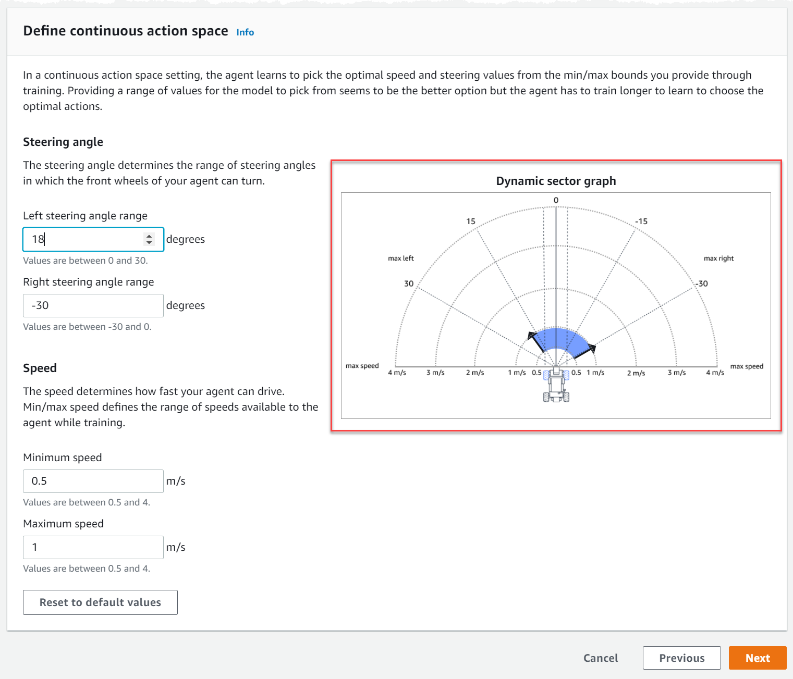
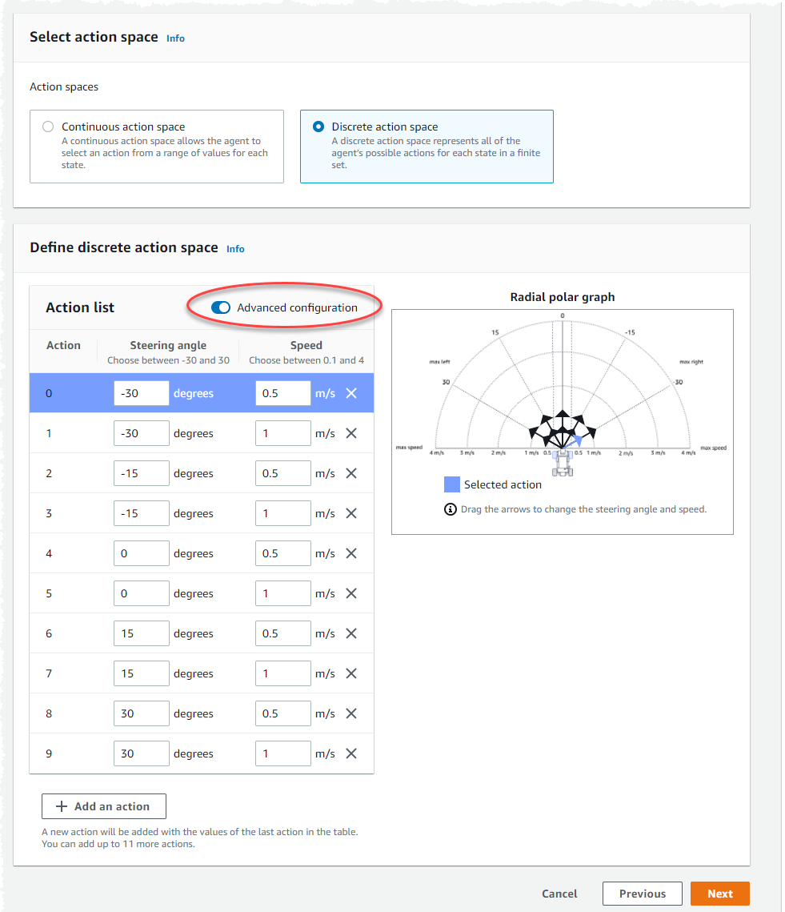
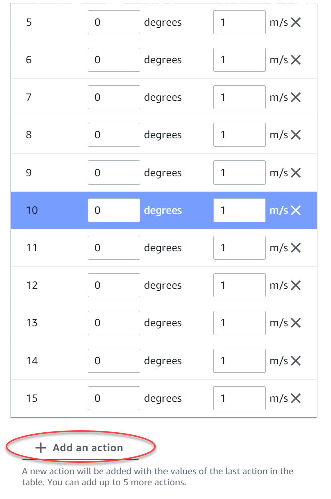
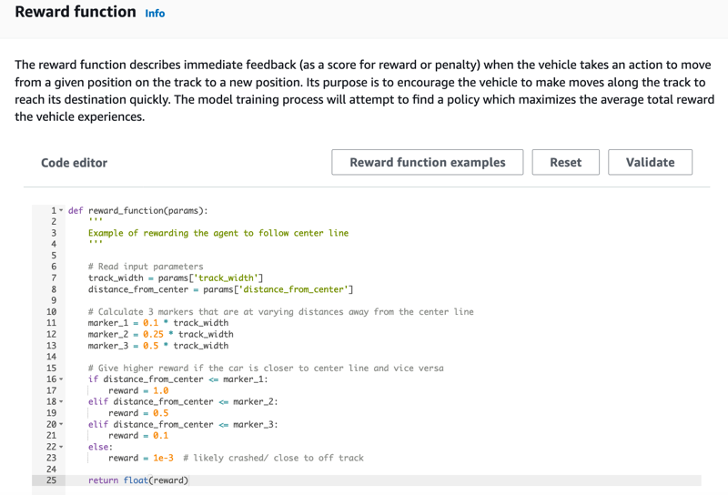
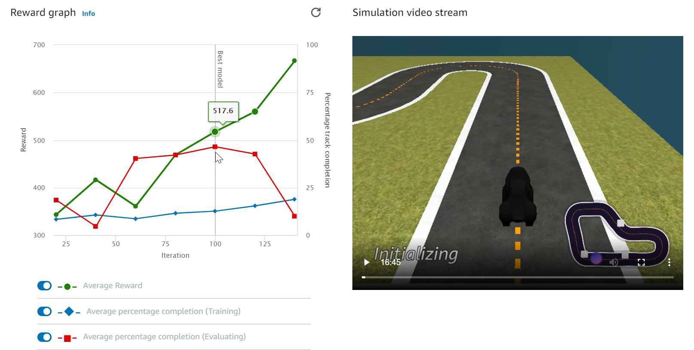

# Train your first AWS DeepRacer model

This walkthrough demonstrates how to train your first model using the AWS DeepRacer console.

## Train a reinforcement learning model using the AWS DeepRacer

console

Learn where to find the **Create model** button in the AWS DeepRacer console to start your model training
journey.

###### To train a reinforcement learning model

1. If this is your first time using AWS DeepRacer, choose **Create model** from the service landing
   page or select **Get started** under the **Reinforcement learning** heading
   on the main navigation pane.
2. On the **Get started with reinforcement learning** page, under **Step 2: Create a
   model**, choose **Create model**.

Alternatively, choose **Your models** under the **Reinforcement learning**
heading from the main navigation pane. On the **Your models** page, choose **Create
model**.

## Specify the model name and environment

Name your model and learn how to pick the simulation track that's right for you.

###### To specify the model name and environment

1. On the **Create model** page, under **Training details**, enter a name for
   your model.
2. Optionally, add a training job description.
3. To learn more about adding optional tags, see [Tagging](deepracer-tagging.md "deepracer-tagging.md").
4. Under **Environment simulation**, choose a track to serve as a training environment for
   your AWS DeepRacer agent. Under **Track direction**, choose **Clockwise** or **Counterclockwise**. Then, choose **Next**.

For your first run, choose a track with a simple shape and smooth turns. In later iterations, you can choose
more complex tracks to progressively improve your models. To train a model for a particular racing event,
choose the track most similar to the event track. 5. Choose **Next** at the bottom of the page.

## Choose a race type and training algorithm

The AWS DeepRacer console has three race types and two training algorithms from which to choose. Learn which are appropriate
for your skill level and training goals.

###### To choose a race type and training algorithm

1. On the **Create model** page, under **Race type**, select **Time
   trial**, **Object avoidance**, or **Head-to-bot**.

For your first run, we recommend choosing **Time trial**. For guidance on optimizing your
agent's sensor configuration for this race type, see [Tailor AWS DeepRacer training
for time trials](deepracer-choose-race-type.md#deepracer-get-started-training-simple-time-trial "deepracer-choose-race-type.md#deepracer-get-started-training-simple-time-trial"). 2. Optionally, on later runs, choose **Object avoidance** to go around stationary obstacles
placed at fixed or random locations along the chosen track. For more information, see [Tailor AWS DeepRacer training
for object avoidance races](deepracer-choose-race-type.md#deepracer-get-started-training-object-avoidance "deepracer-choose-race-type.md#deepracer-get-started-training-object-avoidance").

    1. Choose **Fixed location** to generate boxes in fixed,
     user designated locations across the two lanes of the track or select **Random location** to
     generate objects that are randomly distributed across the two lanes at the beginning of each episode
     of your training simulation.
    2. Next, choose a value for the **Number of objects on a track**.
    3. If you chose **Fixed location** you can adjust each object's placement on the track. For **Lane placement**, choose between the inside lane and the outside lane.
     By default, objects are evenly distributed across the track. To change how far between the start and the finish line an object is, enter a percentage of that distance between seven and 90 on the **Location (%) between start and finish** field.

3. Optionally, for more ambitious runs, choose **Head-to-bot racing** to race against up to
   four bot vehicles moving at a constant speed. To learn more, see [Tailor AWS DeepRacer training for
   head-to-bot races](deepracer-choose-race-type.md#deepracer-get-started-training-h2h-racing "deepracer-choose-race-type.md#deepracer-get-started-training-h2h-racing").
   1. Under **Choose the number of bot vehicles**, select with how many bot vehicles you
      want your agent to train.
   2. Next, choose the speed in millimeters per second at which you want the bot vehicles to travel around
      the track.
   3. Optionally, check the **Enable lane changes** box to give the bot vehicles the
      ability to randomly change lanes every 1-5 seconds.

4. Under **Training algorithm and hyperparameters**, choose the **Soft Actor Critic
   (SAC)** or **Proximal Policy Optimization (PPO)** algorithm. In the AWS DeepRacer
   console, SAC models must be trained in continuous action spaces. PPO models can be trained in either
   continuous or discrete action spaces.
5. Under **Training algorithm and hyperparameters**, use the default hyperparameter values
   as-is.

Later on, to improve training performance, expand **Hyperparameters** and modify the
default hyperparameter values as follows:

    1. For **Gradient descent batch size**, choose [available options](deepracer-console-train-evaluate-models.md#deepracer-iteratively-adjust-hyperparameters "deepracer-console-train-evaluate-models.md#deepracer-iteratively-adjust-hyperparameters").
    2. For **Number of epochs**, set a [valid value](deepracer-console-train-evaluate-models.md#deepracer-iteratively-adjust-hyperparameters "deepracer-console-train-evaluate-models.md#deepracer-iteratively-adjust-hyperparameters").
    3. For **Learning rate**, set a [valid value](deepracer-console-train-evaluate-models.md#deepracer-iteratively-adjust-hyperparameters "deepracer-console-train-evaluate-models.md#deepracer-iteratively-adjust-hyperparameters").
    4. For **SAC alpha value** (SAC algorithm only), set a [valid value](deepracer-console-train-evaluate-models.md#deepracer-iteratively-adjust-hyperparameters "deepracer-console-train-evaluate-models.md#deepracer-iteratively-adjust-hyperparameters").
    5. For **Entropy**, set a [valid value](deepracer-console-train-evaluate-models.md#deepracer-iteratively-adjust-hyperparameters "deepracer-console-train-evaluate-models.md#deepracer-iteratively-adjust-hyperparameters").
    6. For **Discount factor**, set a [valid value](deepracer-console-train-evaluate-models.md#deepracer-iteratively-adjust-hyperparameters "deepracer-console-train-evaluate-models.md#deepracer-iteratively-adjust-hyperparameters").
    7. For **Loss type**, choose [available options](deepracer-console-train-evaluate-models.md#deepracer-iteratively-adjust-hyperparameters "deepracer-console-train-evaluate-models.md#deepracer-iteratively-adjust-hyperparameters").
    8. For **Number of experience episodes between each policy-updating iteration**, set a
     [valid value](deepracer-console-train-evaluate-models.md#deepracer-iteratively-adjust-hyperparameters "deepracer-console-train-evaluate-models.md#deepracer-iteratively-adjust-hyperparameters").For more information about hyperparameters, see [Systematically tune hyperparameters](deepracer-console-train-evaluate-models.md#deepracer-iteratively-adjust-hyperparameters "deepracer-console-train-evaluate-models.md#deepracer-iteratively-adjust-hyperparameters").

6. Choose **Next**.

## Define action space

On the **Define action space** page, if you've chosen to train with the Soft Actor Critic (SAC)
algorithm, your default action space is the continuous action space. If you've chosen to train with the Proximal
Policy Optimization (PPO) algorithm, choose between **Continuous action space** and
**Discrete action space**. To learn more about how each action space and algorithm shapes the
agent's training experience, see [AWS DeepRacer action space and reward
function](deepracer-how-it-works-action-space.md "deepracer-how-it-works-action-space.md").

1. Under **Define continuous action space**, choose the degrees of your **Left
   steering angle range** and **Right steering angle range**.

Try entering different degrees for each steering angle range and watch the visualization of your
range change to represent your choices on the **Dynamic sector graph**.

 2. Under **Speed**, enter a minimum and maximum speed for your agent in millimeters
per second.

Notice how your changes are reflected on the **Dynamic sector graph**. 3. Optionally, choose **Reset to default values** to clear unwanted values. We
encourage trying out different values on the graph to experiment and learn. 4. Choose **Next**.

1. Choose a value for **Steering angle granularity** from the dropdown list.
2. Choose a value in degrees between 1-30 for your agent's **Maximum steering angle**.
3. Choose a value for **Speed granularity** from the dropdown list.
4. Choose a value in millimeters per second between 0.1-4 for your agent's **Maximum
   speed**.
5. Use the default action settings on the **Action list** or, optionally, toggle on
   **Advanced configuration** to fine tune your settings. If you choose
   **Previous** or toggle off **Advanced configuration** after
   adjusting values, you lose your changes.

    1. Enter a value in degrees between -30 and 30 in the **Steering angle**
     column.
    2. Enter a value between 0.1 and 4 in millimeters per second for up to nine actions in the
     **Speed** column.
    3. Optionally, select **Add an action** to increase the number of rows in the
     action list.

    
    4. Optionally, select **X** on a row to remove it.

6. Choose **Next**.

## Choose a virtual car

Learn how to get started with virtual cars. Earn new custom cars, paint jobs, and modifications by competing in the
Open Division each month.

###### To choose a virtual car

1. On the **Choose vehicle shell and sensor configuration** page, choose a shell that is
   compatible with your race type and action space. If you don't have a car in your garage that matches, go to
   **Your garage** under the **Reinforcement learning** heading on the main
   navigation pane to create one.

For **Time trial** training, the default sensor configuration and single-lens camera of
**The Original DeepRacer** is all you need, but all other shells and sensor
configurations work as long as the action space matches. For more information, see [Tailor AWS DeepRacer training
for time trials](deepracer-choose-race-type.md#deepracer-get-started-training-simple-time-trial "deepracer-choose-race-type.md#deepracer-get-started-training-simple-time-trial").

For **Object avoidance** training, stereo cameras are helpful, but a single camera can also
be used for avoiding stationary obstacles in fixed locations. A LiDAR sensor is optional. See [AWS DeepRacer action space and reward
function](deepracer-how-it-works-action-space.md "deepracer-how-it-works-action-space.md").

For **Head-to-bot** training, in addition to either a single camera or a stereo camera, a
LiDAR unit is optimal for detecting and avoiding blind spots while passing other moving vehicles. To learn
more, see [Tailor AWS DeepRacer training for
head-to-bot races](deepracer-choose-race-type.md#deepracer-get-started-training-h2h-racing "deepracer-choose-race-type.md#deepracer-get-started-training-h2h-racing"). 2. Choose **Next**.

## Customize your reward function

The reward function is at the core of reinforcement learning. Learn to use it to incentivize your car (agent) to
take specific actions as it explores the track (environment). Like encouraging and discouraging certain behaviors in a
pet, you can use this tool to encourage your car to finish a lap as fast as possible and discourage it from driving
off of the track or colliding with objects.

###### To customize your reward function

1. On the **Create model** page, under **Reward function**, use the default
   reward function example as-is for your first model.

Later on, you can choose **Reward function examples** to select another example function
and then choose **Use code** to accept the selected reward function.

There are four example functions with which you can start. They illustrate how to follow the track center
(default), how to keep the agent inside the track borders, how to prevent zig-zag driving, and how to avoid
crashing into stationary obstacles or other moving vehicles.

To learn more about the reward function, see [AWS DeepRacer reward function reference](deepracer-reward-function-reference.md "deepracer-reward-function-reference.md"). 2. Under **Stop conditions**, leave the default
**Maximum time** value as-is, or set a new value to terminate the training job, to help
prevent long-running (and possible run-away) training jobs.

When experimenting in the early phase of training, you should start with a small value for this parameter
and then progressively train for longer amounts of time. 3. Under **Automatically submit to the
AWS DeepRacer**, **Submit this model to the AWS DeepRacer automatically after training completion
and get a chance to win prizes** is checked by default. Optionally, you may opt out of entering
your model by selecting the checkmark. 4. Under **League requirements**, select your **Country of residence** and accept the the terms and conditions by checking the box. 5. Choose **Create model** to start creating
the model and provisioning the training job instance. 6. After the submission, watch your training job being initialized and then run.

The initialization process takes a few minutes to change from **Initializing** to
**In progress**. 7. Watch the **Reward graph** and **Simulation video stream** to observe the
progress of your training job. You can choose the refresh button next to **Reward graph**
periodically to refresh the **Reward graph** until the training job is complete.

The training job runs on the AWS Cloud, so you don't need to keep the AWS DeepRacer console open.
You can always come back to the console to check on your model at any point while the job is in progress.

If the **Simulation video stream** window or the **Reward graph** display become
unresponsive, refresh the browser page to get the training progress updated.
