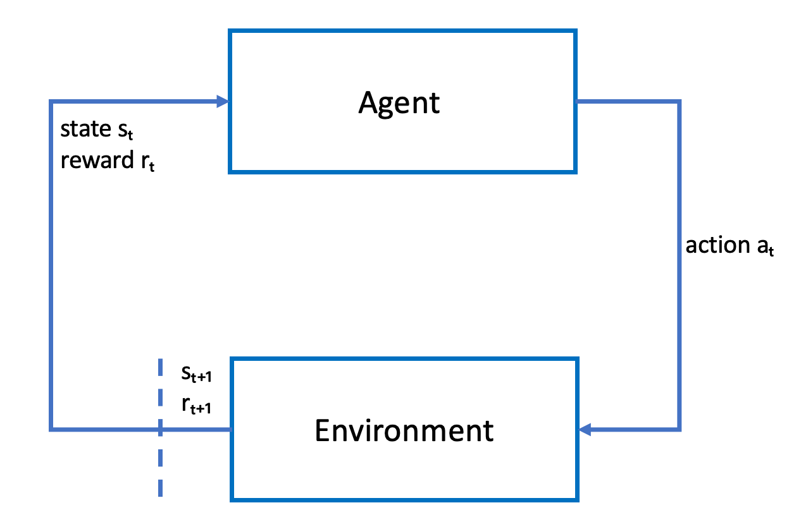

# Reinforcement

learning in AWS DeepRacer

In reinforcement learning, an _agent_, such as a physical or
virtual AWS DeepRacer vehicle, with an objective to achieve an intended goal interacts with an
_environment_ to maximize the agent's total reward. The agent
takes an _action_, guided by a strategy referred to as a
_policy_, at a given environment _state_ and
reaches a new state. There is an immediate _reward_ associated with
any action. The reward is a measure of the desirability of the action. This immediate
reward is considered to be returned by the environment.

The goal of the reinforcement learning in AWS DeepRacer is to learn the optimal policy in a
given environment. Learning is an iterative process of trials and errors. The agent
takes the random initial action to arrive at a new state. Then the agent iterates the
step from the new state to the next one. Over time, the agent discovers actions that
lead to the maximum long-term rewards. The interaction of the agent from an initial
state to a terminal state is called an _episode_.

The following sketch illustrates this learning process:

The _agent_ embodies a neural network that represents a function to
approximate the agent's policy. The image from the vehicle's front camera is the
environment _state_ and the agent _action_ is
defined by the agent's speed and steering angles.

The agent receives positive _rewards_ if it stays on-track to
finish the race and negative rewards for going off-track. An
_episode_ starts with the agent somewhere on the race track and
finishes when the agent either goes off-track or completes a lap.

###### Note

Strictly speaking, the environment state refers to everything relevant to the
problem. For example, the vehicle's position on the track as well as the shape of
the track. The image fed through the camera mounted on the vehicle's front does not
capture the entire environment state. For this reason, the environment is deemed partially
observed and the input to the agent is referred to as _observation_ rather than state. For simplicity, we use _state_ and
_observation_ interchangeably throughout this documentation.

Training the agent in a simulated environment has the following advantages:

- The simulation can estimate how much progress the agent has made and identify
  when it goes off the track to compute a reward.
- The simulation relieves the trainer from tedious chores to reset the vehicle
  each time it goes off the track, as is done in a physical environment.
- The simulation can speed up training.
- The simulation provides better controls of the environment conditions, for example
  selecting different tracks, backgrounds, and vehicle conditions.
  The alternative to reinforcement learning is _supervised learning_,
  also referred to as _imitation learning_. Here a known dataset (of
  [image, action] tuples) collected from a given environment is used to train the agent.
  Models that are trained through imitation learning can be applied to autonomous driving.
  They work well only when the images from the camera look similar to the images in the
  training dataset. For robust driving, the training dataset must be comprehensive. In
  contrast, reinforcement learning does not require such extensive labeling efforts and
  can be trained entirely in simulation. Because reinforcement learning starts with random
  actions, the agent learns a variety of environment and track conditions. This makes the
  trained model robust.
