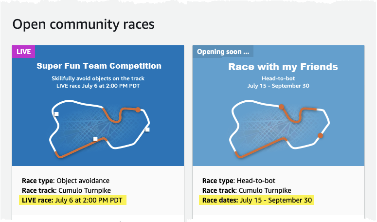
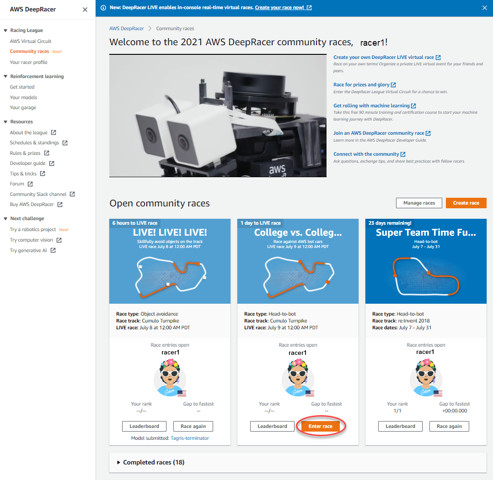
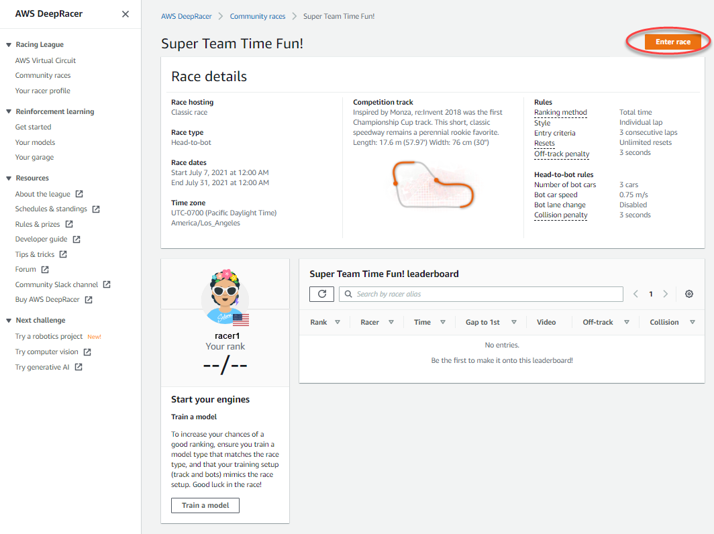
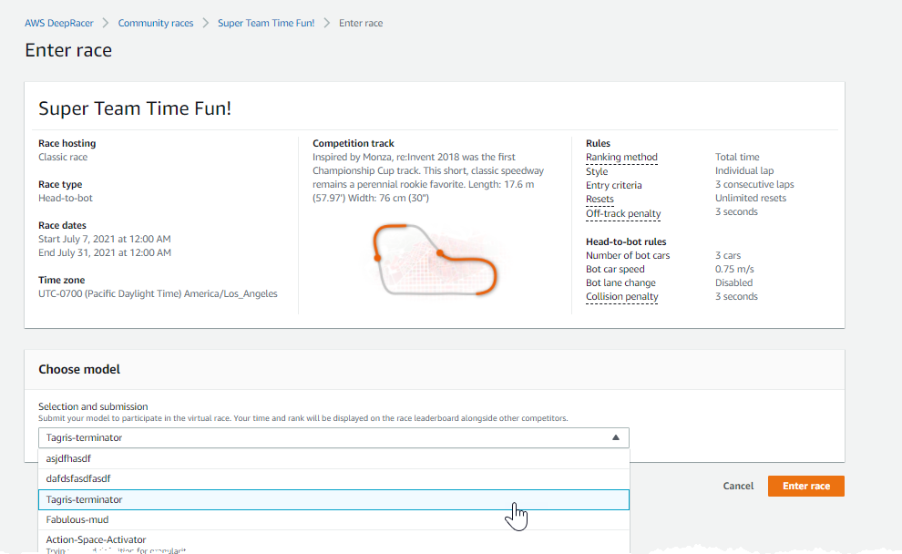
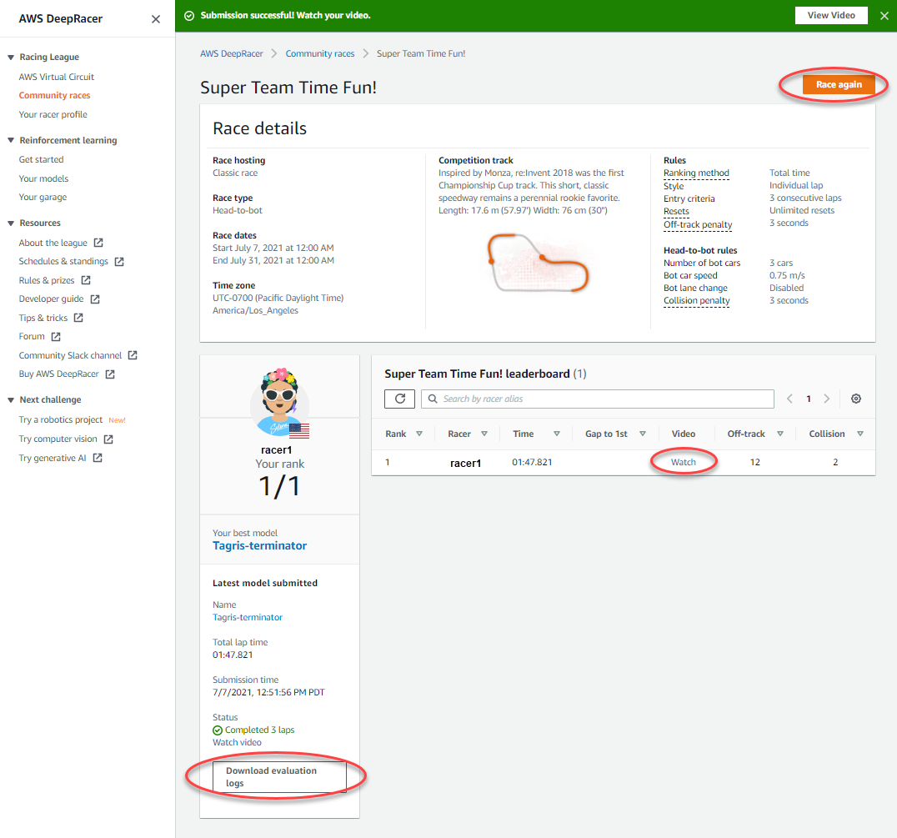
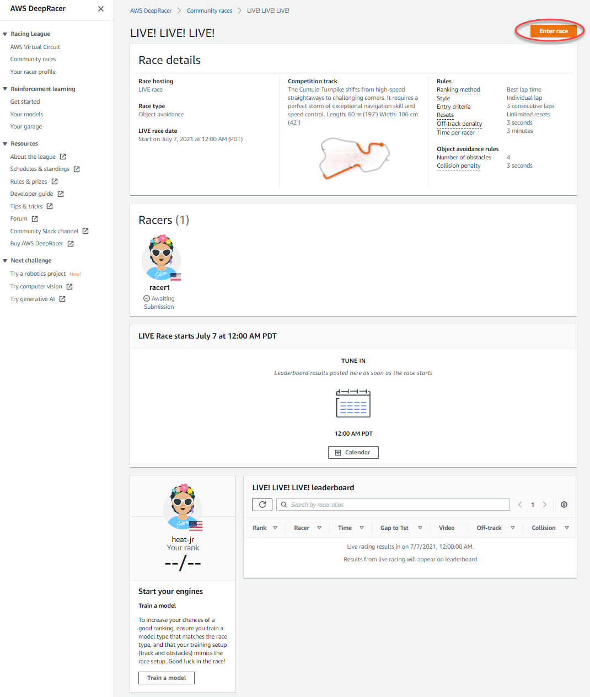
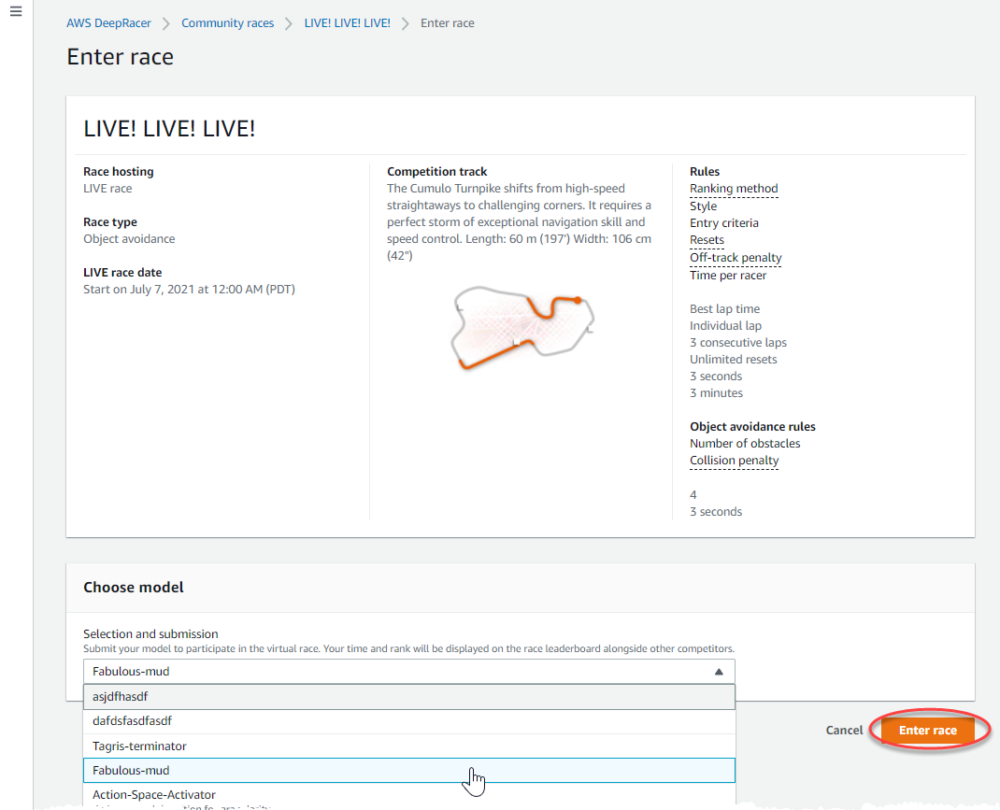

#

To join a AWS DeepRacer community race

###### Note

To join an AWS DeepRacer community race, you first need to receive a link to the race from the race organizer.

When you receive an invitation to join an AWS DeepRacer race, find out whether it's a
_LIVE_ or _classic_ race.

**Classic race**

Classic races are asynchronous events that do not require real-time interaction. Your
invitation link gives you access to submit a model to the race and view the leaderboard. You
can submit unlimited models at any time within the race's opening and closing dates to achieve
your best standing on the leaderboard. Results and videos for classic races are viewable for
submitted models on the Leaderboard page as soon as the race is initiated. All classic races
are private events.

**LIVE race**

LIVE races are real-time racing events where you gather virtually with other racers taking
turns to compete for the fastest time on the leaderboard. You can enter multiple models, but
only the last model you submit before the submission window closes will be used. During your
race, you have the option to try interactive speed controls, which temporarily override your
model’s speed parameters giving you the opportunity to make strategic, real-time adjustments.
LIVE races can be broadcast privately among invited racers or publicly for anyone to see.

If the competition format is not specified in your invitation, check your race card. LIVE races say,
"LIVE," and tell you the date and time of the synchronous event. Classic races give you the date range for
the asynchronous competition.

##

Join an AWS DeepRacer community race as a race participant

If you're new to AWS and receive an invitation to join an AWS DeepRacer community race, follow the steps in
**To join as a new user**. If you're invited to an active community race and you've
entered an AWS DeepRacer race before, follow the steps below in **To join a Classic race** or **To join a LIVE race** as is appropriate for your competition format.

If you're new to AWS and receive an invitation link to join an AWS DeepRacer community race, choose
the link to go to the AWS DeepRacer console and then sign up for an AWS account before proceeding to
join the race.

As a new AWS DeepRacer user or a first-time participant to any AWS DeepRacer race, follow the steps to join a
community race in the AWS DeepRacer console.

######

To join a race as a new user

1. Create an AWS account in the [AWS DeepRacer console](https://console.aws.amazon.com/deepracer "https://console.aws.amazon.com/deepracer").
2. Once you are set up and signed in, choose the link shared with you by the race organizer
   to open the Race page.
3. When prompted to create an **AWS DeepRacer racer name**, enter a name that you
   will use as identification across all the AWS DeepRacer leaderboards. Once you choose a racer name,
   you cannot change it.
4. On the Race details page, expand **Get started racing**.
5. Choose **Get started with RL** to get a quick introduction to
   training an AWS DeepRacer model for autonomous driving.
6. Train and evaluate your model for the race in the AWS DeepRacer console.

For more information on training your model, see [Train your first AWS DeepRacer model](deepracer-get-started-training-model.md "deepracer-get-started-training-model.md") . 7. Navigate to **Community races**. 8. Find the race you're invited to. Choose **Enter race** on the race
card.

 9. Follow the steps in **To join a Classic race** or **To join
a LIVE race** as is appropriate for your race's competition format.

1. Select the link you received from the race organizer. If you're not already signed in
   to your account in the [AWS DeepRacer console](https://console.aws.amazon.com/deepracer "https://console.aws.amazon.com/deepracer"), you'll be prompted to sign in.
2. Once signed in to the AWS DeepRacer console, the link will take you to the Race page. The Race
   page displays the race details, leaderboard, and your racer info. Choose
   **Enter race**.

 3. On the **Enter race** page, under **Choose model**,
choose a trained model and then choose **Enter race**.

 4. If your model is evaluated successfully against the racing criteria, watch the event's
leaderboard to see how your model ranks against other participants. 5. Optionally, choose **Watch** to view a video of your vehicle's
performance or choose **Download evaluation logs** to review a detailed
look at the outputs produced.

 6. Choose **Race again** to enter another model. You can submit
unlimited models at any time within the race's opening and closing dates to achieve
your best standing on the leaderboard.

1. Select the link you received from the race organizer. If you're not already signed in to
   your account in the [AWS DeepRacer console](https://console.aws.amazon.com/deepracer "https://console.aws.amazon.com/deepracer"), you'll be prompted to sign in.
2. Once signed in to the AWS DeepRacer console, the link will take you to the Race page. The Race page
   displays the race details and leaderboard. Choose **Enter race**.

 3. On the **Enter race** page, under **Choose model**,
choose a trained model and then choose **Enter race**.

 4. If your model is evaluated successfully against the racing criteria, watch the event's
leaderboard to see how your model ranks against other participants. 5. Optionally, for LIVE races, select **Calendar** to add the LIVE racing
event to your calendar. 6. Choose **Race again** to enter another model. You can enter multiple
models, but only the last model you submit before the submission window closes will be
used.
