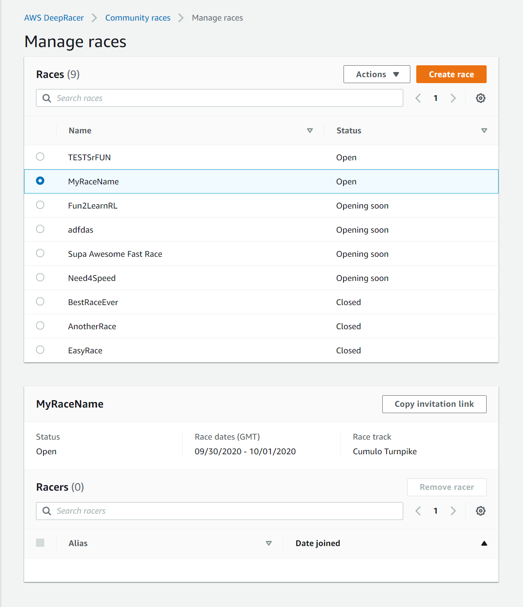
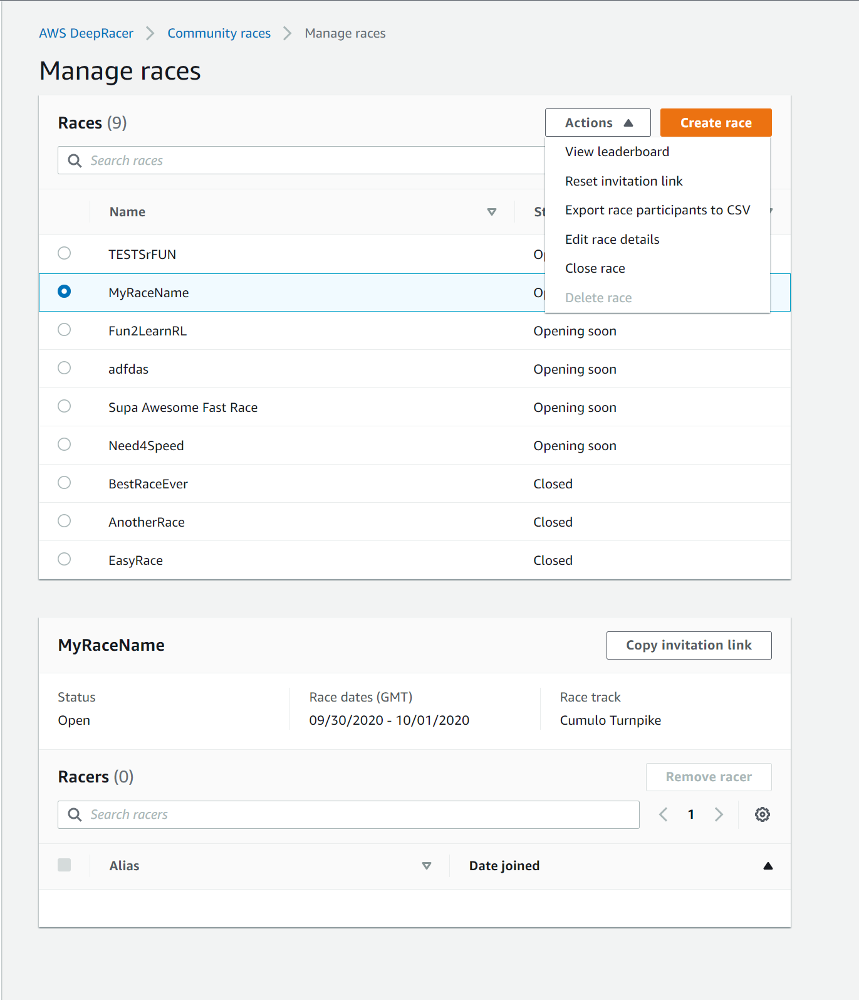

# Manage an AWS DeepRacer community race

All community races are private. They are visible only to individuals who have an invitation link.
Participants can freely forward invitation links. However, to join a race, participants need an AWS account. First-time users must
complete the account creation process before they can join the race.

As the race organizer, you can edit race details, including the start and end dates, and remove
participants.

###### To manage an AWS DeepRacer community race

1. Sign in to the AWS DeepRacer console.
2. Choose **Community races**.
3. On the **Manage races** page, for **Races**, choose the race that you want
   to manage.
   The chosen race's details, including the list of participants is displayed.

 4. To edit the race details, in **Actions**, choose **Edit race details**.

Follow the on-screen instructions to finish editing. 5. To view the event's leaderboard, from **Actions**, choose **View
leaderboard**. 6. To reset the event's invitation link, from **Actions**, choose **Reset invitation
link**. Resetting the invitation link prevents anyone who has not yet chosen the original link
from accessing the race. All users who have already clicked the link and submitted
a model remain in the race.

You can also copy the link to share it with invited participants. 7. To end an open race, from **Actions**, choose **Close race**. This ends
the race immediately, before the specified closing date. 8. To delete the event, from **Actions**, choose **Delete race**. This
permanently removes this race and details from all participants' community races. 9. To remove a participant, choose one or more race participants, choose **Remove
participants**, and then confirm to remove the participant.

Removing a participant from an event revokes the user's permissions to access the racing
event.
