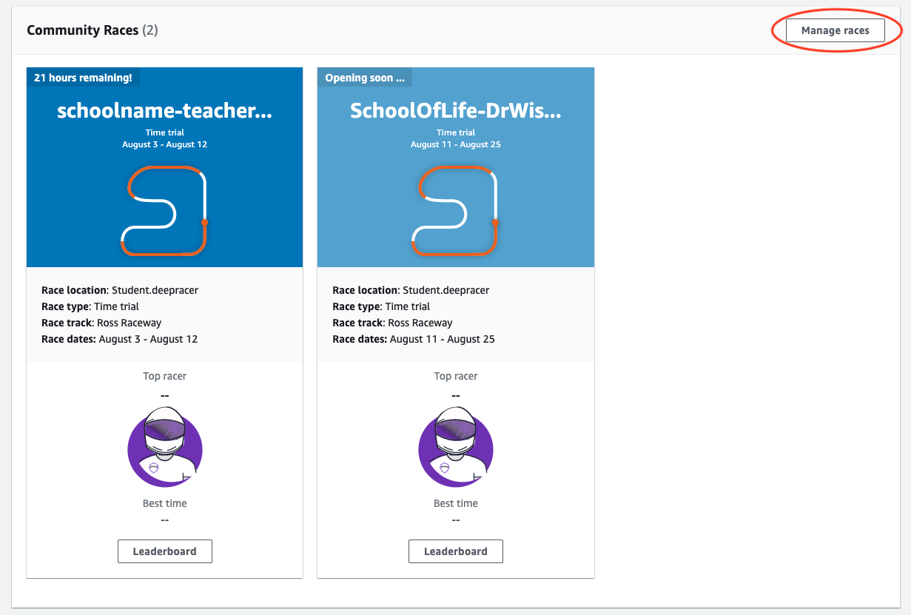
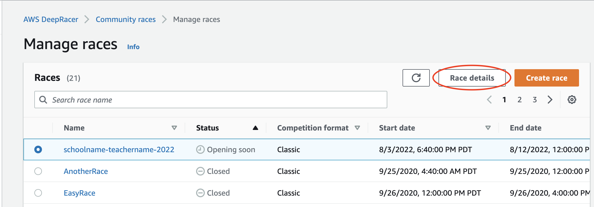
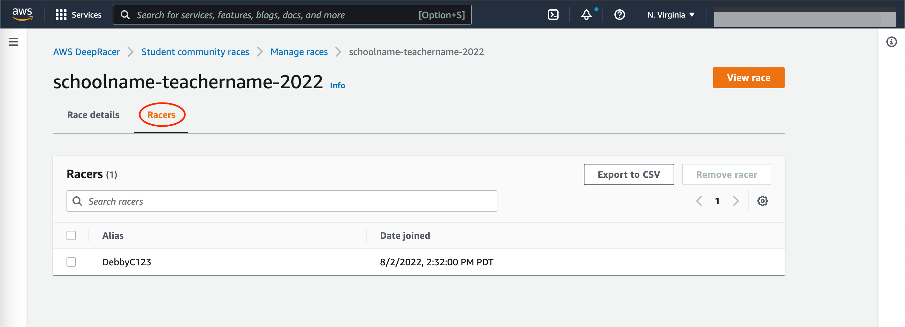

# Manage an AWS DeepRacer Student community race

All student community races are only visible to individuals who have received an invitation link. Participants can freely forward invitation links. However, to join a race, participants need an [AWS DeepRacer Student account](https://student.deepracer.com/home "https://student.deepracer.com/home"). First-time users must
complete the account creation process before they can join the race. Students only need an email address to set up an account.

As the race organizer, you can:

- Edit race details (including the start and end dates)
- Remove participants
- End races
- Delete races

###### Note

You will only see your students' aliases
in the **Racers** tab and on the **Leaderboard**, so
make note of which alias is associated with which student.

###### To manage an AWS DeepRacer Student community race

1. Sign in to the AWS DeepRacer console.
2. Choose **Community races**.
3. Select **Manage races**.

 4. On the **Manage races** page, choose the race that you want
to manage. 5. Choose **Race details** and select **Edit**.

 6. To view the event's leaderboard, choose **View race**. 7. To reset the event's invitation link, choose **Reset invitation
link**. Resetting the invitation link prevents anyone who has not yet chosen the original link
from the race. Resetting the invitation link does not affect existing participants in the race. 8. To end a race, choose **End race**. This ends the race immediately. 9. To delete the event, choose **Delete race**. This permanently
removes this race from the AWS console and AWS DeepRacer Student. 10. To remove a participant, choose the **Racers** tab, select one or more participants and select **Remove
racer**. Removing a participant from an event prevents them from joining the race.

