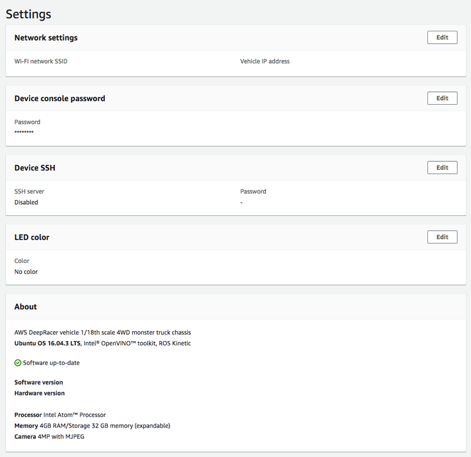
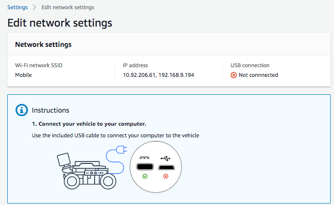
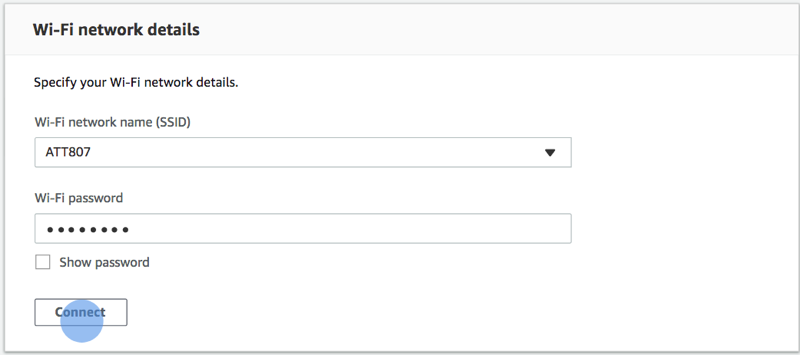
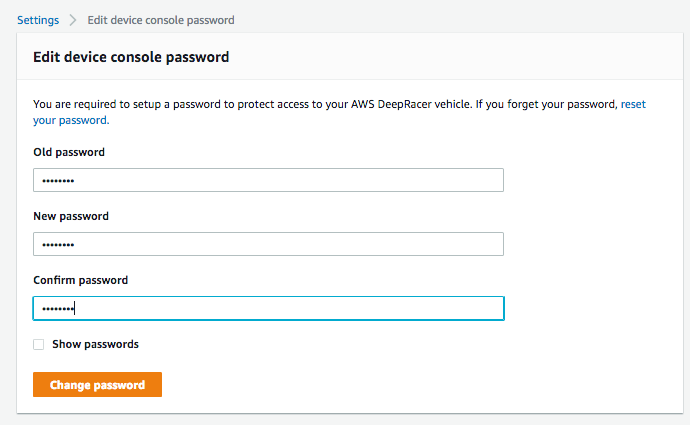
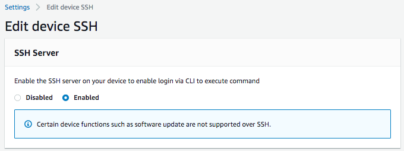
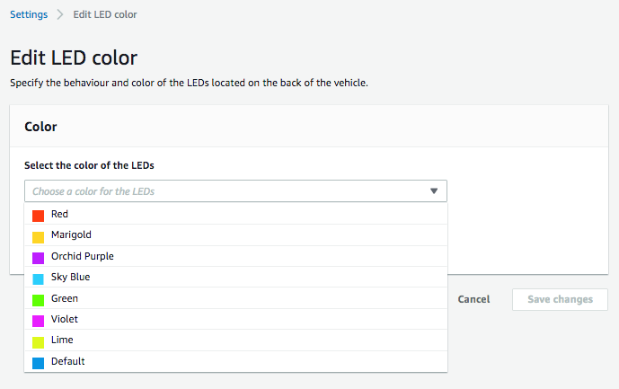

#

Inspect and manage your AWS DeepRacer vehicle settings

After the initial setup, you can use the AWS DeepRacer device control console to manage your vehicle's
settings. The tasks include the following:

- choosing another Wi-Fi network,
- resetting the device console password,
- enabling or disabling the device SSH settings,
- configuring the vehicle's trail light LED color,
- inspecting the device software and hardware versions,
- checking the vehicle battery level.

The procedure below walks you through these tasks.

######

To inspect and manage your vehicle's settings

1. With your AWS DeepRacer vehicle connected to the Wi-Fi network, follow [the instructions](deepracer-set-up-vehicle-test-drive.md "deepracer-set-up-vehicle-test-drive.md") to sign in to the
   vehicle's device control console.
2. Choose **Settings** from the main navigation pane.
3. On the **Settings** page, perform one or more of the following tasks of your
   choosing.

    1. To choose another Wi-Fi network, choose **Edit** for **Network
     settings** and then follow the steps below.

    	1. Follow the instructions, shown on **Edit network settings**,
    	 to connect your vehicle to your computer using the USB-to-USB-C cable. After the
    	 **USB connection** status becomes **Connected**,
    	 choose the **Go to deepracer.aws** button to open the device
    	 console login page.

    	
    	2. On the device console login page, type the password printed on the bottom of
    	 your vehicle and then choose **Access vehicle**.
    	3. Under **Wi-Fi network details**, choose a Wi-Fi network from the
    	 drop-down list, type the password of the chosen network, and then choose
    	 **Connect**.

    	
    	4. After the **Vehicle status** for the Wi-Fi connection becomes
    	 **Connected**, choose **Next** to return to
    	 the **Settings** page of the device console, where you'll see a
    	 new IP address of the vehicle.
    2. To reset the password for signing in to the device console, choose **Edit**
     for **Device console password** and then follow the steps below.

    	1. On **Edit device console password** page, type a new password in
    	 **New password**.
    	2. Retype the new password in **Confirm password** to confirm your
    	 intention for the change. The password value must be the same before you can move on.
    	3. Choose **Change password** to complete the task. This option is
    	 activated only if you have entered and confirmed a valid password value in the
    	 steps above.

    	
    3. To enable or disable SSH connection to the vehicle, choose **Edit**
     for **Device SSH** and then choose **Enable** or
     **Disable**.

    

4. To change the vehicle's trail light LED color to distinguish your vehicle on a track, choose
   **Edit** for **LED color** on the **Settings**
   page and do the following.
   1. Choose an available color from the **Select the color of the LEDs**
      drop-down list on the **Edit LED color** page.

   

   You should choose a color that can help identify your vehicle from other vehicles sharing
   the track at the same time. 2. Choose **Save changes** to complete the task.

   The **Save changes** functionality becomes active only after you have chosen a
   color.

5. To inspect the device software and hardware versions and to find out the system and camera
   configurations, check the **About** section under **Settings**.
6. To inspect the vehicle battery's charge level, check the lower part of the primary navigation pane.
