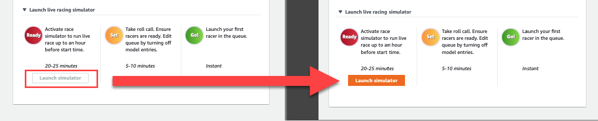
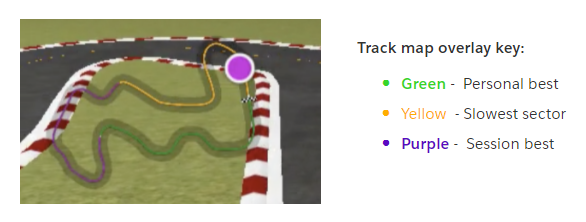
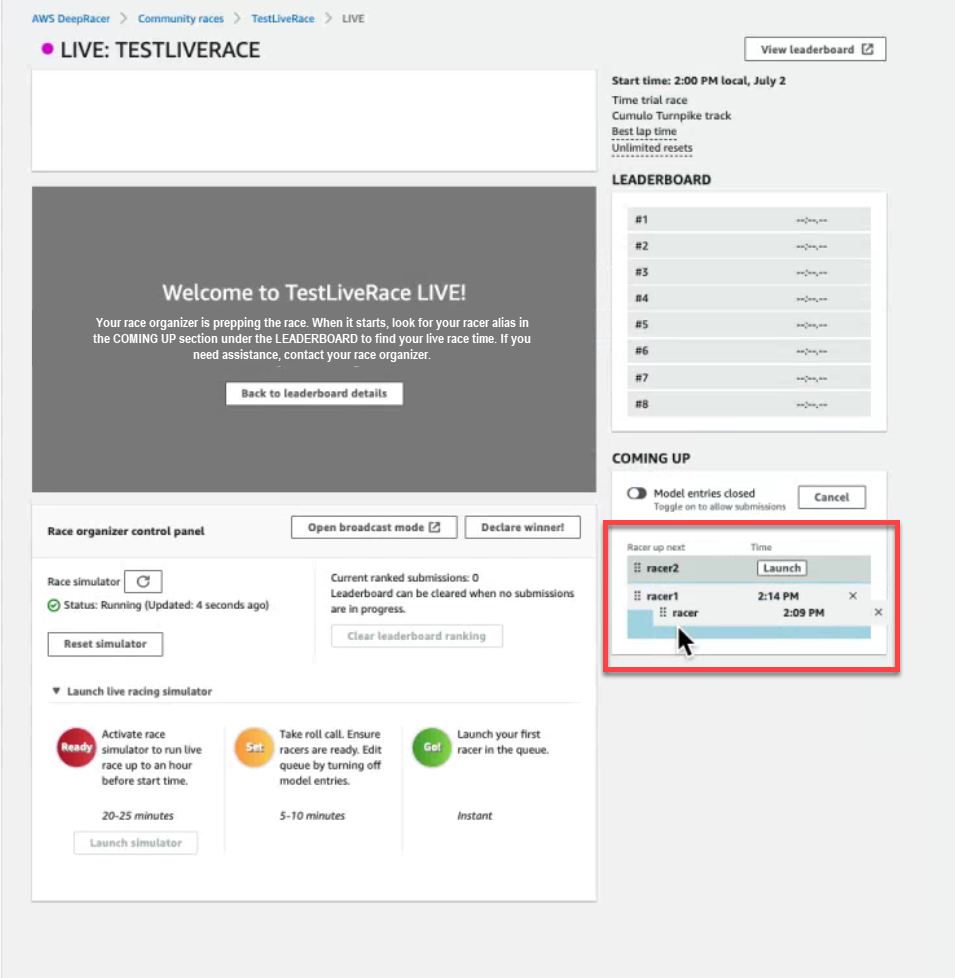
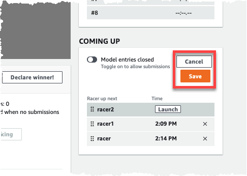
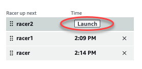

# Run a LIVE AWS DeepRacer community race

You've created a LIVE race and invited racers. You've decided whether to broadcast your event privately or publicly
with support from [Broadcast a LIVE community race using AWS DeepRacer League production
playbooks](deepracer-broadcast-live-community-race.md "deepracer-broadcast-live-community-race.md"). Now, learn how to manage the queue, set
up the race simulator and launch your racers.

###### Before you start

- Use a Chrome or Firefox browser (Check that your browser is up to date).
- Disconnect virtual private network (VPN) if you're using one.
- Close all extra tabs.

###### To run a LIVE virtual race

1. On the **Community races** page, find the race card for the race you want to moderate and
   choose **Join now** to view the race.
2. On the **LIVE: <Your Race Name>** page, under **Race organizer control
   panel** choose **Launch simulator**. This button becomes usable one hour before
   your race start time. You can hide this section of the race organizer control panel by selecting the
   **Launch LIVE racing simulator** header.

 3. Under **COMING UP**, toggle off **Model entries open** to close
submissions. This closes model submissions and creates an editable racer queue below the toggle. You can't
launch racers until the toggle is switched off.

 4. Open the video conference you created to gather your racers. 5. Initiate a racer roll call:

    1. Check with the racers to ensure they can hear you clearly.
    2. Use video at first to introduce yourself. You may want to shut it off later to optimize
     bandwidth.
    3. Check that the list of people on the call matches the list of racers in your group.

6. Initiate a model roll call:
   1. Check that the list of aliases in the racer queue matches those of your racers and that none of them
      are highlighted in red, which means that their model did not successfully submit.
   2. Check in with your racers to see if they’re having any issues submitting their models.

7. Review the race schedule and rules. Tell racers how much time they have to race on their turn, and
   remind them that the leaderboard standings are determined by their single fastest lap during that
   timeframe.
8. Explain that by using the **Speed control** feature, which is only visible to the racer during
   their race, they can manually set the maximum speed using the speed control slider, which
   temporarily overrides their model’s speed parameters, but not the steering angle. The model still steers, but
   racers can now choose key moments to increase or decrease their car’s speed by multiplying its rate. To return
   to using the model’s speed parameters, racers can reset the multiplier to 1. Remind racers that the speed
   control slider is not the gas pedal; it’s an opportunity for a strategic real-time adjustment.

 9. Next, explain that the video overlay of the race window features information to help optimize a racer’s
performance. The track map overlay is divided into three sectors that change color depending on a racer’s
pace. Green indicates the section of the tack where a racer clocked a personal best, yellow denotes the
slowest sector driven, and purple signifies a session best. Racers can also find statistics detailing their
best lap time, time remaining speed in m/s, resets, and current lap time.

 10. Answer racer questions. 11. Optionally, under **COMING UP**, choose **Edit** to reorder your race queue by grabbing and
dropping racer names.

 12. If you make changes to your racer queue, select **Save** to keep your edits or
**Cancel** to discard them.

 13. Launch the first racer in your queue:

    1. Launch each racer manually by choosing the **Launch** button next to the top racer
     queue name. On each racer’s turn, there is a **10, 9, 8, 7, 6...** countdown animated in the
     console after you launch.
    2. On **Go!**, the model runs for your chosen amount of time while being evaluated in real time.
    3. In the case of a model failing in the middle of the race, you need to relaunch the racer using
     the **Launch** button next to their alias in the Racer queue.
    4. About 2 minutes before the current racer finishes, contact the next 2 racers in the queue through
     your conference bridge and confirm that they are ready to race.
    5. 30 seconds before the current racer finishes, give the next racer a 30-second warning.
    6. Launch the next racer as soon as you see that the current racer has finished. The end of the race is
     indicated by a checkered flag icon in the console. The racer’s speed control is deactivated and a replay
     of the race launches on the video screen.

 14. Optionally, choose **Reset simulator** if you are experiencing issues with the
simulator. 15. You can also choose **Clear leaderboard ranking** if for any reason you'd like to reset the
leaderboard, which clears all entries. 16. At the end of your race, choose the **Declare winner!** button, make final remarks to
racers, explain how prizes are be distributed, answer questions, and close the video conference.
