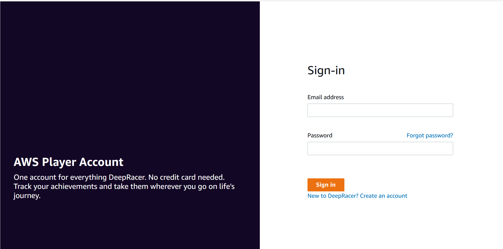

# AWS DeepRacer multi-user experience

(participant)

This walkthrough demonstrates the experience of an individual participant whose
profile is sponsored by an organization’s account in multi-user mode.

AWS DeepRacer provides an exciting way for you to experience reinforcement learning (RL) by
training and racing AWS DeepRacer models. Your organization may offer you the opportunity
to have your profile sponsored under their AWS account. All charges you generate,
including training, evaluating, and storing models, are billed to the AWS account
you used to log in. The administrator of the AWS account that sponsors your
profile can view your models, cars, and leaderboards; pause your training hours; adjust
your training hours and storage quotas; and
stop sponsoring your profile.

As part of your sponsored racer sign up process, you create an
AWS Player account. The account is a portable profile that you retain and can
use with a number of other AWS services. For more information, see
[AWS Player accounts.](../student-userguide/setting-up.md "../student-userguide/setting-up.md")

## Prerequisites

Your organization's event coordinator shares an invitation to join AWS DeepRacer, which
includes login credentials for the AWS console. Use these credentials to log in to
the console. You also create a racer profile and an AWS Player account as part of
your setup.

This walkthrough covers the following steps:

- Log in to the AWS console using the sponsoring account's credentials.
- Create or log in to an AWS Player account.
- Customize your profile.
- Train models.
- View sponsored usage.
- (Optional) Request additional sponsored hours.

## Step 1. Log in to the AWS console using the sponsoring account's credentials

To get started with AWS DeepRacer as a sponsored participant, you log in to the console using the credentials provided in the
invitation you received from the event coordinator.

###### To log in to the AWS console as a sponsored participant

1. Use the credentials provided in the invitation you received from the event coordinator.
2. In the console, navigate to AWS DeepRacer.

The AWS Player account page appears.

## Step 2. Create or log in to

an AWS Player account

1. In the **AWS Player account** page, create or log in to an existing AWS
   Player account.
   - If you do not already have an account, choose **Create
     account**, enter your email address and a password, then
     choose **Create your account**.
   - If you already have an AWS Player account, enter your email and
     password and choose **Sign in**.

2. A message is sent to the email address you
   specified to validate the account setup.
3. In the **Verification code** box, enter the code you
   received in the email and choose **Confirm registration**.

###### Note

Stay on the current page until you have entered your verification code.

You are now logged in to AWS DeepRacer console as a sponsored participant. 4. Proceed to Step 3 to customize your racer profile.

## Step 3. Customize your profile

Customize your profile by editing your profile image and adding a racer name. You can
update and change your racer profile at any time. You can also add your country of residence and a contact email for receiving communications about prizes earned in the AWS DeepRacer League.
Additionally, if you receive achievements for your performance in the AWS DeepRacer League, you can share them on social media
from the **Your racer profile** page.

###### Note

To join in AWS DeepRacer League racing events and train models, you need to create a racer name and add your country of residence. Your racer
name must be globally unique. Once you select your country of residence, it is locked in for the racing season.

###### To customize your racer profile image

1. In the left navigation pane, navigate to the **Your racer
   profile** page.
2. In the **Your racer profile** page, choose
   **Edit**.
3. In the **Your racer profile** dialog box, customize your
   racer profile image by choosing items from the dropdown lists.
4. Choose **Save**.

###### To customize your racer name

1. In the left navigation pane, navigate to the **Your racer
   profile** page.
2. In the **Your racer profile** page, choose
   **Edit**.
3. In the **Your racer profile** dialog box, choose
   **Change your racer name** and enter a name for your
   profile.
4. Choose **Save**.

## Step 4. Train models

When you have customized your profile, you are ready to start training models. For
more information, see [Train and evaluate AWS DeepRacer models](create-deepracer-project.md "create-deepracer-project.md").

## Step 5. View sponsored

usage

You'll want to keep track of your sponsored hours and models so you can get the most out of them.

###### To view sponsored hours usage and stored models

- In **Your racer profile** page, see **Sponsored
  usage** for total hours used and number of stored models.

## Step 6. (Optional) Request additional sponsored hours

As a sponsored participant, you receive five hours of free training time. If you run out of
your free sponsored hours, you can request additional hours from your account
administrator or event organizer. Alternatively, if you don't have access to additional
sponsored hours, you can continue your journey with AWS DeepRacer by creating your own AWS DeepRacer
account. For information about training and storage costs, see [Pricing](https://aws.amazon.com/deepracer/pricing/ "https://aws.amazon.com/deepracer/pricing/").
