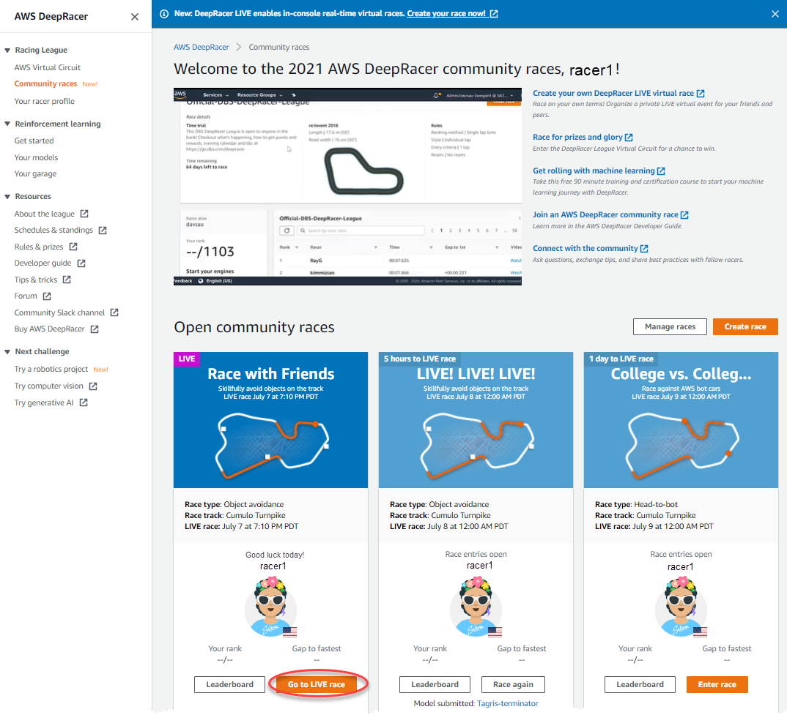
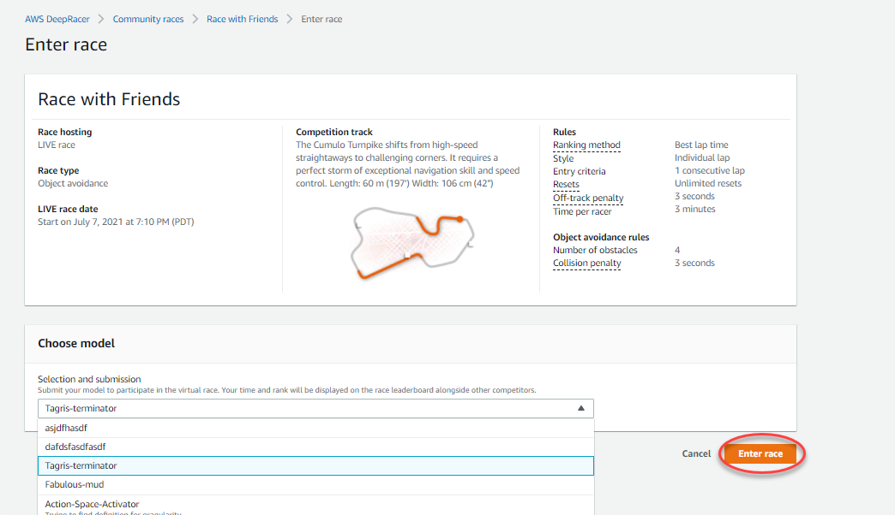
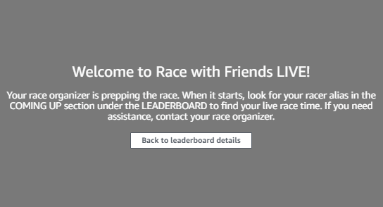
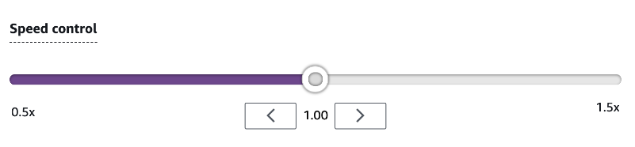

#

Participate in an AWS DeepRacer LIVE race

###### Note

Submit your model at least one hour prior to the LIVE race start time. You can enter multiple models,
but only the last model you submit before the submission window closes will be used.

######

Before you start

- Use a Chrome or Firefox browser (Check that your browser is up to date).
- Disconnect virtual private network (VPN) if you're using one.
- Close all extra tabs.

######

To participate in a LIVE race

1. Sign in to the [AWS DeepRacer console](https://console.aws.amazon.com/deepracer "https://console.aws.amazon.com/deepracer").
2. If you haven't submitted a model, find the race card for the race you want to participate in and
   select **Go to LIVE race**.

 3. On the **Race** page, select **Enter race**. 4. On the **Enter race** page, under **Choose model**, select the
model you want to submit from the drop down menu and choose **Enter race**.

 5. On the **Race** page, choose **Go to LIVE race**. 6. On the **LIVE race** page, you'll see a wait message. Navigate to the conference
bridge provided to you by your race organizer.

 7. Check in with your race organizer, who will review the race rules and answer racer questions. 8. Check the **COMING UP** section under **LEADERBOARD** for your
live race time and be ready when the race organizer announces that you are up next. 9. On your turn, there will be a **10, 9, 8, 7, 6...** countdown animated in the
console when the race organizer launches your race. On **Go!** you will have
access to the optional speed control. To choose key moments to boost or slow down your model’s
speed. There are three ways to operate the Speed control feature:

    1. Drag the slider with your computer’s mouse.
    2. Alternatively, choose the **< / >** arrow buttons in console.
    3. You can also select the slider knob to activate the slider and then use your
     `←` and `→` keyboard arrow keys.

 10. Reset the multiplier to 1 to return to using your model’s speed parameters. 11. As you race, check the video overlay of your LIVE race to help optimize your performance. The
track map overlay is divided into three sectors that change color depending on your pace. Green
indicates the section of the tack where you clocked a personal best, yellow denotes the slowest
sector driven, and purple signifies a session best. You can also find statistics detailing your
best lap time, time remaining speed in m/s, resets, and current lap time.

 12. The race ends when you see the checkered flag icon in the console. The Speed control is disabled
and a replay of your race launches on the video screen. You are ranked on the leaderboard by your
single best lap time.
