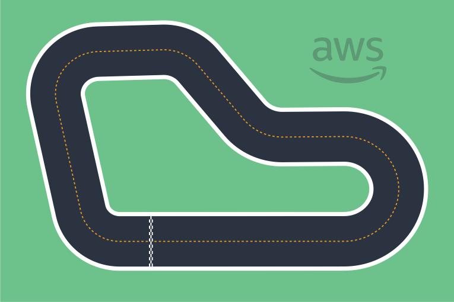
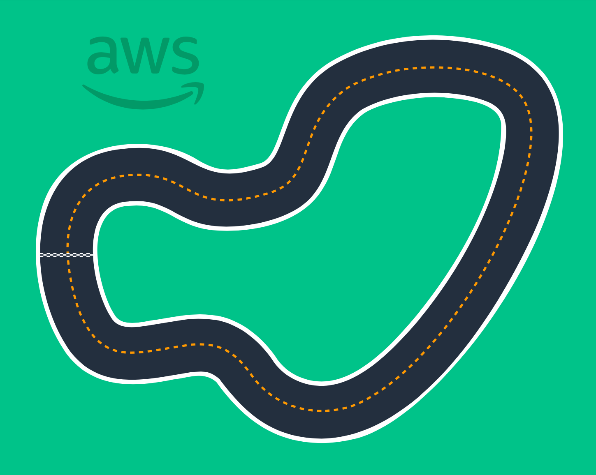
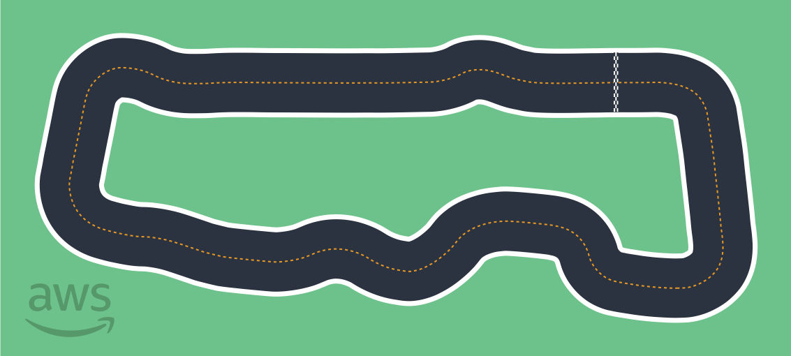
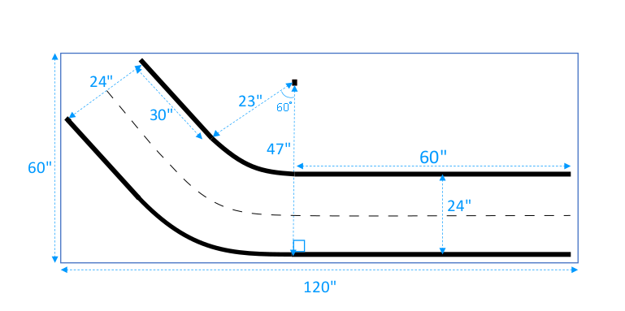
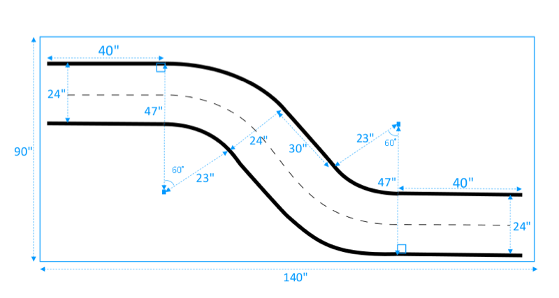
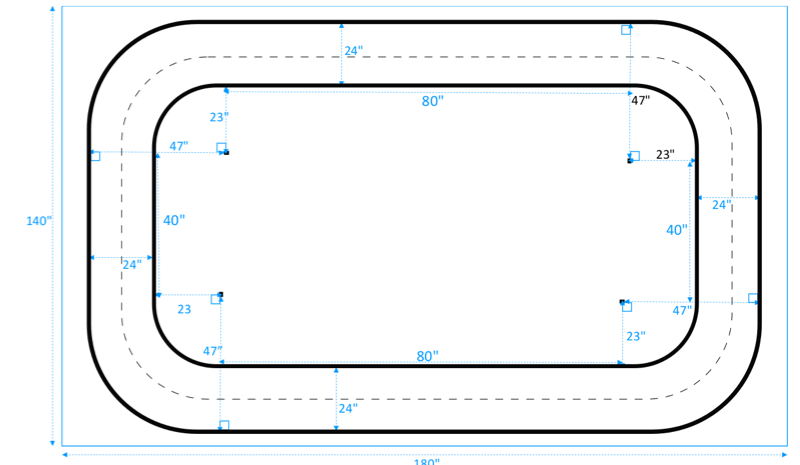
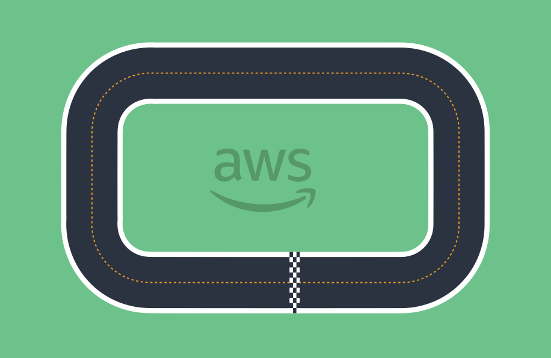

# AWS DeepRacer track design templates

The following track design templates show AWS DeepRacer tracks that you can build by
following the [instructions](deepracer-build-your-track-construction.md "deepracer-build-your-track-construction.md") presented in this section.

###### Note

Templates for tracks that are available pre-printed are also presented in this section. The assembly of pre-printed tracks requires less time and is a simpler process than constructing tracks with your own materials.
We recommend using pre-printed tracks and barriers. To purchase pre-printed tracks, see [AWS DeepRacer
storefront.](https://www.amazon.com/b/?node=32957528011&ref_=aws_dr_sf_doc_dg_bw "https://www.amazon.com/b/?node=32957528011&ref_=aws_dr_sf_doc_dg_bw")

For all tracks, to reproduce the same color production, use the following specifications:

- Green: PMS 3395C
- Orange: PMS 137C
- Black: PMS 432C
- White: CMYK 0-0-2-9
  These tracks were tested with the following materials for their surfaces:

- Vinyl

The tracks were printed on 13-ounce scrim vinyl with a matte finish to reduce glare. Vinyl is
typically cheaper than carpet and provides good performance. Vinyl is not as
durable as carpet.

- Carpet

The tracks were printed on 8-ounce, dye-sublimated, polyester-faced carpet with latex
rubberized backing. Carpet is durable and provides great performance, but is
expensive.
Due to their large size, the tracks cannot be easily printed on a single piece of
material. Align track lines well when connecting pieces together.

###### Topics

- [AWS DeepRacer A to Z Speedway (Basic) track template](#deepracer-track-example-A-Z-speedway-basic "#deepracer-track-example-A-Z-speedway-basic")
- [AWS DeepRacer Smile Speedway (Intermediate) track template](#deepracer-track-example-smile-speedway-intermediate "#deepracer-track-example-smile-speedway-intermediate")
- [AWS DeepRacer RL Speedway (Advanced) track template](#deepracer-track-example-RL-speedway-advanced "#deepracer-track-example-RL-speedway-advanced")
- [AWS DeepRacer Single-turn track template](#deepracer-track-example-single-turn "#deepracer-track-example-single-turn")
- [AWS DeepRacer S-curve track template](#deepracer-track-example-s-curve "#deepracer-track-example-s-curve")
- [AWS DeepRacer Loop track template](#deepracer-track-example-loop "#deepracer-track-example-loop")

## AWS DeepRacer A to Z Speedway (Basic) track template

The AWS DeepRacer A to Z Speedway (Basic) track is the most popular physical competition track
in AWS DeepRacer history. It was originally released at AWS re:invent 2018 and has the
smallest footprint of all the AWS DeepRacer physical competition tracks. It's available pre-printed for purchase at [AWS DeepRacer
Storefront.](https://www.amazon.com/gp/browse.html?node=32957528011 "https://www.amazon.com/gp/browse.html?node=32957528011")

We recommend this track for beginner events and first-time racers. With a variety of runs and straightaways,
it offers a compelling challenge for both first-time and experienced racers. The AWS DeepRacer A to Z Speedway (Basic)
track is a 1:1 physical reproduction of the virtual track available in the console. It provides racers the opportunity to
train a model in a virtual environment and then deploy the model to a physical AWS DeepRacer device for autonomous racing on a physical track.

To print or create your own A to Z Speedway (Basic) track, download this [AWS DeepRacer A to Z Speedway (Basic) file](samples/deepracer-A-to-Z-speedway-basic.ai.md "samples/deepracer-A-to-Z-speedway-basic.ai.md").

## AWS DeepRacer Smile Speedway (Intermediate) track template

The AWS DeepRacer Smile Speedway track was originally released as the
AWS DeepRacer Championship 2019 track. It's available pre-printed for purchase at [AWS DeepRacer
Storefront.](https://www.amazon.com/gp/browse.html?node=32957528011 "https://www.amazon.com/gp/browse.html?node=32957528011")

We recommend this intermediate track for events with experienced racers and larger physical spaces. It's a 1:1 physical reproduction of the virtual track available in the console. It provides racers the opportunity to
train a model in a virtual environment and then deploy the model to a physical AWS DeepRacer device for autonomous racing on a physical track.

To print or create your own AWS DeepRacer Smile Speedway (Intermediate) track, download this [AWS DeepRacer Smile Speedway (Intermediate)
track file](samples/deepracer-championship-cup-intermediate.ai.md "samples/deepracer-championship-cup-intermediate.ai.md").

## AWS DeepRacer RL Speedway (Advanced) track template

The AWS DeepRacer RL Speedway (Advanced) track (aka AWS DeepRacer Summit Speedway) was originally released for AWS DeepRacer summits in 2022 and is the longest physical track in AWS DeepRacer history. It's available pre-printed for purchase at [AWS DeepRacer
Storefront.](https://www.amazon.com/gp/browse.html?node=32957528011 "https://www.amazon.com/gp/browse.html?node=32957528011")

We recommend the AWS DeepRacer RL Speedway (Advanced) track for events with experienced racers. It offers a compelling challenge for racers who enjoy going fast on straightaways.
The AWS DeepRacer RL Speedway (Advanced) track is a 1:1 physical reproduction of the virtual track available in the console. It provides the opportunity for racers to train a model in a virtual
environment and then deploy the model to a physical AWS DeepRacer device for autonomous racing on a physcial track.

To print or create your own AWS RL Speedway (Advanced) track, download this [AWS DeepRacer RL Speedway (Advanced)
track file](samples/deepracer-summit-speedway-advanced.ai.md "samples/deepracer-summit-speedway-advanced.ai.md").

## AWS DeepRacer Single-turn track template

This basic track template consists of two straight track segments connected by a
curved track segment. Models trained with this track should make your AWS DeepRacer
vehicle drive in straight line or make turns in one direction.

## AWS DeepRacer S-curve track template

The track is more complex than the single-turn track because the model needs to
learn to make turns in two directions. You can easily extend the single-turn track
construction instructions to this track by turning it in the opposite direction
after the first turn.

## AWS DeepRacer Loop track template

This regular loop track is a repeating, 90-degree, single-turn track.
It requires a larger enclosing area for laying the entire track.

