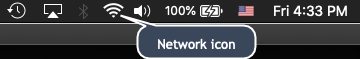
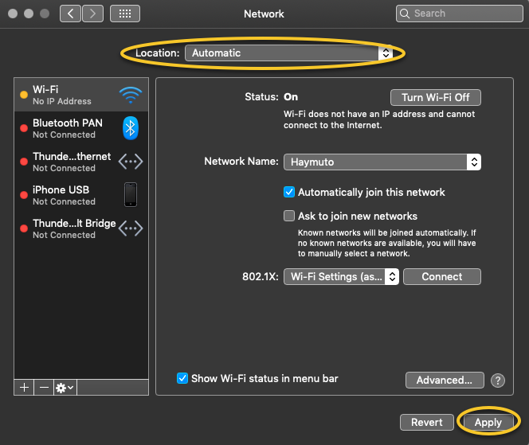
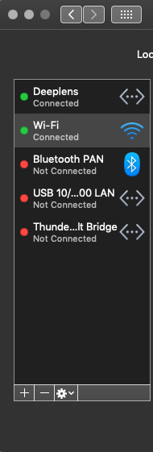

# Why can't I connect to the device console with

USB connection between my computer and vehicle?

When setting up your vehicle for the first time, you might find it unable to open the device console (also known as
the device web server, `https://deepracer.aws`, hosted on the vehicle) after connecting your AWS DeepRacer vehicle
to your computer with a micro-USB/USB cable (USB is also referred to as USB-A).

Multiple causes may be behind this. Typically, you can resolve the issue with the following simple remedy.

###### To activate your device's USB-over-Ethernet network

1. Turn off Wi-Fi on your computer and unplug any Ethernet cable connected to it.
2. Press the **RESET** button on the vehicle to reboot the device.
3. Open the device console by navigating to `https://deepracer.aws` from a web browser on your
   computer.
   If the previous procedure doesn't work, you can check your computer's network preferences to verify that they're
   properly configured to let the computer connect to the device's network, whose network name is `Deepracer`.
   To do this, follow the steps in the following procedure.

###### Note

The instructions below assume you're working with a MacOS computer. For other computer systems, consult with the
network preferences documentation for the respective operating system and use the below instructions as a general
guide.

###### To activate the device's

USB-over-ethernet network on your MacOS computer

1. Choose the network icon (on the top-right corner of the display) to open **Network
   preferences**.



Alternatively, choose **Command+space**, type **Network**, and then choose
**Network System Preferences**. 2. Check if **Deepracer** is listed as **Connected**. If
**DeepRacer** is listed but not connected, make sure the micro-USB/USB cable is tightly
plugged in between the vehicle and your computer. 3. If the **Deepracer** network is not listed there or is listed but not connected when the
USB cable is plugged in, choose **Automatic** from the **Location**
preference and then choose **Apply**.

 4. Verify that the AWS DeepRacer network is up and running as **Connected**.

 5. When your computer is connected to the **Deepracer** network, refresh the
`https://deepracer.aws` page on the browser, and continue with the rest of **Get
Started Guide** instructions of **Connect to Wi-Fi**. 6. If the **Deepracer** network is not connected, disconnect your computer from the AWS DeepRacer
vehicle and then reconnect it. When the **Deepracer** network becomes
**Connected**, continue with the **Get Started Guide**d
instructions. 7. If the **Deepracer** network on the device is still not connected, reboot your computer and
AWS DeepRacer vehicle and repeat from **Step 1** of this procedure, if necessary.
If the above remedy still doesn't resolve the issue, the device certificate might have been corrupted. Follow the
steps below to generate a new certificate for your AWS DeepRacer vehicle to repair the corrupted file.

###### To generate a new certificate on the AWS DeepRacer vehicle

1. Terminate the USB connection between your computer and your AWS DeepRacer vehicle by unplugging the micro-USB/USB
   cable.
2. Connect your AWS DeepRacer vehicle to a monitor (with a HDMI-to-HDMI cable) and to USB keyboard and mouse.
3. Log in to the AWS DeepRacer operating system. If this is the first login to the device operating system, use
   `deepracer` for the password, when asked for, and then proceed to change the password, as
   required, and use the updated password for subsequent logins.
4. Open a terminal window and type the following Shell command. You can choose the
   **Terminal** shortcut from **Applications -> System Tools** on the
   desktop to open a terminal window. Or you can use the file browser, navigate to the `/usr/bin`
   folder, and choose **gnome-terminal** to open it.

```
sudo /opt/aws/deepracer/nginx/nginx_install_certs.sh && sudo reboot
```

Enter the password, which you used or updated in the previous step, when prompted.

The above command installs a new certificate and reboots the device. It also reverts the device console's
password to the default value printed at the bottom of the AWS DeepRacer vehicle. 5. Disconnect the monitor, keyboard and mouse from the vehicle and reconnect it to your computer with the
micro-USB/USB cable. 6. Follow the [second procedure
in this topic](#deepracer-activate-device-usb-over-ethernet-network-on-computer "#deepracer-activate-device-usb-over-ethernet-network-on-computer") to verify your computer is indeed connected to the device network before opening the
device console (`https://deepracer.aws`) again and, then, continue with the **Connect to
Wi-Fi** instructions in **Get Started Guide**.
