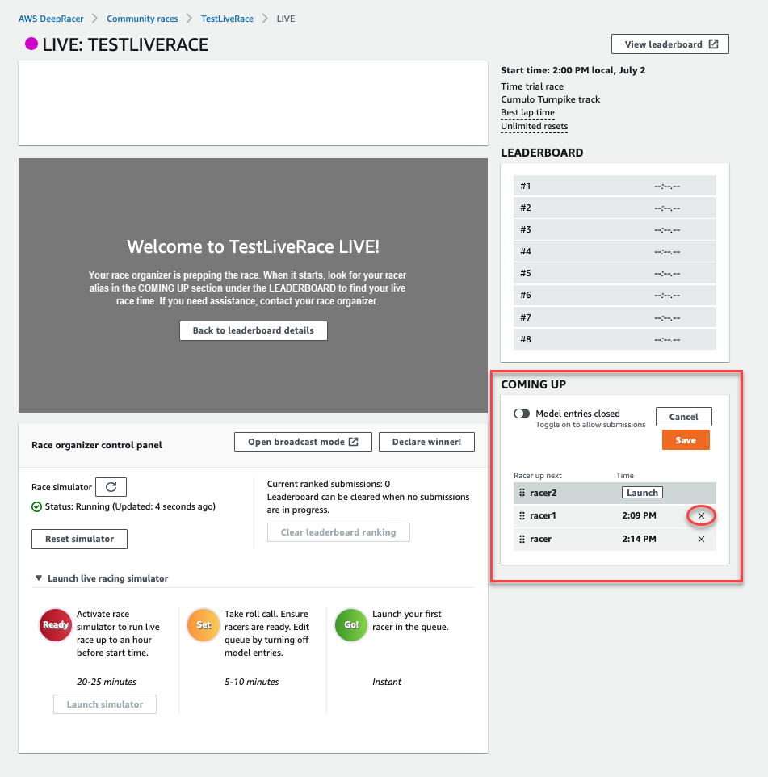
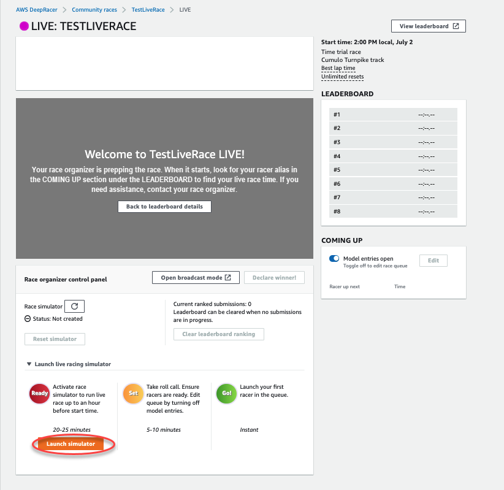
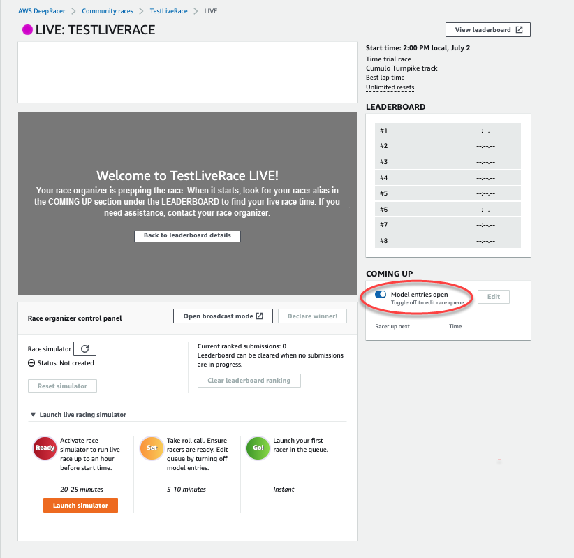

# How to resolve common AWS DeepRacer LIVE issues

## I can't see the race video on the LIVE race page

- If you are using a virtual private network (VPN), verify that it's disconnected during the racing
  event.
- If your device runs an ad blocker, verify that it's disconnected during the racing event.
- If your home network is running an ad blocker, verify that it's disconnected during the racing
  event.

## A racer's name in the race queue is red

When a racer's name in the coming up section of the **LIVE: <Your Race Name>** page is
highlighted in red, it means that something went wrong with the racer's model submission.

- If you are a race organizer, in the coming up section of the **LIVE: <Your Race
  Name>** page, choose **Edit** to delete the racer's model submission by
  selecting **X** on the row containing that racer's name. Next, choose
  **Save**. See step 11 of [Run a LIVE AWS DeepRacer community race](deepracer-moderate-live-community-race.md "deepracer-moderate-live-community-race.md") for
  help reordering your queue.

- If you are a racer, resubmit your model to the race. Go to [Run a LIVE AWS DeepRacer community race](deepracer-moderate-live-community-race.md "deepracer-moderate-live-community-race.md") and choose **To join a LIVE race**
  for help.

## I'm running a LIVE Race and I can't launch the

racers

- Verify that you have selected **Launch simulator** under the **Launch live
  racing simulator** section of the **LIVE: <Your Race Name>** page. For
  more help see step two of [Run a LIVE AWS DeepRacer community race](deepracer-moderate-live-community-race.md "deepracer-moderate-live-community-race.md").

- Verify that you have toggled off **Model entries open** to close submissions under
  **COMING UP** on the **LIVE: <Your Race Name>** page. For more
  help see step three of [Run a LIVE AWS DeepRacer community race](deepracer-moderate-live-community-race.md "deepracer-moderate-live-community-race.md").

## I'm using a Chrome or Firefox browser but I'm still

having issues seeing the LIVE race

- Verify that you have the most recent version of the Chrome or Firefox browser. If not, update your
  browser to the latest version and try viewing the race again.
- If you are using a virtual private network (VPN), verify that it's disconnected.
- If your device runs an ad blocker verify that its disconnected during the racing event.
- If your home network is running an ad blocker, verify that it's disconnected during the racing
  event.
- If WebRTC is turned off in your internet browser, turn it on during the racing event.
