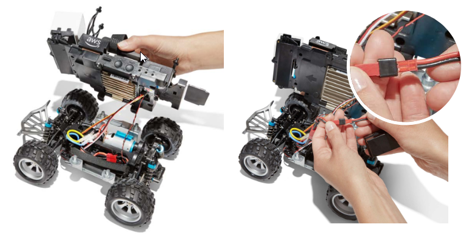
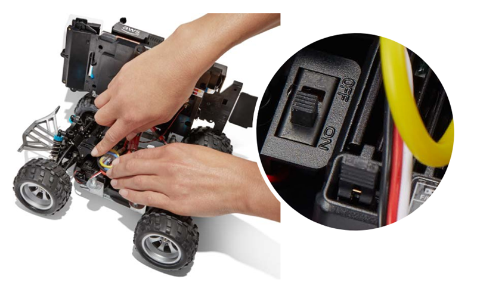
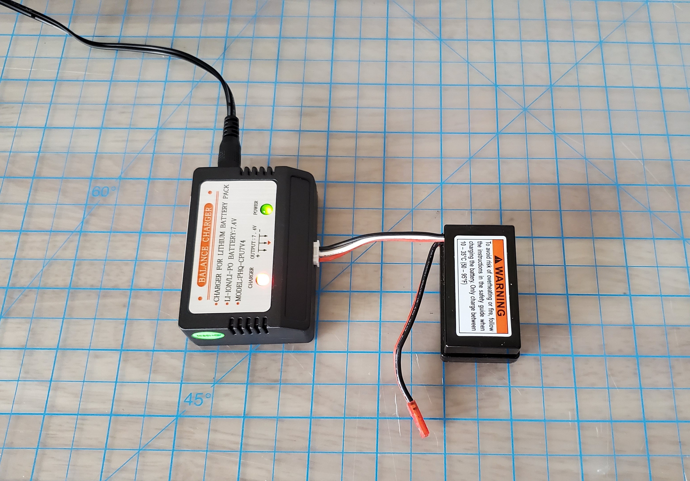
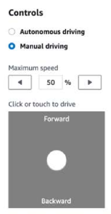

# My battery is charged but my AWS DeepRacer

vehicle doesn't move

Follow these steps if your AWS DeepRacer console is set up, your compute battery is charged, and your Wi-Fi is connected, but
your vehicle still doesn't move:

1. Lift the compute module, being careful not to loosen the wires connecting it to the drive train. Make sure
   the vehicle battery underneath is correctly connected, red 2-pin connector to black and red drive train
   connector.

 2. Turn on the vehicle drive train by pushing the switch to the "on" position. Listen for the indicator sound
(two short beeps) to confirm that the vehicle has charge. If the vehicle powers on successfully, skip to step 4.

 3. If you do not hear two beeps when you switch on your vehicle battery, ensure that the battery is fully
charged. Plug the vehicle battery's white connector cable into its charge adapter, which can be differentiated
from the compute module's adapter by its red and green LED indicator lights. Connect the adapter to its charge
cable and plug it into a power outlet. When both red and green lights on the vehicle battery charge adapter
are lit, it indicates that the battery still needs charging.

_Red light + green light = not fully
charged_

When only the green light is illuminated, your battery is fully charged and ready to use. Disconnect the car
battery's white connector from the charge adapter, and reconnect its red connector to the vehicle. If you
removed the battery to charge it (optional) make sure to once again secure it to the drive train with the
Velcro strap. Turn on the vehicle drive train by pushing its switch to the "on" position. If you still don't
hear two beeps, try [unlocking your
vehicle battery](deepracer-troubleshooting-unlock-dead-vehicle-batteries.md "deepracer-troubleshooting-unlock-dead-vehicle-batteries.md"). 4. Connect your vehicle to [Wi-Fi](deepracer-set-up-vehicle.md "deepracer-set-up-vehicle.md") and open the AWS DeepRacer console in
your browser. Manually drive your vehicle with the touch joystick to confirm that it can move.

**REMINDER:** To get the most millage out of your vehicle battery, make sure to switch
off the vehicle drive train or disconnect its battery when you are not using your AWS DeepRacer.

If your vehicle still does not move, contact AWSDeepRacer-Help@amazon.com.
