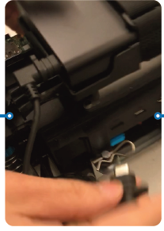
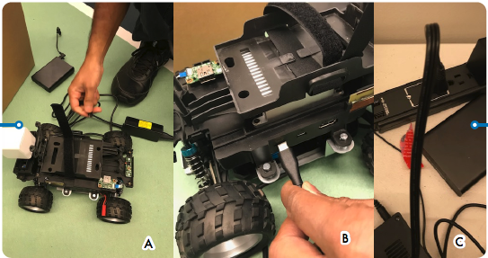

# How to switch AWS DeepRacer compute module power

source from battery to a power outlet

If the compute module battery level is low when you set up your AWS DeepRacer for the first time, follow the steps below to
switch the compute power supply from the battery to a power outlet:

1. Unplug the USB-C cable from the vehicle's compute power port.

 2. Attach the AC power cord and the USB-C cable to the computer module power adapter (A). Plug the power cord
to a power outlet (C) and plug the USB-C cable the vehicle's computer module power port (B).

