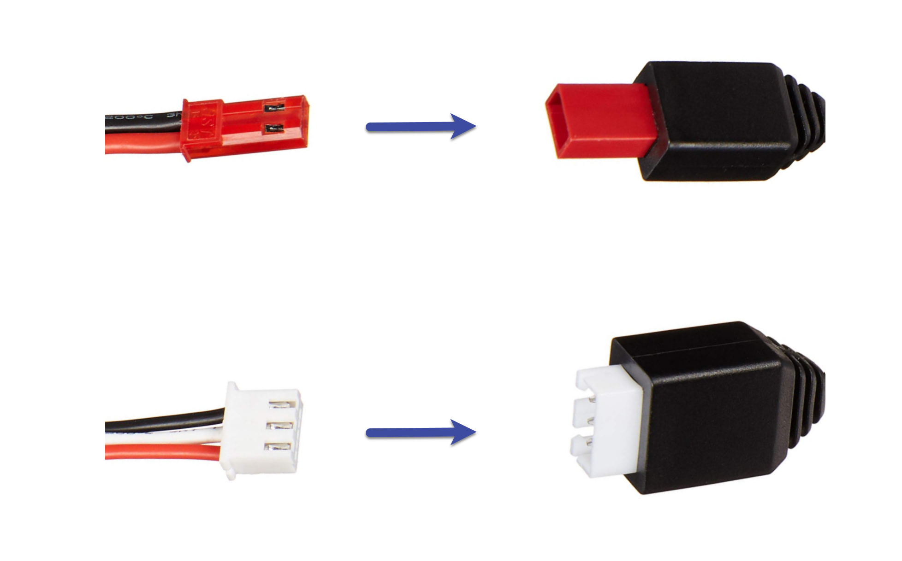
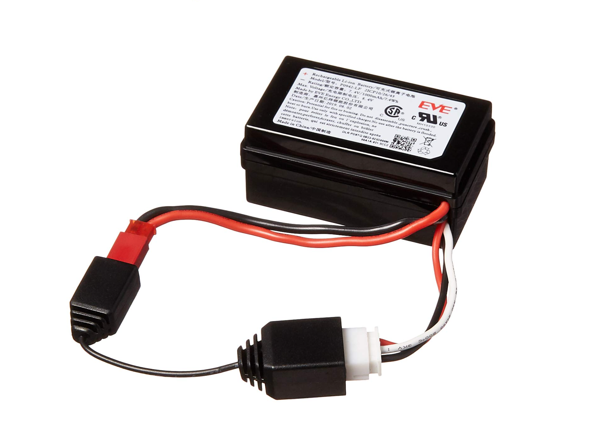
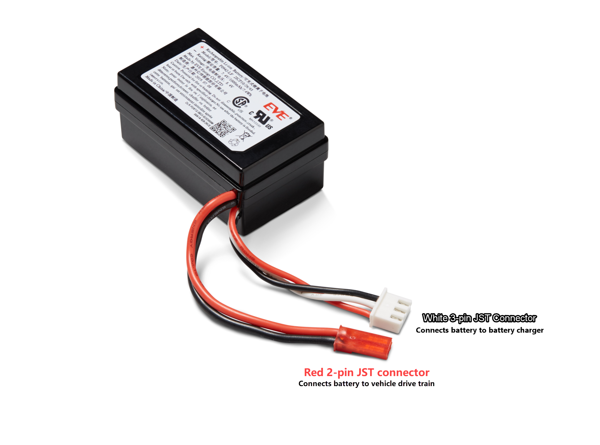

# How to unlock an AWS DeepRacer vehicle battery

after lockout

To unlock your AWS DeepRacer battery after lockout, use the [unlock cable](https://www.amazon.com/gp/product/B0849J6WL9 "https://www.amazon.com/gp/product/B0849J6WL9"):

1. Insert battery connectors into to the matching colored cable connectors, red to red and white to white.

 2. Disconnect the battery from the cable.

 3. Your AWS DeepRacer vehicle battery is immediately ready for use. Reconnect its red 2-pin connector to the vehicle
drive train connector and secure the battery to the vehicle with the Velcro strap. 4. Turn on the vehicle drive train by pushing its switch to the "on" position. Listen for the indicator
sound (two short beeps) to confirm that the battery has been successfully unlocked.
