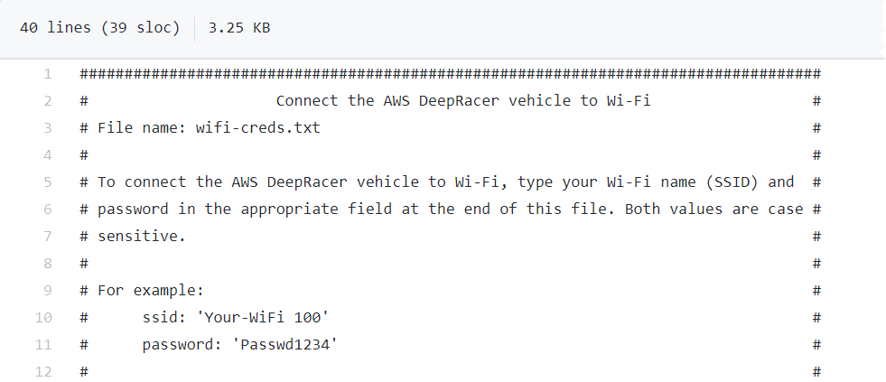
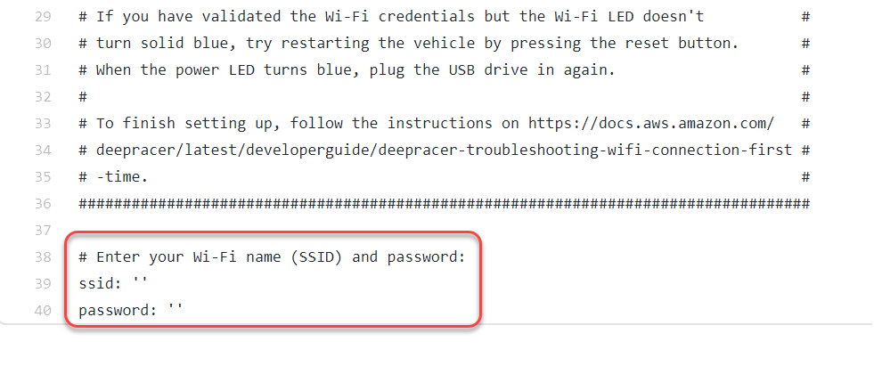
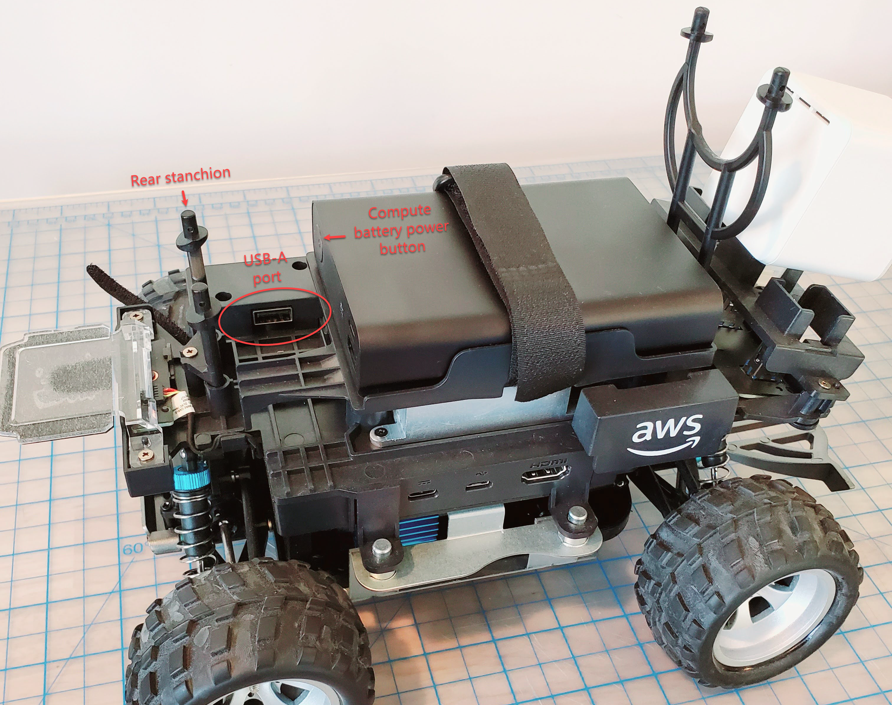
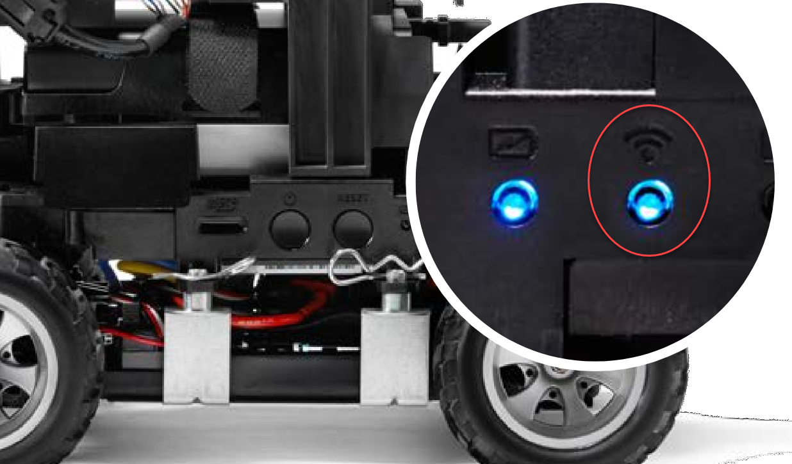
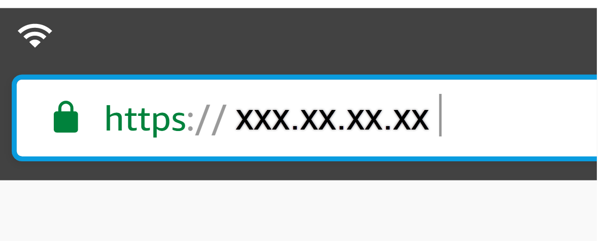

# How to use a USB flash drive to connect AWS DeepRacer to

your Wi-Fi network

To connect an AWS DeepRacer vehicle to your home or office Wi-Fi network using a USB flash drive, you need the
following:

######

- A USB flash drive
- The name (SSID) and password for the Wi-Fi network that you want to join

###### Note

AWS DeepRacer does not support Wi-Fi networks that require active [captcha](https://en.wikipedia.org/wiki/CAPTCHA "https://en.wikipedia.org/wiki/CAPTCHA") verification for user sign-in.

###### To connect an AWS DeepRacer vehicle to a Wi-Fi network using a USB flash drive

1. Plug the USB flash drive into your computer.
2. Open a web browser on your computer and navigate to [https://aws.amazon.com/deepracer/usbwifi](https://aws.amazon.com/deepracer/usbwifi "https://aws.amazon.com/deepracer/usbwifi"). This link opens a text file named
   `wifi-creds.txt` hosted on GitHub.

 3. Save `wifi-creds.txt` to your USB flash drive. Depending on which web browser you use, the text
file might download to your computer and open in your default code editor automatically. If
`wifi-creds.txt` doesn't download automatically, open the context (right-click) menu and choose
**Save as** to save the text file to your USB flash drive.

###### Warning

Do not change the file name. 4. If `wifi-creds.txt` isn't already open, open it in a code editor in plain text mode. Some
text editors default to rich text (.rtf) instead of plain text (.txt) when the file type isn't specified, so
if you are having trouble editing the file, check your settings. If you are using Windows, you can also try to
open the file using the Sublime Text application, which you can download for free, or, if you use a Mac, try
the TextEdit application, which is pre-installed on most Mac devices and defaults to plain text. 5. In between the single quotation marks at the bottom of the file, enter the name (SSID) and password of the
Wi-Fi network that you want to use. SSID stands for "Service Set Identifier." It is the technical term for the
name of your Wi-Fi network.

###### Note

If the network name (SSID) or password contains a space, such as in _Your-Wi-Fi 100_,
enter the name exactly, including the space, inside the quotation marks (''). If there is no space, using
quotation marks is optional. For example, the Wi-Fi password, _Passwd1234_ doesn't
contain a space, so using single quotation marks works but isn't necessary. Both SSID and password are
case sensitive.

 6. Save the file on your USB flash drive. 7. Eject the USB drive from your computer and plug it into the USB-A port on the back of the AWS DeepRacer vehicle
between the compute battery power button and the rear stanchion.

 8. Ensure that the AWS DeepRacer is powered on. 9. Watch the Wi-Fi LED on the vehicle. If it blinks and then changes from white to blue, the vehicle is
connected to the Wi-Fi network. Unplug the USB drive and skip to step 11.

###### Note

If the USB drive was plugged into the vehicle before you attempted to connect the vehicle to a Wi-Fi
network, a list of available Wi-Fi networks will be automatically displayed in
`wifi-creds.txt` file on your flash drive. Uncomment the one that you want to
connect to by removing the pound sign.

 10. If the Wi-Fi LED turns red after blinking, unplug the USB drive from the vehicle and plug it back into your
computer. Check the Wi-Fi name and password that you entered in the text file for typos, errors in spacing,
incorrect sentence casing, or missing or misused single quotation marks. Correct mistakes, and re-save the
file, and repeat Steps 7-9. 11. After the vehicle Wi-Fi LED turns blue, unplug the USB drive from the vehicle and plug it into your
computer. 12. Open the `wifi-creds.txt` file. Find your vehicle's IP address at the bottom of the text
file and copy it. 13. Make sure your computer is in the same network as the vehicle, then paste the IP address into your web
browser.

###### Note

If you are using macOS Catalina, use the Firefox web browser. Chrome is not supported.

 14. When prompted with a message that the connection is not private or secure, accept the security warning and
proceed to the host page.
Your AWS DeepRacer is now connected to Wi-Fi.
