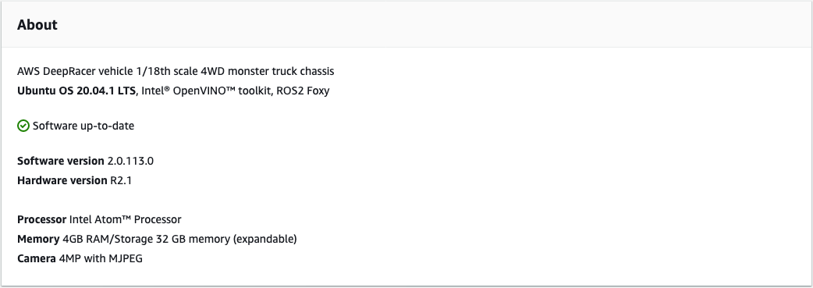
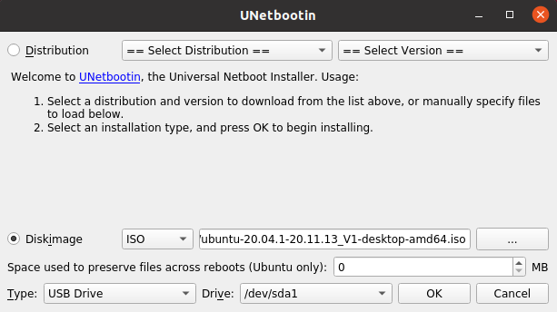
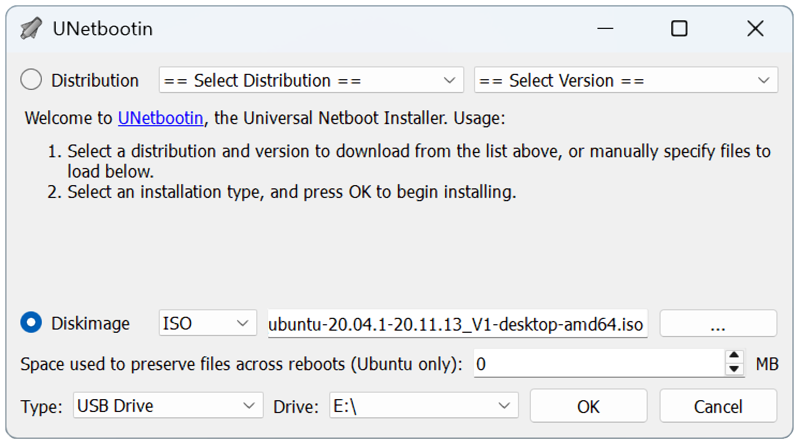
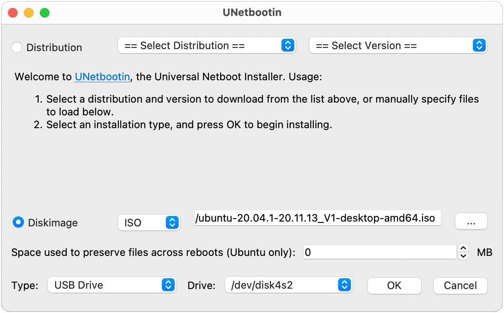

#

Update and restore your AWS DeepRacer device

Update your AWS DeepRacer device to the latest software stack including Ubuntu 20.04 Focal Fossa,
Intel® OpenVINO™ toolkit 2021.1.110, ROS2 Foxy Fitzroy, and Python 3.8. This update is required to run AWS DeepRacer open-source projects but is otherwise optional. AWS DeepRacer only supports Ubuntu 20.04 Focal Fossa and ROS2 Foxy Fitzroy.

###### Important

Updating to the new AWS DeepRacer software stack will wipe all data on your AWS DeepRacer device.

###### Topics

- [Check which software version your AWS DeepRacer device is currently running](#deepracer-ubuntu-update-check-version "#deepracer-ubuntu-update-check-version")
- [Prepare to update your AWS DeepRacer device to the Ubuntu 20.04 software stack](#deepracer-ubuntu-update-preparation "#deepracer-ubuntu-update-preparation")
- [Update your AWS DeepRacer device to the Ubuntu 20.04 software stack](#deepracer-ubuntu-update-instructions "#deepracer-ubuntu-update-instructions")

##

Check which software version your AWS DeepRacer device is currently running

######

To check which software version your AWS DeepRacer device is currently running

1. Log in to the AWS DeepRacer device console. To learn how, follow the steps in [Launch the AWS DeepRacer vehicle's
   device console](deepracer-set-up-vehicle-test-drive.md "deepracer-set-up-vehicle-test-drive.md").
2. Choose **Settings** on the navigation pane.
3. Check the **About** section to verify which software version your AWS DeepRacer Vehicle is currently running.



##

Prepare to update your AWS DeepRacer device to the Ubuntu 20.04 software stack

This topic walks you through the process to create the AWS DeepRacer Ubuntu instalation media. Preparing the bootable USB drive requires additional hardware.

###

Prerequisites

Before you get started, make sure you have the following items ready:

- An AWS DeepRacer device
- A USB flash drive (32 GB or larger)
- A custom AWS DeepRacer [Ubuntu ISO image](https://s3.amazonaws.com/deepracer-public/factory-restore/Ubuntu20.04/BIOS-0.0.8/ubuntu-20.04.1-20.11.13_V1-desktop-amd64.iso "https://s3.amazonaws.com/deepracer-public/factory-restore/Ubuntu20.04/BIOS-0.0.8/ubuntu-20.04.1-20.11.13_V1-desktop-amd64.iso")
  .
- The latest AWS DeepRacer [software update package](https://s3.amazonaws.com/deepracer-public/factory-restore/Ubuntu20.04/BIOS-0.0.8/factory_reset.zip "https://s3.amazonaws.com/deepracer-public/factory-restore/Ubuntu20.04/BIOS-0.0.8/factory_reset.zip")
  .
- A copy of [UNetbootin](https://unetbootin.github.io/ "https://unetbootin.github.io/") compatible with your operating system.
- A computer running Ubuntu, Windows, or macOS to prepare the USB instalation media. You can also use the
  compute module on your AWS DeepRacer device as a Linux computer by connecting a mouse, keyboard, and monitor with
  an HDMI type A cable.

###

Preparation

To prepare the AWS DeepRacer update media, you will perform the following tasks:

- Format the USB drive into the following two partitions:
  - A 4 GB, FAT32 boot partition
  - An NTFS data partition of at least 18 GB

- Make the USB drive bootable to start the update on reboot:
  - Burn the required custom Ubuntu ISO image to the boot partition
  - Copy the required update files to the data partition of the USB drive

### Prepare a bootable USB drive

Follow these instructions to prepare your AWS DeepRacer update media on Ubuntu (Linux), Windows, or macOS.
Depending on the computer you use, specific tasks may differ from one operating system to another.
Choose the tab corresponding to your operating system.

Ubuntu

Follow the instructions here to use an Ubuntu computer, including your AWS DeepRacer device's compute module, to prepare the update media for your AWS DeepRacer device. If you are using a different Linux distribution, replace the `apt-get *` commands with those compatible with your operating system’s package manager.

######

To erase and partition the USB drive

1. Run the following commands to install and launch GParted.

```
sudo apt-get update; sudo apt-get install gparted
sudo gparted
```

2. To erase your USB drive, you will need its device path. To find it on the GParted console and erase the USB drive, do the following:
   1. On the menu bar, choose **View**, then choose **Device Information**. A sidebar showing the selected disk's **Model**, **Size**, and **Path** will appear.
   2. Select your USB drive by going to **GParted** on the menu bar, then **Devices**, finally, select your USB drive from the list. Match the **Size** and **Model** shown in the **Device Description** with your USB drive.
   3. Once you are sure that you've selected the correct disk, delete all its existing partitions.

   If the partitions are locked, open the context (right-click) menu and choose **unmount**.

3. To create the FAT32 boot partition with a 4 GB capacity, select the file icon on the top-left,
   set the following parameters, and choose **Add**.

**Free space preceding:**
`1`

**New size:**
`4096`

**Free space following:**
`<remaining size>`

**Align to:**
`MiB`

**Create as:**
`Primary Partition`

**Partition name:**

**File system:**
`fat32`

**Label:**
`BOOT` 4. To create the NTFS data partition with a minimum 18 GB capacity, select the file icon,
set the following parameters, and choose **Add**.

**Free space preceding:**
`0`

**New size:**
`<remaining size>`

**Free space following:**
`0`

**Align to:**
`MiB`

**Create as:**
`Primary Partition`

**Partition name:**

**File system:**
`nfts`

**Label:**
`Data` 5. On the menu bar, choose **Edit**, then **Apply All Operations**. A warning prompt will appear asking if you want to apply the changes. Choose **Apply**. 6. After the FAT32 and NTFS partitions are created, the USB drive's partition information
will appear in the GParted console. Make note of the `BOOT` partition's drive path, you will need it to complete the next step.

######

To make the USB drive bootable from the FAT32 partition

1. Make sure you downloaded the
   [custom Ubuntu ISO image](https://s3.amazonaws.com/deepracer-public/factory-restore/Ubuntu20.04/BIOS-0.0.8/ubuntu-20.04.1-20.11.13_V1-desktop-amd64.iso "https://s3.amazonaws.com/deepracer-public/factory-restore/Ubuntu20.04/BIOS-0.0.8/ubuntu-20.04.1-20.11.13_V1-desktop-amd64.iso") from the pre-requisites section.
2. If you're using Ubuntu 20.04, you need to run UNetbootin using its binary file. To do this:
   1. Download the latest [UNetbootin binary file](https://unetbootin.github.io/ "https://unetbootin.github.io/") to your Downloads folder. In our example, we use `unetbootin-linux64-702.bin`.
   2. Press **Ctrl+Alt+T** to open a new terminal window. Alternatively, choose **Activities** on the menu bar, enter `terminal` in the search bar, then select the **Terminal** icon.
   3. Use the following commands to navigate to the binary file location, give the file execute permission, and run UNetbootin. Make sure to adjust the file name in the commands if the version doesn't match the one on your downloaded binary file.

   ```
   cd Downloads
   sudo chmod +x ./unetbootin-linux64-702.bin
   sudo ./unetbootin-linux64-702.bin
   ```

   If you're using an older version of Ubuntu, install UNetbootin from its repository by running the following commands:

```
sudo add-apt-repository ppa:gezakovacs/ppa
sudo apt-get update; sudo apt-get install unetbootin
sudo unetbootin
```

3.  On the **UNetbootin** console, do the following:

        1. Select the **Disk image** radio button.
        2. For the disk image type, choose **ISO** from the drop-down list.
        3. Open the file selector and choose the [Ubuntu ISO](https://s3.amazonaws.com/deepracer-public/factory-restore/Ubuntu20.04/BIOS-0.0.8/ubuntu-20.04.1-20.11.13_V1-desktop-amd64.iso "https://s3.amazonaws.com/deepracer-public/factory-restore/Ubuntu20.04/BIOS-0.0.8/ubuntu-20.04.1-20.11.13_V1-desktop-amd64.iso") provided in the pre-requisites section.
        4. For **Type**, choose **USB Drive**.
        5. For **Drive**, choose the drive path for your `BOOT` partition, in our case **`/dev/sda1`**.
        6. Choose **OK**.

    

###### Tip

If you get a **/dev/sda1 not mounted** alert message, choose **OK** to close the
message, unplug the USB drive, plug in the drive again, and then follow the preceding steps to create the Ubuntu
ISO image.

######

To extract the AWS DeepRacer update files to the NTFS partition

1. Unzip the[software update package](https://s3.amazonaws.com/deepracer-public/factory-restore/Ubuntu20.04/BIOS-0.0.8/factory_reset.zip "https://s3.amazonaws.com/deepracer-public/factory-restore/Ubuntu20.04/BIOS-0.0.8/factory_reset.zip") you downloaded from the prerequisites section.
2. Extract the contents of the update package to the root of your USB drive's Data (NTFS) partition.

Windows

Follow the instructions here to use a Windows computer to prepare the update media for your AWS DeepRacer device.

######

To erase the USB drive

1. Open the Windows command prompt, enter `diskpart`, and choose **OK** to launch Windows DiskPart.
2. Once the terminal for Microsoft DiskPart opens, list the available disks to find the USB drive you want to clean by entering
   `list disk` after the **DISKPART>** prompt.
3. Select the disk corresponding to your USB drive. For example, we entered `select Disk 2` after the
   **DISKPART>** prompt. Read the output carefully to verify that you have chosen the disk you
   want to clean because the next step is irreversible.
4. Once you are sure that you've selected the correct disk, enter `Clean` after the
   **DISKPART>** prompt.
5. Enter `list disk` after the **DISKPART>** prompt again. Find the disk you cleaned
   on the table and compare the disk size to the free disk space. If the two values match, the cleaning was successful.
6. Exit the Windows **DiskPart** console by entering `Exit` after the
   **DISKPART>** prompt.

######

To partition the USB drive

1. Open the Windows command prompt, enter `diskmgmt.msc`, and choose **OK**
   to launch the **Disk Management** console.
2. From the **Disk Management** console, select your USB drive.
3. To create the FAT32 partition with a 4 GB capacity, open the context (right-click) menu on your USB drive's **Unallocated** space and choose **New Simple Volume**.
   The New Simple Volume Wizard will appear.
4. Once the New Simple Volume Wizard appears, do the following:
   1. On the **Specify Volume Size** page, set the following parameter and then choose **Next**.

   **Simple volume size in MB:**
   `4096` 2. On the **Assign Drive Letter or Path** page, check the **Assign the following drive letter:** radio button and select a drive letter from the drop down list, then choose **Next**. Make note of the assigned drive letter, you will need it later to make the FAT32 partition bootable. 3. On the **Format Partition** page,
   check the **Format this volume with the following settings** radio button and set the following parameters, then choose **Next**.

   **File system:**
   `FAT32`

   **Allocation unit size:**
   `Default`

   **Volume label:**
   `BOOT`

   Leave **Perform a quick format** checked.

5. To create the NTFS partition with the remaining disk capacity, open the context (right-click) menu on your USB drive's remaining **Unallocated** space and choose **New Simple Volume**. The New Simple Volume Wizard will appear.
6. Once the New Simple Volume Wizard appears, do the following:
   1. On the **Specify Volume Size** page, set the **Simple volume size in MB** to match the **Maximum disk space in MB**, then choose **Next**.
   2. On the **Assign Drive Letter or Path** page, check the **Assign the following drive letter:** radio button and select a drive letter from the drop down list, then choose **Next**.
   3. On the **Format Partition** page,
      check the **Format this volume with the following settings** radio button and set the following parameters, then choose **Next**.

   **File system:**
   `NTFS`

   **Allocation unit size:**
   `Default`

   **Volume label:**
   `Data`

   Leave **Perform a quick format** checked.

######

To make the USB drive bootable from the FAT32 partition

1.  Make sure you've downloaded the [customized Ubuntu ISO image](https://s3.amazonaws.com/deepracer-public/factory-restore/Ubuntu20.04/BIOS-0.0.8/ubuntu-20.04.1-20.11.13_V1-desktop-amd64.iso "https://s3.amazonaws.com/deepracer-public/factory-restore/Ubuntu20.04/BIOS-0.0.8/ubuntu-20.04.1-20.11.13_V1-desktop-amd64.iso") from the prerequisites section.
2.  After downloading [UNetbootin](https://unetbootin.github.io/ "https://unetbootin.github.io/"), start the **UNetbootin** console.
3.  On the UNetbootin console, do the following:

        1. Check the **Disk image** radio button.
        2. For **disk image**, choose **ISO** from the drop-down list.
        3. Open the file picker and choose the custom Ubuntu ISO file.
        4. For **Type**, choose **USB Drive**.
        5. For **Drive**, choose the drive letter corresponding to the FAT32 partition you created.
         In our case, it's `E:\`.
        6. Choose **OK**.

    

######

To extract the AWS DeepRacer update files to the NTFS partition

1. Unzip the[software update package](https://s3.amazonaws.com/deepracer-public/factory-restore/Ubuntu20.04/BIOS-0.0.8/factory_reset.zip "https://s3.amazonaws.com/deepracer-public/factory-restore/Ubuntu20.04/BIOS-0.0.8/factory_reset.zip") you downloaded from the prerequisites section.

###### Tip

If your favorite tool can't unzip the file successfully, try using the PowerShell
[Expand-Archive](https://docs.microsoft.com/en-us/powershell/module/microsoft.powershell.archive/expand-archive?view=powershell-6 "https://docs.microsoft.com/en-us/powershell/module/microsoft.powershell.archive/expand-archive?view=powershell-6") command. 2. Extract the contents of the update package to the root of your USB drive's Data (NTFS) partition.

macOS

Follow the instructions here to use a Mac to prepare the update media for your AWS DeepRacer device.

######

To erase and partition the USB drive

1. Plug in the USB drive to your Mac.
2. Press **Command+Space bar** to open the **Spotlight** search field,
   then enter `Disk Utility`.

Alternatively, you can choose **Finder** > **Applications** > **Utilities** > **Disk Utility** to open Disk Utility. 3. On the menu bar, choose **View**, then **Show All Devices**. 4. In the sidebar, under **External**, select the USB drive that you want to format and then choose **Erase**. 5. A new window will ask you to confirm that you want to erase your USB drive and will allow you to change its **Name**, **Format**, and **Partition Scheme**.
You don't need to change the name yet, for **Format** and **Scheme**, select the following options and choose **Erase**.

    * **Format:** Mac OS Extended (Journaled)
    * **Scheme:** GUID Partition Map

Once the erase process is complete, choose **Done** on the dialog window. 6. On the main Disk Utility window, select your USB drive from the sidebar, choose
**Partition** from the toolbar on the top. A window titled **Partition device "`YOUR-USB-DRIVE`"?** will pop up. Select the **add (+)**
button to create a new partition. 7. Once you create the new partition, under **Partition Information**, choose and enter the following:

    * **Name:** `BOOT`
    * **Format:** MS-DOS (FAT)
    * **Size:**  `4` GB

###### Tip

If the **Size** input box is grayed out after choosing MS-DOS (FAT) as the format, you can drag the resize control on the partition graph until
the `BOOT` partition is 4 GB.

Do not choose **Apply** yet. 8. Select the other **Untitled** partition, choose and enter the following options under **Partition Information**:

    * **Name:** `Data`
    * **Format:** ExFAT
    * **Size:**  the remaining space of the USB drive (in GB)

Choose **Apply**. 9. A new window will pop up and show you the changes that will be made to the USB Drive. Verify that these changes are correct. To confirm and begin the creation of the new partitions, choose **Partition**. 10. On the Disk Utility console, choose the **BOOT** partition from the Sidebar,
then select **Info** from the Toolbar. Make note of the **BSD device node** value, it might be different from the one used in this tutorial.
In our case, the value assigned is `disk4s2`. You need to supply this path when making the USB drive bootable from the
FAT32 partition.

######

To make the USB drive bootable from the FAT32 partition

1. Make sure you've downloaded the [customized Ubuntu ISO image](https://s3.amazonaws.com/deepracer-public/factory-restore/Ubuntu20.04/BIOS-0.0.8/ubuntu-20.04.1-20.11.13_V1-desktop-amd64.iso "https://s3.amazonaws.com/deepracer-public/factory-restore/Ubuntu20.04/BIOS-0.0.8/ubuntu-20.04.1-20.11.13_V1-desktop-amd64.iso") from the prerequisites section.
2. After downloading [UNetbootin](https://unetbootin.github.io/ "https://unetbootin.github.io/"), select **open** from the context (right-click) menu. A security prompt will appear asking if you want to open the application, select **open**
   to start the UNetbootin console.

If you are using a [Mac with Apple Silicon](https://support.apple.com/en-us/HT211814 "https://support.apple.com/en-us/HT211814"), and the UNetbootin console does not show after selecting **open**, make sure that Rosetta 2 is installed by following these steps:

    1. Open a terminal window by choosing **Finder** > **Applications** > **Utilities** > **Terminal**.
    2. Enter the following command to install Rosetta 2:


    ```
    softwareupdate --install-rosetta
    ```
    3. Retry opening UNetbootin.

3. On the UNetbootin console, do the following:
   1. Check the **Disk image** radio button.
   2. For **disk image**, choose **ISO** from the drop-down list.
   3. Open the file picker and choose the custom Ubuntu ISO file.
   4. For **Type**, choose **USB Drive**.
   5. For **Drive**, choose the BSD device node for your BOOT partition, in our case, `/dev/disk4s2`.
   6. Choose **OK**.

   ###### Tip

If you get a **/dev/disk4s2 not mounted** alert message, choose **OK** to close
the message, unplug the USB drive, replug the drive, and then follow the steps above create the Ubuntu ISO image.

######

To extract the AWS DeepRacer update files to the ExFAT partition

1. Unzip the[software update package](https://s3.amazonaws.com/deepracer-public/factory-restore/Ubuntu20.04/BIOS-0.0.8/factory_reset.zip "https://s3.amazonaws.com/deepracer-public/factory-restore/Ubuntu20.04/BIOS-0.0.8/factory_reset.zip") you downloaded from the prerequisites section.
2. Extract the contents of the update package to the root of your USB drive's Data (ExFAT) partition.

##

Update your AWS DeepRacer device to the Ubuntu 20.04 software stack

Once you create the USB update media as described in the previous steps, you can update your AWS DeepRacer device to the latest software stack including Ubuntu 20.04 Focal Fossa,
Intel® OpenVINO™ toolkit 2021.1.110, ROS2 Foxy Fitzroy, and Python 3.8.

###### Important

Updating to the new AWS DeepRacer software stack will wipe all data on your AWS DeepRacer device.

######

To update your AWS DeepRacer device software to the Ubuntu 20.04 stack

1. Connect your AWS DeepRacer device to a monitor. You'll need an HDMI-to-HDMI, HDMI-to-DVI, or similar
   cable. Insert the HDMI end of the cable into the compute module's HDMI port and
   plug the other end into a compatible port on the monitor.
2. Connect a USB keyboard and mouse. The AWS DeepRacer device's compute module has three USB ports in the front of the vehicle,
   on either side of and including the port into which the camera is plugged. A fourth USB port is found at the back
   of the vehicle, in the space between the compute battery and the LED tail light.
3. Insert the USB update media into an available USB port on your compute module. Turn on the power or reset your AWS DeepRacer device and repeatedly press
   the **ESC** key to enter the BIOS.
4. From the BIOS window, choose **Boot From File**, then select the option with your boot partition's name, in our case it's named **BOOT**
   , then select **<EFI>**, then **<BOOT>**, and finally **BOOTx64.EFI**.
5. After the compute module has booted, a terminal window will appear on the desktop to display the progress. The AWS DeepRacer device will automatically begin the update process after ten seconds.
   You don't need to provide any input at this stage.

If an error occurs and the update fails, restart the procedure from **Step 1**. For detailed error
messages, see the `result.log` file generated on the USB drive's data partition. 6. Wait for the update to complete. When the factory reset is complete the terminal window will close automatically. 7. After the device software is updated, disconnect the USB drive from the
compute module. You can now reboot or shut down your AWS DeepRacer device. 8. The AWS DeepRacer device defaults to the following user credentials after update. You will be prompted to change your password on your first login.

**User:** Deepracer

**Password:** `deepracer`
