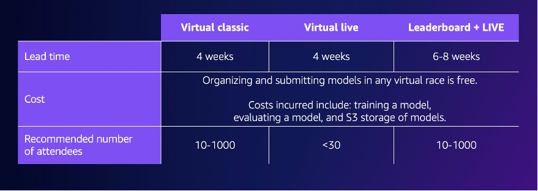
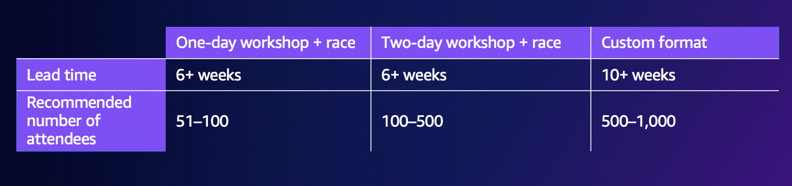

# Getting started with your AWS DeepRacer event

Once you've defined your organization's goals, you can use your project plan to begin
narrowing down the type of event you want to hold. The following example goals demonstrate how you
can set up an event based on your requirements and the benefits you want to gain
from AWS DeepRacer.

**Team building**

If you want to host a one-time local event that encourages team building for
smaller groups, consider an in-person or virtual event. For an
example of the type of event that meets this goal, see [Virtual event examples](#virtual-event-examples "#virtual-event-examples").

**Investing in AI/ML education**

If you want your technical and non-technical employees to become more familiar with
machine learning and apply these skills, you should consider asking for more leadership
support and think about making your event a cross-team event, which includes more
participants to create a larger organizational impact. This event can include both
in-person and virtual event components to allow for participant scaling. For an example
of the type of event that meets this goal, see [In-Person event examples](#in-person-event-examples "#in-person-event-examples").

**Promote and generate organization awareness**

If you want to position your organization as innovative and thought leaders to attract more talent
and encourage more general awareness within your organization, consider livestreaming your virtual or
in-person event, or creating a custom event. For an example of the type of event that meets this
goal, see [Custom event
example](#custom-event-example "#custom-event-example").

## AWS DeepRacer event examples

The following sections provide some examples of the different types of events you can create based
on your goals and project plan requirements. These event timelines are scheduled based on the education and race components. However, you can customize your event timeline for any number of event components based on your organizational needs.

### Virtual event examples

Virtual events are a great way for organizations across multiple locations or
multi-regional teams to gather in a convenient and cost-effective way. Virtual
events are more convenient and cost-effective because they have fewer
dependencies. For example, you don't need to consider physical tracks, devices,
or a location space like you would for an in-person event. The following virtual
event examples focus on different project plan items, such as timeline and
number of participants.

- **Virtual classic race two-week event**:

The following example of a two-week event schedule is a great option for
organizations looking for a simple way to host an event with many
participants and teams planning to join the race, since there is no
limit to classic race submissions and no Live race time constraints. All
participants can submit their models at any time, even simultaneously,
within the race window. This event example uses the community races section in the AWS console
to create a private classic race and schedules the training and races in two separate weeks. To learn how to set up a community race, see [Manage your
races](deepracer-manage-community-races.md "deepracer-manage-community-races.md").

    + Day 1: Participants attend a free, on-demand virtual workshop for all
     attendees. For more information about the online workshop resource, see
     [AWS DeepRacer: Driven by Reinforcement Learning](https://explore.skillbuilder.aws/learn/course/external/view/elearning/87/aws-deepracer-driven-by-reinforcement-learning "https://explore.skillbuilder.aws/learn/course/external/view/elearning/87/aws-deepracer-driven-by-reinforcement-learning").
     You can also schedule an AWS DeepRacer Pit Crew expert to deliver a
     virtual workshop.
    + Days 1 - 5: Participants train, update, and test their models in the AWS DeepRacer console. They submit
     their models to compete in a private virtual race throughout days 1-5. To learn how to set up the AWS console for multiple
     participants under one AWS account, see [Multi-user Mode](multi-user-mode.md "multi-user-mode.md").
    + Days 5 - 10: The top 10 winners are identified on day 5 and provided
     with access to a new private virtual race on a new track in the
     following week.
    + Day 10: The top three winners are identified on day 10 and the race and event
     concludes.

- **Virtual live race one-week event:**

The following Virtual live race event example is a great way to bring the excitement and fun
of racing in real time to smaller teams. This type of event is low-budget and
allows everyone to race in real time. For more information about how to
run a live race, see [Run a LIVE
race](deepracer-moderate-live-community-race.md "deepracer-moderate-live-community-race.md").

    + Day 1: Participants attend a virtual workshop with an AWS DeepRacer Pit Crew expert. For more
     information about workshops, see [AWS DeepRacer
     Events](https://aws.amazon.com/deepracer/enterprise/ "https://aws.amazon.com/deepracer/enterprise/").
    + Days 1 - 5: Participants train, update, and test their models in the AWS DeepRacer console from days 1-5.
    + Day 5: Participants gather for 1-2 hours online to submit their
     models and participate in a live virtual race on day 5.

- **Virtual classic race and live race event:**

The following event example is a great option for organizations that want to unite many multi-regional
participants or participants working remotely across multiple offices online. In this type of
event, your participants have more opportunities to practice
training their models and race since the event timeline is spread out across two weeks. We also recommend having an announcer at
your live race events to make your event more exciting for participants
watching the livestream. Check out the [Pro Division Finale Twitch stream](https://www.twitch.tv/aws/clip/FrigidEasyCurryLitty-K41oF2nfXL-2Knxb "https://www.twitch.tv/aws/clip/FrigidEasyCurryLitty-K41oF2nfXL-2Knxb") to see how the finale broadcasters make the race more exciting.

    + Day 1: Participants attend virtual workshop with an AWS DeepRacer Pit Crew expert. For more
     information about workshops, see [AWS DeepRacer
     Events](https://aws.amazon.com/deepracer/enterprise/ "https://aws.amazon.com/deepracer/enterprise/").
    + Days 1-5: Participants train, update, and test their models in the AWS DeepRacer console and then submit
     models to compete in a private league race from days 1-5.
    + Day 5: The top 10 winners are identified and provided with access to a new private league race on a new track.
    + Days 5 - 10: On the following week, the top 10 winners are identified and race while live streaming the event on Twitch. For more information, see [Broadcast a LIVE race](deepracer-broadcast-live-community-race.md "deepracer-broadcast-live-community-race.md").

### In-person event examples

For organizations that are able to gather their participants in a single physical
space, there is no better way to experience AWS DeepRacer than an in-person event.
Nothing beats experiencing the thrill and excitement of standing trackside and
seeing your model perform on a physical car. In general, in-person events
require more resources and are more expensive than virtual events. For any
organization that has more than 50 participants and the necessary budget, we
highly recommend taking advantage of the in-person AWS DeepRacer experience. We also
recommend having an announcer at these in-person events to make your races even
more exciting as competition results are announced in real time for participants
watching from the trackside.

- **In-person one-day event:**

The following example of an in-person event is great for local teams and ensures that
all participants can train their first model in the AWS Management Console and
compete in one day. A typical one-day in-person event consists of an
in-person workshop and race for all attendees. The workshop is usually led by an
AWS DeepRacer Pit Crew expert who goes through
the fundamentals of reinforcement learning and gives participants an
opportunity to train their first model. Following the workshop, participants
can submit their models and upload them to an AWS DeepRacer device and
race on the same day.

    + Participants attend an in-person AWS DeepRacer workshop delivered by an AWS DeepRacer Pit Crew expert (90-120
     minutes). For more information on how to request AWS DeepRacer
     workshops, see [Request an event](https://pages.awscloud.com/GLOBAL-ln-GC-DeepRacer-Enterprise-Events-2021-interest.html "https://pages.awscloud.com/GLOBAL-ln-GC-DeepRacer-Enterprise-Events-2021-interest.html").
    + In-person race following the workshop (120 minutes or ~5 minutes per race).

- **In-person two-day event:**

The following two-day in-person event example is similar to the one-day
event, except that spreading out the workshop and actual race on
separate days gives participants more time to train and update their
models as they prepare for the race. It’s common for organizations to
host these events over a few days or even weeks apart to give
participants more time to train and refine their models. Providing more
time in between workshops and races allows participants to have a more
competitive race day.

    + Day 1: Participants attend an in-person AWS DeepRacer workshop delivered by an AWS DeepRacer Pit Crew expert
     (90-120 minutes). For more information on how to request in-person
     workshops, see [Request an event](https://pages.awscloud.com/GLOBAL-ln-GC-DeepRacer-Enterprise-Events-2021-interest.html "https://pages.awscloud.com/GLOBAL-ln-GC-DeepRacer-Enterprise-Events-2021-interest.html").
    + Day 2: Participants attend an in-person race following the workshop (120 minutes or approxiamtely 5 minutes per race).

### Custom event example

As with virtual events, custom events are a great option for larger organizations (100 participants or more) that need to host an event for
teams across multiple locations. Custom events allow you to be more flexible
with training, workshops, and races because there are no limits on time and
race formats. You can include both virtual and in-person races in these events
and these races can span multiple weeks to allow global participants to
spend more time training their models and collaborating. This type of custom
event is more successful when you first run a few
smaller events beforehand to prepare for any potential logistical issues. This
type of event or series of events also helps cultivate a team of machine
learning evangelists in your own organization.

- In the following example, the custom event is spread across three months to accommodate employees across multiple regions.
  - Month 1: Global workshops in multiple locations.
  - Month 2: Month-long virtual league qualifier races available to participants in multiple regions.
  - Month 3: In-person race and virtual Championship Cup race. This in-person race can be
    livestreamed so your global teams can watch.

If you're interested in hosting a custom event, contact AWS to get event support. See [Request an event](https://pages.awscloud.com/GLOBAL-ln-GC-DeepRacer-Enterprise-Events-2021-interest.html "https://pages.awscloud.com/GLOBAL-ln-GC-DeepRacer-Enterprise-Events-2021-interest.html").

## Additional resources

For more resources related to AWS DeepRacer events, refer to the following list:

- [AWS DeepRacer Blog](https://aws.amazon.com/blogs/machine-learning/accenture-drives-machine-learning-growth-in-one-of-the-worlds-largest-private-aws-deepracer-leagues/ "https://aws.amazon.com/blogs/machine-learning/accenture-drives-machine-learning-growth-in-one-of-the-worlds-largest-private-aws-deepracer-leagues/")
- [AWS DeepRacer League](https://aws.amazon.com/blogs/machine-learning/announcing-the-aws-deepracer-league-2022/ "https://aws.amazon.com/blogs/machine-learning/announcing-the-aws-deepracer-league-2022/")
- [AWS DeepRacer community Slack channel](http://join.deepracing.io/ "http://join.deepracing.io/")
- [Machine learning training](https://aws.amazon.com/machine-learning/mlu/ "https://aws.amazon.com/machine-learning/mlu/")
- [Machine learning certification](https://aws.amazon.com/certification/certified-machine-learning-specialty/ "https://aws.amazon.com/certification/certified-machine-learning-specialty/")
- [AWS DeepRacer training](https://explore.skillbuilder.aws/learn/course/internal/view/elearning/87/aws-deepracer-driven-by-reinforcement-learning "https://explore.skillbuilder.aws/learn/course/internal/view/elearning/87/aws-deepracer-driven-by-reinforcement-learning")
- [AWS DeepRacer GitHub repository](https://github.com/aws-samples/aws-deepracer-workshops/ "https://github.com/aws-samples/aws-deepracer-workshops/")
- [Racing tips](https://aws.amazon.com/deepracer/racing-tips/ "https://aws.amazon.com/deepracer/racing-tips/")
- [AWS DeepRacer YouTube channel](https://www.youtube.com/playlist?list=PLhr1KZpdzukfQBjBInkkaUuxDMLj_TaHO "https://www.youtube.com/playlist?list=PLhr1KZpdzukfQBjBInkkaUuxDMLj_TaHO")
- [AWS DeepRacer storefront](https://www.amazon.com/b/?node=32957528011&ref_=aws_dr_sf_doc_dg_bw "https://www.amazon.com/b/?node=32957528011&ref_=aws_dr_sf_doc_dg_bw")
