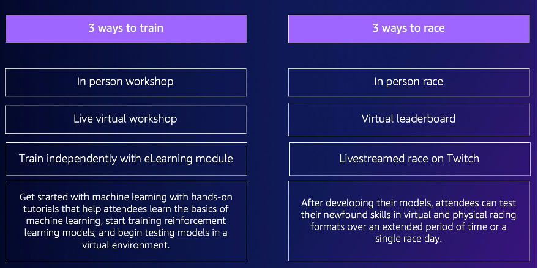

# How AWS DeepRacer events work and what to expect

Whether you want to provide education and hands-on practice with reinforcement
learning for your team, promote your organization to attract new talent, or a
combination of both, this guide provides the tools and resources to help you create
and customize your own AWS DeepRacer event.

AWS DeepRacer events are flexible to suit your needs and objectives, but the basic formula for an AWS DeepRacer event includes:

- An educational component, such as an [online AWS DeepRacer reinforcement learning course](https://explore.skillbuilder.aws/learn/course/external/view/elearning/87/aws-deepracer-driven-by-reinforcement-learning "https://explore.skillbuilder.aws/learn/course/external/view/elearning/87/aws-deepracer-driven-by-reinforcement-learning") or in-person workshop with
  an AWS DeepRacer Pit Crew expert.
- Hands-on model training in the AWS console and time for participants to create and train their models.
- An AWS DeepRacer race, such as a single in-person race or multiple virtual races, so
  that participants can see their trained machine learning models in action. For
  more information about the types of races you can host, see [Types of AWS DeepRacer races](#types-of-races "#types-of-races").
- A post-event recap or next steps communication for event participants.

For more context about what to expect from AWS DeepRacer events and customer highlights, see the [AWS
DeepRacer Accelerate YouTube video](https://www.youtube.com/watch?v=NWTQ35telYk "https://www.youtube.com/watch?v=NWTQ35telYk").

## What to consider before getting started

The first step in planning your event is to define your business objectives and
goals for your organization and then develop a project plan. An example of a goal
is, “I want to encourage team building in a fun and educational way in my
organization.”

Your project plan should answer the following questions:

- **Who are your event leaders?**

Identify who in your organization is helping lead the planning and execution of this event. Event leaders might include teams like Facilities, Human Resources, PR/Marketing, an Executive sponsor, or AWS account team

- **Who are the event owners?**

Identify who in your organization owns the event. This person or team
should be the primary organizer and should be part of all decisions when
planning this event.

- **What is the event date?**

Identify when you want to hold the event. If you are considering a large event
(with more than 100 participants), you need to schedule your event date
further out to provide enough lead time to plan and facilitate the event.
For an example timeline, refer to [AWS DeepRacer event examples](getting-started-with-your-event.md#aws-deepracer-event-examples "getting-started-with-your-event.md#aws-deepracer-event-examples").

- **What is the estimated budget?**

Estimate a budget for your event. There are two cost considerations you should
plan for with an event.

    + **The event costs**: If you're hosting an in-person event, this can include everything from the
     event location, track, and device purchases to food, beverages, and
     event prizes.
    + **Model training costs**: This cost is incurred by your employees training reinforcement learning
     models on the AWS Management Console using the AWS DeepRacer service. For example, each
     participant needs approximately 10 hours to train one or
     multiple models in the AWS DeepRacer console. For more details about costs, see [AWS DeepRacer
     Pricing](https://aws.amazon.com/deepracer/pricing/ "https://aws.amazon.com/deepracer/pricing/").

- **What kind of location is necessary for the event?**

If you are holding an in-person event, you need to procure a physical location for the workshop and race. The type of physical track you select also needs to fit in the location.

- **What is the estimated number of participants?**

Estimate the number of participants attending your event. The number of participants also factors into your estimated budget.

- **Do you plan to have a retrospective session after the event to gauge success?**

To encourage participants to continue growing their ML skills and keep collaborating, consider communicating next steps and asking for participant feedback. For example, send a survey to participants to gauge interest and recruit AI/ML leaders within the organization. This may also determine who is involved with future AWS DeepRacer events.

- **What is the communications strategy to promote the event in your organization?**

Communicating this event within your organization can be as simple as an internal email or calendar invite.

- **Who are the executive stakeholders?**

Identify the executives that are sponsoring the event and encouraging thought leadership and collaboration within your organization.

## Types of AWS DeepRacer races

After answering the main questions for your project plan, decide what type of races you want at your event. The type of race you host should be based on your estimated budget and number of
participants for the event. You can host the following two types of races.

**Virtual racing**

Virtual racing is a great way for multi-region or remote teams to collaborate and race
their trained models in a virtual environment. Since virtual racing doesn't require physical devices and tracks, it provides flexibility in group size and it's a great solution
for organizations that have location and budget constraints.

There are two types of virtual racing: classic racing and live racing. The
main difference between classic racing and live racing is that classic
racing participants can train their models and submit them on their own
time. Live Racing involves participants racing their models one after
another within a set amount of time. Both types of races can be shared
privately or publicly and use leaderboards to determine participant ranking.
AWS also provides tools so you can broadcast your races on Twitch.

Virtual racing is the fastest way to get started with AWS DeepRacer races. Participants
can go through the getting started process, which includes an introduction
to machine learning and reinforcement learning in the console. The
console guides the participants through creating their first model. For more information
about how to set up a virtual race, see [Create a Race](deepracer-create-community-race.md "deepracer-create-community-race.md").

**In-person racing**

Host an in-person race to provide an engaging event that your team
can attend in-person. In-person racing includes a physical track and AWS DeepRacer vehicle
devices. AWS provides options for building your track and procuring vehicles for your event.

For more information about AWS DeepRacer devices, see [Operate your AWS DeepRacer vehicle](operate-deepracer-vehicle.md "operate-deepracer-vehicle.md").
For more information about constructing and ordering your physical track and
barriers, see [Build your physical
track](deepracer-build-your-track.md "deepracer-build-your-track.md").

In addition to these two types of races, you can also include educational online training or workshops and livestream your race events on Twitch.

## Best practices

To make your AWS DeepRacer event planning even more efficient, we also recommend the following best practices.

- Gain internal leader support. Support from organization leaders encourages team participation and increases engagement and overall participant satisfaction.
- If you have an AWS Account Manager, contact them to inform them of your event and discuss whether you need any support.
- If you're planning a large event (with more than 50 participants), engage with
  your AWS Account Managers early and often. Submit a request if you aren't sure who to contact on your AWS
  account team. To submit a request, see [Request an
  event](https://pages.awscloud.com/GLOBAL-ln-GC-DeepRacer-Enterprise-Events-2021-interest.html "https://pages.awscloud.com/GLOBAL-ln-GC-DeepRacer-Enterprise-Events-2021-interest.html"). For more resources from the AWS DeepRacer community about
  events and training, see the [AWS DeepRacer Slack channel](http://join.deepracing.io/ "http://join.deepracing.io/").
- Establish a budget that meets your AWS DeepRacer event goals. Your budget might affect the type of event you’re planning, but AWS DeepRacer provides tools, such as [multi-user mode](multi-user-mode.md "multi-user-mode.md"), to help limit and manage costs.
- Provide prizes for your participants. Whether your team is interested in the traditional championship
  cup or NFTs, make sure your prizes are appealing to encourage participation.
