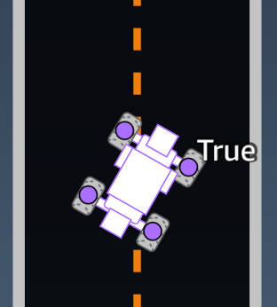
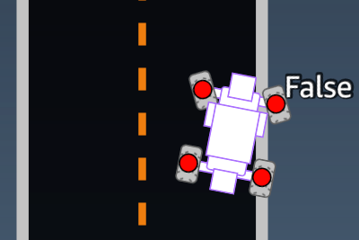
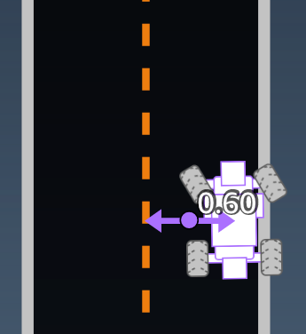
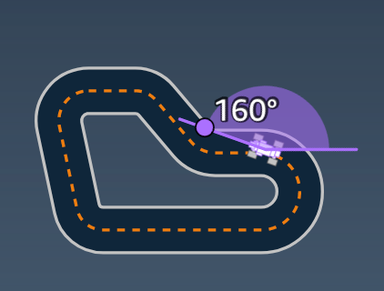
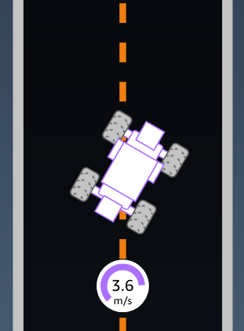
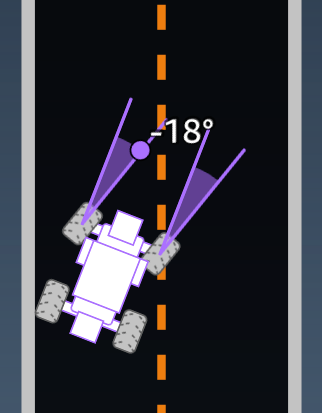
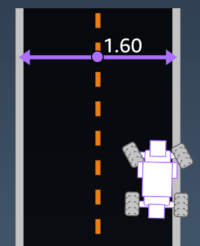
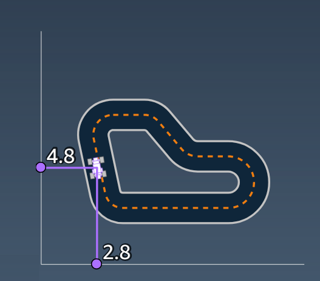
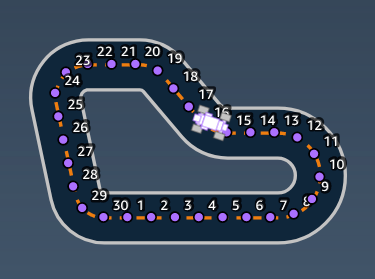

# Customizing a reward function

Creating a reward function is like designing an incentive plan. Parameters are values that can be used to develop your incentive plan.

Different incentive strategies result in different vehicle behaviors. To encourage the vehicle to drive faster, try awarding negative values when the car takes too long to finish a lap or goes off the track. To avoid zig-zag driving patterns, try defining a steering angle range limit and rewarding the car for steering less aggressively on straight sections of the track.

You can use waypoints, which are numbered markers placed along the centerline and outer and inner edges of the track, to help you associate certain driving behaviors with specific features of a track, like straightaways and curves.

Crafting an effective reward function is a creative and iterative process. Try different strategies, mix and match parameters, and most importantly, have fun!

###### Topics

- [Editing Python code to customize your reward function](#edit-reward-function "#edit-reward-function")
- [Input parameters of the AWS DeepRacer
  reward function](#deepracer-reward-function-input "#deepracer-reward-function-input")

## Editing Python code to customize your reward function

In AWS DeepRacer Student, you can edit sample reward functions to craft a custom racing strategy for your model.

###### To customize your reward function

1. On the **Step 5: Customize reward function** page of the AWS DeepRacer Student **Create model** experience, select a sample reward function.
2. Use the code editor below the sample reward function picker to customize the reward function's input parameters using Python code.
3. Select **Validate** to check whether or not your code will work. Alternatively, choose **Reset** to start over.
4. Once you're done making changes, select **Next**.

Use [Input parameters of the AWS DeepRacer
reward function](#deepracer-reward-function-input "#deepracer-reward-function-input") to learn about each parameter. See how different parameters are used in reward function examples.

## Input parameters of the AWS DeepRacer

reward function

The AWS DeepRacer reward function takes a dictionary object passed as the variable, `params`, as the input.

```
def reward_function(params) :

    reward = ...

    return float(reward)
```

The `params` dictionary object contains the following key-value
pairs:

```
{
    "all_wheels_on_track": Boolean,        # flag to indicate if the agent is on the track
    "x": float,                            # agent's x-coordinate in meters
    "y": float,                            # agent's y-coordinate in meters
    "closest_objects": [int, int],         # zero-based indices of the two closest objects to the agent's current position of (x, y).
    "closest_waypoints": [int, int],       # indices of the two nearest waypoints.
    "distance_from_center": float,         # distance in meters from the track center
    "is_crashed": Boolean,                 # Boolean flag to indicate whether the agent has crashed.
    "is_left_of_center": Boolean,          # Flag to indicate if the agent is on the left side to the track center or not.
    "is_offtrack": Boolean,                # Boolean flag to indicate whether the agent has gone off track.
    "is_reversed": Boolean,                # flag to indicate if the agent is driving clockwise (True) or counter clockwise (False).
    "heading": float,                      # agent's yaw in degrees
    "objects_distance": [float, ],         # list of the objects' distances in meters between 0 and track_length in relation to the starting line.
    "objects_heading": [float, ],          # list of the objects' headings in degrees between -180 and 180.
    "objects_left_of_center": [Boolean, ], # list of Boolean flags indicating whether elements' objects are left of the center (True) or not (False).
    "objects_location": [(float, float),], # list of object locations [(x,y), ...].
    "objects_speed": [float, ],            # list of the objects' speeds in meters per second.
    "progress": float,                     # percentage of track completed
    "speed": float,                        # agent's speed in meters per second (m/s)
    "steering_angle": float,               # agent's steering angle in degrees
    "steps": int,                          # number steps completed
    "track_length": float,                 # track length in meters.
    "track_width": float,                  # width of the track
    "waypoints": [(float, float), ]        # list of (x,y) as milestones along the track center

}
```

Use the following reference to get a better understanding of the AWS DeepRacer input parameters.

### all_wheels_on_track

**Type:** `Boolean`

**Range:**
`(True:False)`

A `Boolean` flag to indicate whether the agent is on track or not on
track. The agent is not on track (`False`) if any of its wheels are
outside of the track borders. It's on track (`True`) if all four wheels
are inside the inner and outer track borders. The following illustration shows an
agent that is on track.



The following illustration shows an agent that is not on track because two wheels
are outside of track borders.



**Example:**
_A reward function using the
`all_wheels_on_track` parameter_

```
def reward_function(params):
    #############################################################################
    '''
    Example of using all_wheels_on_track and speed
    '''

    # Read input variables
    all_wheels_on_track = params['all_wheels_on_track']
    speed = params['speed']

    # Set the speed threshold based your action space
    SPEED_THRESHOLD = 1.0

    if not all_wheels_on_track:
        # Penalize if the car goes off track
        reward = 1e-3
    elif speed < SPEED_THRESHOLD:
        # Penalize if the car goes too slow
        reward = 0.5
    else:
        # High reward if the car stays on track and goes fast
        reward = 1.0

    return float(reward)

```

### closest_waypoints

**Type**: `[int, int]`

**Range**: `[(0:Max-1),(1:Max-1)]`

The zero-based indices of the two neighboring `waypoint`s closest to
the agent's current position of `(x, y)`. The distance is measured by the
Euclidean distance from the center of the agent. The first element refers to the
closest waypoint behind the agent and the second element refers the closest waypoint
in front of the agent. `Max` is the length of the waypoints list. In the
illustration shown in [waypoints](#reward-function-input-waypoints "#reward-function-input-waypoints"), the
`closest_waypoints` are `[16, 17]`.

The following example reward function demonstrates how to use
`waypoints` and `closest_waypoints` as well as
`heading` to calculate immediate rewards.

AWS DeepRacer supports the following Python libraries:
`math`,
`random`,
`numpy`,
`scipy`,
and
`shapely`.
To use one, add an import statement, `import `supported
library``, preceding your function definition, `def
reward_function(params)`.

**Example**: _A reward function using the
`closest_waypoints` parameter._

```
# Place import statement outside of function (supported libraries: math, random, numpy, scipy, and shapely)
# Example imports of available libraries
#
# import math
# import random
# import numpy
# import scipy
# import shapely

import math

def reward_function(params):
    ###############################################################################
    '''
    Example of using waypoints and heading to make the car point in the right direction
    '''

    # Read input variables
    waypoints = params['waypoints']
    closest_waypoints = params['closest_waypoints']
    heading = params['heading']

    # Initialize the reward with typical value
    reward = 1.0

    # Calculate the direction of the centerline based on the closest waypoints
    next_point = waypoints[closest_waypoints[1]]
    prev_point = waypoints[closest_waypoints[0]]

    # Calculate the direction in radius, arctan2(dy, dx), the result is (-pi, pi) in radians
    track_direction = math.atan2(next_point[1] - prev_point[1], next_point[0] - prev_point[0])
    # Convert to degree
    track_direction = math.degrees(track_direction)

    # Calculate the difference between the track direction and the heading direction of the car
    direction_diff = abs(track_direction - heading)
    if direction_diff > 180:
        direction_diff = 360 - direction_diff

    # Penalize the reward if the difference is too large
    DIRECTION_THRESHOLD = 10.0
    if direction_diff > DIRECTION_THRESHOLD:
        reward *= 0.5

    return float(reward)
​


```

### closest_objects

**Type**: `[int, int]`

**Range**: `[(0:len(object_locations)-1),
 (0:len(object_locations)-1]`

The zero-based indices of the two closest objects to the agent's current position
of (x, y). The first index refers to the closest object behind the agent, and the
second index refers to the closest object in front of the agent. If there is only
one object, both indices are 0.

### distance_from_center

**Type**: `float`

**Range**: `0:~track_width/2`

Displacement, in meters, between the agent's center and the track's center. The
observable maximum displacement occurs when any of the agent's wheels are outside a
track border and, depending on the width of the track border, can be slightly
smaller or larger than half the `track_width`.



**Example:**
_A reward function using the
`distance_from_center` parameter_

```
def reward_function(params):
    #################################################################################
    '''
    Example of using distance from the center
    '''

    # Read input variable
    track_width = params['track_width']
    distance_from_center = params['distance_from_center']

    # Penalize if the car is too far away from the center
    marker_1 = 0.1 * track_width
    marker_2 = 0.5 * track_width

    if distance_from_center <= marker_1:
        reward = 1.0
    elif distance_from_center <= marker_2:
        reward = 0.5
    else:
        reward = 1e-3  # likely crashed/ close to off track

    return float(reward)

```

### heading

**Type**: `float`

**Range**: `-180:+180`

The heading direction, in degrees, of the agent with respect to the x-axis of the
coordinate system.



**Example:**
_A reward function using the `heading`
parameter_

For more information, see [closest_waypoints](#reward-function-input-closest_waypoints "#reward-function-input-closest_waypoints").

### is_crashed

**Type**: `Boolean`

**Range**: `(True:False)`

A `Boolean` flag that indicates whether the agent has crashed into another object
(`True`) or not (`False`) as a termination status.

### is_left_of_center

**Type**: `Boolean`

**Range**: `[True : False]`

A `Boolean` flag that indicates if the agent is left of the
track center (`True`) or not left of the track center (`False`).

### is_offtrack

**Type**: `Boolean`

**Range**: `(True:False)`

A `Boolean` flag that indicate if all four of the agent's wheels have driven outside of the track's inner or outer boarders (`True`) or not (`False`).

### is_reversed

**Type**: `Boolean`

**Range**:
`[True:False]`

A `Boolean` flag that indicates if the agent is driving clockwise
(`True`) or counterclockwise (`False`).

It's used when you enable direction change for each episode.

### objects_distance

**Type**: `[float, … ]`

**Range**: `[(0:track_length), … ]`

A list of distances between objects in the environment in relation to the
starting line. The ith element measures the distance in
meters between the ith object and the starting line along
the track center line.

###### Note

abs | (var1) - (var2)| = how close the car is to an object, WHEN var1 = ["objects_distance"][index] and var2 = params["progress"]\*params["track\_length"]

To get an index of the closest object in front of the vehicle and the closest
object behind the vehicle, use the
`closest_objects`
parameter.

### objects_heading

**Type**: `[float, … ]`

**Range**: `[(-180:180), … ]`

List of the headings of objects in degrees. The ith
element measures the heading of the ith object.
Stationary objects' headings are 0. For bot cars,
the corresponding element's value is the bot car's heading angle.

### objects_left_of_center

**Type**: `[Boolean, … ]`

**Range**: `[True|False, … ]`

List of `Boolean` flags. The ith element value indicates whether the ith object is to the left (`True`) or right (`False`) of the track center.

### objects_location

**Type**: `[(x,y), ...]`

**Range**:
`[(0:N,0:N), ...]`

This parameter stores all object locations. Each location is a tuple of ([x, y](#reward-function-input-x_y "#reward-function-input-x_y")).

The size of the list equals the number of objects on the track. The objects listed
include both stationary obstacles and moving bot
cars.

### objects_speed

**Type**: `[float, … ]`

**Range**: `[(0:12.0), … ]`

List of speeds (meters per second) for the
objects on the track. For stationary
objects, their speeds are 0. For a bot vehicle, the value is the speed you set in
training.

### progress

**Type**: `float`

**Range**: `0:100`

Percentage of track completed.

**Example:**
_A reward function using the
`progress` parameter_

For more information, see [steps](#reward-function-input-steps "#reward-function-input-steps").

### speed

**Type**: `float`

**Range**: `0.0:5.0`

The observed speed of the agent, in meters per second (m/s).



**Example:**
_A reward function using the `speed`
parameter_

For more information, see [all_wheels_on_track](#reward-function-input-all_wheels_on_track "#reward-function-input-all_wheels_on_track").

### steering_angle

**Type**: `float`

**Range**: `-30:30`

Steering angle, in degrees, of the front wheels from the center line of the agent.
The negative sign (-) means steering to the right and the positive (+) sign means
steering to the left.
The
agent's centerline is not necessarily parallel with the track center line as is shown
in the following illustration.



**Example:**
_A reward function using the `steering_angle`
parameter_

```
def reward_function(params):
    '''
    Example of using steering angle
    '''

    # Read input variable
    abs_steering = abs(params['steering_angle']) # We don't care whether it is left or right steering

    # Initialize the reward with typical value
    reward = 1.0

    # Penalize if car steer too much to prevent zigzag
    ABS_STEERING_THRESHOLD = 20.0
    if abs_steering > ABS_STEERING_THRESHOLD:
        reward *= 0.8

    return float(reward)
```

### steps

**Type**: `int`

**Range**: `0:Nstep`

The number of steps completed. A step corresponds to one observation-action sequence completed by the agent
using the current policy.

**Example:**
_A reward function using the `steps`
parameter_

```
def reward_function(params):
    #############################################################################
    '''
    Example of using steps and progress
    '''

    # Read input variable
    steps = params['steps']
    progress = params['progress']

    # Total num of steps we want the car to finish the lap, it will vary depends on the track length
    TOTAL_NUM_STEPS = 300

    # Initialize the reward with typical value
    reward = 1.0

    # Give additional reward if the car pass every 100 steps faster than expected
    if (steps % 100) == 0 and progress > (steps / TOTAL_NUM_STEPS) * 100 :
        reward += 10.0

    return float(reward)


```

### track_length

**Type**: `float`

**Range**:
`[0:Lmax]`

The track length in meters. `Lmax is track-dependent.`

### track_width

**Type**: `float`

**Range**: `0:Dtrack`

Track width in meters.



**Example:**
_A reward function using the
`track_width` parameter_

```
def reward_function(params):
    #############################################################################
    '''
    Example of using track width
    '''

    # Read input variable
    track_width = params['track_width']
    distance_from_center = params['distance_from_center']

    # Calculate the distance from each border
    distance_from_border = 0.5 * track_width - distance_from_center

    # Reward higher if the car stays inside the track borders
    if distance_from_border >= 0.05:
        reward = 1.0
    else:
        reward = 1e-3 # Low reward if too close to the border or goes off the track

    return float(reward)
```

### x, y

**Type**: `float`

**Range**: `0:N`

Location, in meters, of the agent's center along the x and y axes of the simulated
environment containing the track. The origin is at the lower-left corner of the
simulated environment.



### waypoints

**Type**: `list` of `[float, float]`

**Range**:
`[[xw,0,yw,0] …
 [xw,Max-1,
 yw,Max-1]]`

An ordered list of track-dependent `Max` milestones along the track
center. Each milestone is described by a coordinate of (xw,i,
yw,i). For a looped track, the first and last waypoints
are the same. For a straight or other non-looped track, the first and last waypoints
are different.



**Example**
_A reward function using the
`waypoints` parameter_

For more information, see [closest_waypoints](#reward-function-input-closest_waypoints "#reward-function-input-closest_waypoints").
