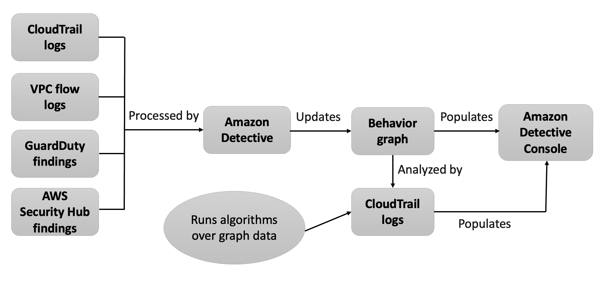

# How Detective populates a

behavior graph

To provide the raw data for investigations, Detective brings together data from across your
AWS environment and beyond, including the following:

- Log data, including Amazon Virtual Private Cloud (Amazon VPC) and AWS CloudTrail
- Findings from Amazon GuardDuty
- Findings from AWS Security Hub
  To learn more about the source data used in a behavior graph, see [Source
  data used in a behavior graph](detective-source-data-about.md "detective-source-data-about.md").

## How Detective processes source data

As new data comes in, Detective uses a combination of extraction and analytics to populate the
behavior graph.

## Detective extraction

Extraction is based on configured mapping rules. A mapping rule basically says, "Whenever
you see this piece of data, use it in this specific way to update behavior graph data."

For example, an incoming Detective source data record might include an IP address. If it does,
Detective uses the information in that record to create a new IP address entity or update an
existing IP address entity.

## Detective analytics

Analytics are more complex algorithms that analyze the data to provide insight into
activity that is associated with entities.

For example, one type of Detective analytic analyzes how often activity occurs by running
algorithms. For entities that make API calls, the algorithm looks for API calls that the entity
doesn't normally use. The algorithm also looks for a large spike in the number of API
calls.

Analytic insights support investigations by providing answers to key analyst questions and
are frequently used to populate finding and entity profile panels.
