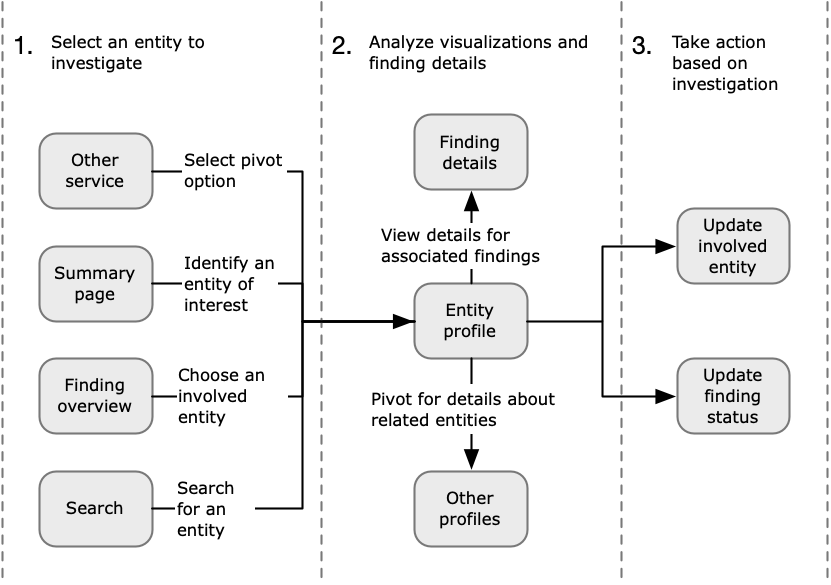

# How Detective is used for investigation

Amazon Detective makes it easy to analyze, investigate, and quickly identify the root cause of
security findings or suspicious activity. Detective provides tools to support the overall investigation process. An investigation in
Detective can start from a finding, a finding group, or an entity.

## Investigation phases in Detective

Any Detective investigation process involves the following phases:

\***\*Triage\*\***

The investigation process starts when you are notified about a suspected instance of
malicious or high-risk activity. For example, you are assigned to look into findings or
alerts uncovered by services such as Amazon GuardDuty and Amazon Inspector.

In the triage phase, you determine whether you believe the activity is a true positive
(genuine malicious activity) or false positive (not malicious or high-risk activity). Detective
profiles support the triage process by providing insight into the activity for the involved
entity.

For true positive instances, you continue to the next phase.

\***\*Scoping\*\***

During the scoping phase, analysts determine the extent of the malicious or high-risk
activity and the underlying cause.

Scoping answers the following types of questions:

- What systems and users were compromised?
- Where did the attack originate?
- How long has the attack been going on?
- Is there other related activity to uncover? For example, if an attacker is extracting
  data from your system, how did they obtain it?

Detective visualizations can help you to identify other entities that were involved or
affected.

**Response**

The final step is to respond to the attack in order to stop the attack, minimize the
damage, and prevent a similar attack from happening again.

## Starting points for a Detective

Investigation

Every investigation in Detective has an essential starting point. For example, you might be
assigned an Amazon GuardDuty or AWS Security Hub CSPM finding to investigate. Or you might have a concern about unusual activity
for a specific IP address.

Typical starting points for an investigation include findings detected by GuardDuty and
entities extracted from Detective source data.

### Findings detected by GuardDuty

GuardDuty uses your log data to uncover suspected instances of malicious or high-risk
activity. Detective provides resources that help you investigate these findings.

For each finding, Detective provides the associated finding details. Detective also shows the
entities, such as IP addresses and AWS accounts, that are connected to the finding.

You can then explore the activity for the involved entities to determine whether the
detected activity from the finding is a genuine cause for concern.

For more information, see [Analyzing a finding overview in Detective](finding-overview.md "finding-overview.md").

### AWS security findings aggregated by Security Hub CSPM

AWS Security Hub CSPM aggregates security findings from various findings providers in a single place,
and provides you with a comprehensive view of your security state in AWS. Security Hub CSPM eliminates
the complexity of addressing large volumes of findings from multiple providers. It reduces the
effort required to manage and improve the security of all of your AWS accounts, resources,
and workloads. Detective provides resources that help you investigate these findings.

For each finding, Detective provides the associated finding details. Detective also shows the entities, such as IP addresses and AWS accounts, that are connected to the finding.

For more information, see [Analyzing a finding overview in Detective](finding-overview.md "finding-overview.md").

### Entities extracted from Detective source

data

From the ingested Detective source data, Detective extracts entities such as IP addresses and
AWS users. You can use one of these as an investigation starting point.

Detective provides general details about the entity, such as the IP address or user name. It
also provides details on activity history. For example, Detective can report what other IP
addresses an entity has connected to, been connected to, or used.

For more information, see [Analyzing entities in Amazon Detective](entity-profiles.md "entity-profiles.md").

## Detective Investigation flow

You can use Amazon Detective to investigate an entity such as an EC2 instance or an AWS user. You
can also investigate security findings.

At a high level, the following image shows the process for a Detective Investigation.

**Step 1: Select the entity to investigate**

When looking at a finding in GuardDuty, analysts can choose to investigate an associated
entity in Detective. See [Pivoting to an entity profile or finding overview
from Amazon GuardDuty or AWS Security Hub CSPM](navigate-to-profile.md#profile-pivot-from-service "navigate-to-profile.md#profile-pivot-from-service").

Selecting the entity takes you to the entity profile in Detective.

**Step 2: Analyze visualizations on profiles**

Each entity profile contains a set of visualizations that are generated from the behavior
graph. The behavior graph is created from the log files and other data that are fed into
Detective.

The visualizations show activity that is related to an entity. You use these
visualizations to answer questions to determine whether the entity activity is unusual. See
[Analyzing entities in Amazon Detective](entity-profiles.md "entity-profiles.md").

To help guide the investigation, you can use the Detective guidance provided for each
visualization. The guidance outlines the displayed information, suggests questions for you to
ask, and proposes next steps based on the answers. See [Using profile panel guidance during an
investigation](profile-panel-drilldown-kubernetes-api-volume.md#profile-panel-guidance "profile-panel-drilldown-kubernetes-api-volume.md#profile-panel-guidance").

Each profile contains a list of associated findings. You can view the details for a
finding, and view the finding overview. See [Viewing details for associated findings in Detective](entity-finding-list.md "entity-finding-list.md").

From an entity profile, you can pivot to other entity and finding profiles, to
investigate further into activity for related assets.

**Step 3: Take action**

Based on the results of your investigation, take the appropriate action.

For a finding that is a false positive, you can archive the finding. From Detective, you can
archive GuardDuty findings. For more details, see [Archiving an Amazon GuardDuty finding](finding-update-status.md "finding-update-status.md").

Otherwise, you take the appropriate action to address the vulnerability and mitigate
damage. For example, you might need to update the configuration of a resource.
