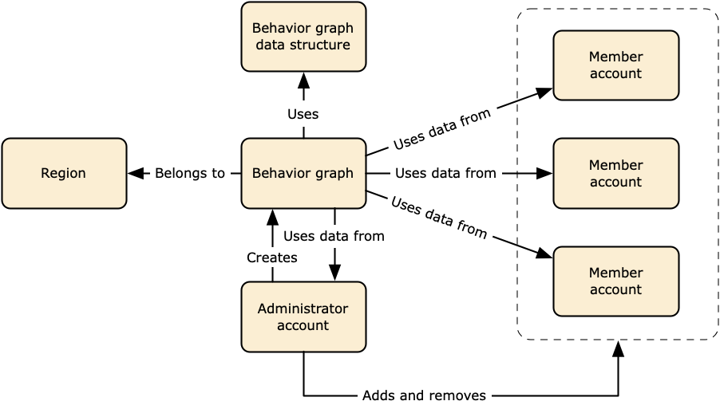

# Source data used in a Detective behavior graph

To populate a behavior graph, Amazon Detective uses source data from the behavior graph
administrator account and member accounts.

With Detective, you can access up to a year of historical event data. This data is available through a set of visualizations that show changes in the type and volume of activity over a selected time window. Detective links these changes to GuardDuty findings.

For details about the behavior graph data structure, see [Overview of the behavior
graph data structure](graph-data-structure-overview.md "graph-data-structure-overview.md") in _Detective User Guide_.

## Types of core data sources in Detective

Detective ingests data from these types of AWS logs:

- AWS CloudTrail logs
- Amazon Virtual Private Cloud (Amazon VPC) flow logs
  - Ingests both IPv4 and IPv6 records, but not MAC records produced by Elastic Fabric Adapters.
  - Ingests log records when the value of the `log-status` field is in
    `OK` state. For more information, see [Flow log records](../../../vpc/latest/userguide/flow-logs.md#flow-logs-fields "../../../vpc/latest/userguide/flow-logs.md#flow-logs-fields") in the
    Amazon VPC User Guide.
  - Ingests flow logs produced by Amazon Elastic Compute Cloud instances running in those VPCs only. No other resources, such as NAT gateways, RDS instances, or Fargate clusters are used.
  - Ingests both accepted and rejected traffic.

- For accounts that are enrolled in GuardDuty, Detective also ingests GuardDuty findings.

Detective consumes CloudTrail and VPC flow log events using independent and duplicative streams of
CloudTrail and VPC flow logs. These processes do not affect or use your existing CloudTrail and VPC flow log
configurations. They also do not affect the performance of or increase your costs for these
services.

## Types of optional data sources in Detective

Detective offers optional source packages in addition to the three data sources offered in the
Detective core package (the core package includes AWS CloudTrail logs, VPC Flow logs, and GuardDuty
findings). An optional data source package can be started or stopped for a behavior graph at any
time.

Detective provides a 30-day free trial for all core and optional source packages per
Region.

###### Note

Detective retains all data received from each data source package for up to 1 year.

Currently the following optional source packages are available:

- **EKS audit logs**

This optional data source package allows Detective to ingest detailed information on EKS
clusters in your environment and adds that data to your behavior graph. Detective correlates
user activities with AWS CloudTrail Management events and network activity with Amazon VPC
Flow Logs without the need for you to enable or store these logs manually. See [Amazon EKS audit logs](source-data-types-EKS.md "source-data-types-EKS.md") for details.

- **AWS security findings**

This optional data source package allows Detective to ingest data from Security Hub CSPM and adds that
data to your behavior graph. See [AWS security
findings](source-data-types-asff.md "source-data-types-asff.md") for details.

###### **Starting or stopping an optional data source:**

1. Open the Detective console at [https://console.aws.amazon.com/detective/](https://console.aws.amazon.com/detective/ "https://console.aws.amazon.com/detective/").
2. From the navigation panel under **Settings**, choose
   **General**.
3. Under **Optional source packages**, select **Update**.
   Then select the data source you wish to enable or deselect a box for an already enabled data
   source and choose **Update** to change which data source packages are
   enabled.

###### Note

If you stop and then restart an optional data source you will see a gap in the data
displayed on some entity profiles. This gap will be noted in the console display and represent
the period of time when the data source was stopped. When a data source is restarted Detective does
not retroactively ingest data.

## How Detective ingests and stores source data

When Detective is enabled, Detective begins ingesting source data from the behavior graph
administrator account. As member accounts are added to the behavior graph, Detective also begins
using the data from those member accounts.

Detective source data consists of structured and processed versions of the original feeds. To
support Detective analytics, Detective stores copies of the Detective source data.

The Detective ingest process feeds data into Amazon Simple Storage Service (Amazon S3) buckets in the Detective source data
store. As new source data arrives, other Detective components pick up the data and start the
extraction and analytics processes. For more information, see [How Detective uses source data
to populate a behavior graph](behavior-graph-population-about.md "behavior-graph-population-about.md") in _Detective User Guide_.

## How Detective enforces the data volume quota for behavior

graphs

Detective has strict quotas on the volume of data it allows in each behavior graph. The data
volume is the amount of data per day that flows into the Detective behavior graph.

Detective enforces these quotas when an administrator account enables Detective, and when a member
account accepts an invitation to contribute to a behavior graph.

- If the data volume for an administrator account exceeds 10 TB per day, then the
  administrator account cannot enable Detective.
- If the added data volume from a member account would cause the behavior graph to exceed 10
  TB per day, the member account cannot be enabled.

The data volume for a behavior graph also can grow naturally over time. Detective checks the
behavior graph data volume each day to make sure that it does not exceed the quota.

If the behavior graph data volume is approaching the quota, Detective displays a warning message
on the console. To avoid exceeding the quota, you can remove member accounts.

If the behavior graph data volume exceeds 10 TB per day, then you cannot add a new member
account to the behavior graph.

If the behavior graph data volume exceeds 15 TB per day, then Detective stops ingesting data
into the behavior graph. The 15 TB per day quota reflects both normal data volume and spikes in
the data volume. When this quota is reached, no new data is ingested into the behavior graph, but
existing data is not removed. You can still use that historical data for investigation. The
console displays a message to indicate that the data ingest is suspended for the behavior
graph.

If the data ingest is suspended, you must work with Support to get it re-enabled. If possible,
before you contact Support, try to remove member accounts to get the data volume below the quota.
This makes it easier to re-enable the data ingest for the behavior graph.
