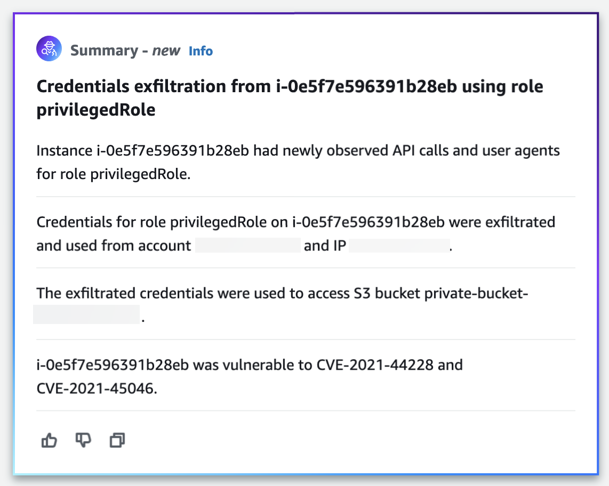

# Finding group summary powered by generative

AI

By default, Amazon Detective automatically provides summaries of an individual finding group.
The summaries are powered by generative artificial intelligence (generative AI) models hosted on [Amazon Bedrock](../../../bedrock/latest/userguide/what-is-bedrock.md "../../../bedrock/latest/userguide/what-is-bedrock.md").

###### Note

Beginning February 16th, 2026, Detective's Finding Group Summary feature will automatically select the
optimal AWS region (from a grouping of regional endpoints within your geography) to process your finding
group data and generate summaries using [Cross-region inference](#fg-summary-cross-region-inference "#fg-summary-cross-region-inference").

If you do not wish to use this feature, you can disable it from Detective's console or by using deny
permissions on the IAM role used to access Detective's console.
See [Opting out of finding group summary](#fg-summary-disable "#fg-summary-disable").

By using finding groups, you can examine multiple security findings, as they relate to
a potential security event, and identify potential threat actors. Finding group
summaries for finding groups builds upon these capabilities. Finding group summaries
consume the data for a finding group, rapidly analyze relationships between the findings
and affected resources, and then summarize potential threats in natural language. You
can leverage these summaries to identify larger security threats, improve investigation
efficiency, and shorten the response timelines.

###### Note

Finding group summaries powered by generative AI may and not always provide completely
accurate information. See [AWS Responsible AI
Policy](https://aws.amazon.com//machine-learning/responsible-ai/policy/ "https://aws.amazon.com//machine-learning/responsible-ai/policy/") for more information.

## Reviewing finding group summary

The finding group summary for a finding group gives you a clear, detailed
explanation of a security event. In natural language, the explanation includes a
succinct title, a summary of the resources involved, and curated information about
those resources.

###### To review a finding group summary

1. Open the Detective console at [https://console.aws.amazon.com/detective/](https://console.aws.amazon.com/detective/ "https://console.aws.amazon.com/detective/").
2. In the navigation pane, choose **Finding groups**.
3. In the **Finding groups** table, choose the finding group
   that you want to display a summary of. A details page appears.

On the details page, you can use the **Summary** pane to review a
generated, descriptive summary of the top findings in the finding group. You can
also review an analysis of the top threat events in the finding group, which you can
then investigate further. To add the generated summary to your notes or a ticketing
system, choose the copy icon in the pane. This copies the summary to your clipboard.
You can also share your feedback about the finding group summary output in the summary,
which can provide a better experience in the future. To share your feedback, choose
the thumbs up or thumbs down icon, depending on the nature of your feedback.

###### Note

If you provide feedback about the finding group summary, your feedback is not used for model
tuning. We use it only to help facilitate that the prompts in Detective are crafted
effectively.

## Opting out of finding group summary

By default, finding group summary is enabled for finding groups. Customers who do not wish to use the finding group summary feature can opt out at the user level, or via the IAM role being used to access the AWS Management Console.

### User-level opt-out

Each user accessing Detective can set their individual preference to opt out of the finding group summary feature. Opting out of the summary will prevent the finding group data from being processed via cross-region inference.

###### To opt out of finding group summary

1. Open the Detective console at [https://console.aws.amazon.com/detective/](https://console.aws.amazon.com/detective/ "https://console.aws.amazon.com/detective/").
2. In the navigation pane, choose **Preferences**.
3. Under **Finding group summary**, choose
   **Edit**.
4. Turn off **Enabled**.
5. Choose **Save**.

### IAM role-based opt-out

Multiple users can be opted out of the finding group summary feature by modifying the IAM role being used to access Detective. Adding a Deny statement for the `detective:InvokeAssistant` permission on the role will prevent all users accessing Detective via that role from using the finding group summary feature, preventing the processing of finding group data via cross-region inference. Users can then individually follow the user-level opt-out steps to prevent the summary pane from appearing.

###### To opt out of finding group summary using IAM

1. Identify the IAM roles being used for accessing Amazon Detective.
2. Add an IAM policy statement with the `Deny` effect for the `detective:InvokeAssistant` action to the role.

## Enabling finding group summary

If you previously opted out of finding group summary for finding groups, you can
enable them again at any time.

###### To enable finding group summary

1. Open the Detective console at [https://console.aws.amazon.com/detective/](https://console.aws.amazon.com/detective/ "https://console.aws.amazon.com/detective/").
2. In the navigation pane, choose **Preferences**.
3. Under **Finding group summary**, choose
   **Edit**.
4. Turn on **Enabled**.
5. Choose **Save**.

## Cross-region inference

Detective automatically selects the optimal AWS Region within your geography to process your finding group data and generate summaries. This maximizes available compute resources, model availability, and delivers the best customer experience. Your finding group data remains stored only in the Region where the summary request originates, however, finding group data and summary results may be processed outside that Region. All data is transmitted encrypted across Amazon's secure network.

Detective securely routes your inference requests to available compute resources within the geographic area where the request originated, as shown in the following table.

| Cross-region inference routing | Supported Detective geography              | Detective Regions                                                                               | Inference Regions |
| ------------------------------ | ------------------------------------------ | ----------------------------------------------------------------------------------------------- | ----------------- |
| United States                  | us-east-1                                  | us-east-1, us-east-2, us-west-1, us-west-2                                                      |
| us-west-2                      | us-east-1, us-east-2, us-west-1, us-west-2 |
| Europe                         | eu-central-1                               | eu-central-1, eu-central-2, eu-north-1, eu-south-1, eu-south-2, eu-west-1, eu-west-2, eu-west-3 |
| Japan                          | ap-northeast-1                             | ap-northeast-1, ap-northeast-3                                                                  |

## Supported Regions

**Finding group summary** is available in the following AWS Regions.

- US East (N. Virginia)
- US West (Oregon)
- Asia Pacific (Tokyo)
- Europe (Frankfurt)
