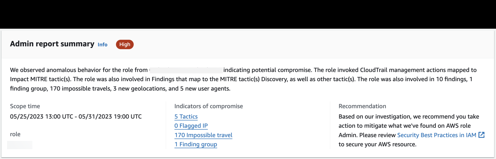

# Understanding a Detective Investigations report

A Detective Investigations report lists a summary of the uncommon behavior or malicious activity
that indicates compromise. It also lists the recommendations that Detective suggests to
mitigate the security risk.

To view an investigations report for a specific investigation ID.

1. Sign in to the AWS Management Console. Then open the Detective console at [https://console.aws.amazon.com/detective/](https://console.aws.amazon.com/detective/ "https://console.aws.amazon.com/detective/").
2. In the navigation pane, choose **Investigations**.
3. In the **Reports** table, select an investigation
   **ID**.

Detective generates the report for the selected **Scope** time and
**User**. The report contains an **Indicators of
Compromise** section that includes details regarding one or more of the
indicators of compromise listed below. As you review each indicator of compromise,
optionally choose an item to drill down and review its details.

- Tactics. Techniques, and Procedures – Identifies tactics, techniques, and procedures (TTPs) used in a potential security event. The MITRE ATT&CK framework is used to understand the TTPs. Tactics are based on the [MITRE ATT&CK
  matrix for Enterprise](https://attack.mitre.org/matrices/enterprise/ "https://attack.mitre.org/matrices/enterprise/").
- Threat Intelligence Flagged IP Addresses
  – Suspicious IP addresses are flagged and identified as critical or
  severe threats based on Detective threat intelligence.
- Impossible Travel – Detects and
  identifies unusual and impossible user activity for an account. For example,
  this indicator lists a drastic change between source to destination location of
  a user within a short time span.
- Related Finding Group – Shows multiple
  activities as they relate to a potential security event. Detective uses graph
  analysis techniques that infers relationships between findings and entities,
  and groups them together as a finding group.
- Related Findings – Related activities associated with a potential security event. Lists all distinct categories of evidence that are connected to the resource or the finding group.
- New Geolocations – Identifies new geolocations used either at the resource or account level. For example, this indicator lists an observed geolocation that is an infrequent or unused location based on previous user activity.
- New User Agents – Identifies new user agents used either at the resource or account level.
- New ASOs – Identifies new Autonomous
  System Organizations (ASOs) used either at the resource or account level.
  For example, this indicator lists a new organization assigned as an ASO.
