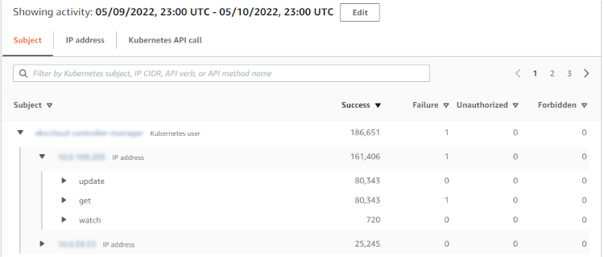
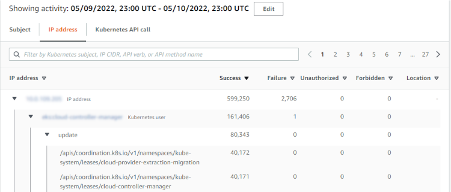
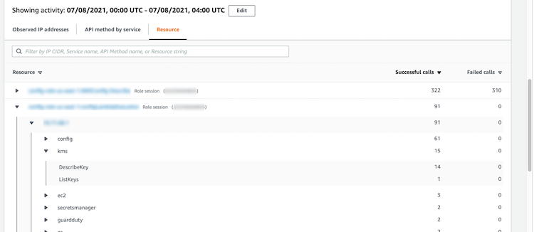

# Overall Kubernetes API activity involving EKS cluster

The activity details for **Overall Kubernetes API activity involving EKS cluster** show the number of successful and failed Kubernetes API calls that were issued during a selected time range.

To display the activity details for a single time interval, choose the time interval on the chart.

To display the activity details for the current scope time, choose **Display
details for scope time**.

## Content of the activity details (Cluster, pod, user, role, role session)

For a cluster, pod, user, role, or role session, the activity details contain the following information:

- Each tab provides information about the set of API calls that were issued during the
  selected time range.

For clusters, the API calls occurred inside the cluster.

For pods, the API calls targeted the pod.

For users, roles, and role sessions, the API calls were issued by Kubernetes users that authenticated as that user, role, or role session.

- For each entry, the activity details show the number of successful, failed, unauthorized, and forbidden calls.
- The information includes the IP address, the type of Kubernetes call, the entity that was affected by the call, and the subject (service account or user) that made the call. From the activity details, you can pivot to the profiles for the IP address, subject, and the affected entity.

The activity details contain the following tabs:

**Subject**

Initially displays the list of service accounts and users that were used to make API calls.

You can expand each service account and user to display the list of IP addresses from which the account or user made API calls.

You can then expand each IP address to show the Kubernetes API calls that were made by that account or user from that IP address.

Expand the Kubernetes API call to see the `requestURI` to identify the
action that was done.

**IP Address**

Initially displays the list of IP addresses from which the API calls were made.

You can expand each call to display the list of Kubernetes subjects (service accounts and users) that made the call.

You can then expand each subject to a list of API call types made by the subject during the scope time.

Expand the API call type to see the requestURI to identify the action that was done.

**Kubernetes API call**

Initially displays the list of Kubernetes API call verbs.

You can expand each API verb to display the requestURIs associated with that action.

You can then expand each requestURI to see Kubernetes subject (service accounts and users) that made the API call.

Expand the subject to see which IPs that subject used to make the API call.

## Sorting the activity details

You can sort the activity details by any of the list columns.

When you sort using the first column, only the top-level list is sorted. The lower-level
lists are always sorted by the count of successful API calls.

## Filtering the activity details

You can use the filtering options to focus on specific subsets or aspects of the activity
represented in the activity details.

On all of the tabs, you can filter the list by any of the values in the first
column.

## Selecting the time range for the activity

details

When you first display the activity details, the time range is either the scope time or a
selected time interval. You can change the time range for the activity details.

###### To change the time range for the activity details

1. Choose **Edit**.
2. On **Edit time window**, choose the start and end time to use.

To set the time window to the default scope time for the profile, choose **Set
to default scope time**. 3. Choose **Update time window**.

The time range for the activity details is highlighted on the profile panel charts.

## Using profile panel guidance during an

investigation

Each profile panel is designed to provide answers to specific questions that arise as you
conduct an investigation and analyze the activity for the related entities.

The guidance provided for each profile panel helps you find these answers.

Profile panel guidance starts with a single sentence on the panel itself. This guidance
provides a brief explanation of the data presented on the panel.

To display more detailed guidance for a panel, choose **More info** from
the panel heading. This extended guidance appears in the help pane.

The guidance can provide these types of information:

- An overview of the panel content
- How to use the panel to answer the relevant questions
- Suggested next steps based on the answers
