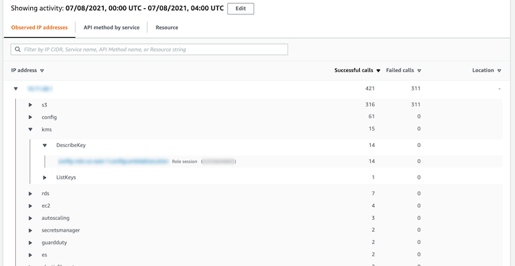
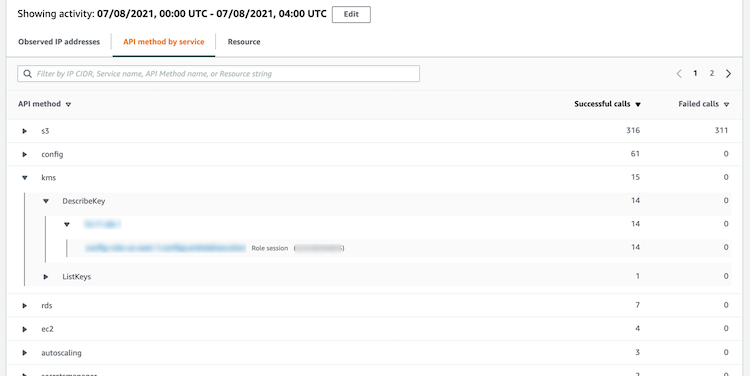
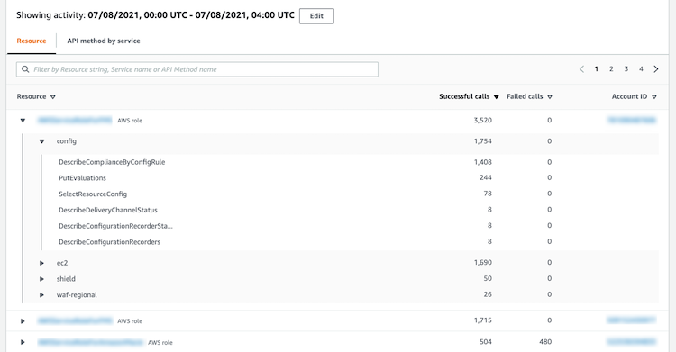
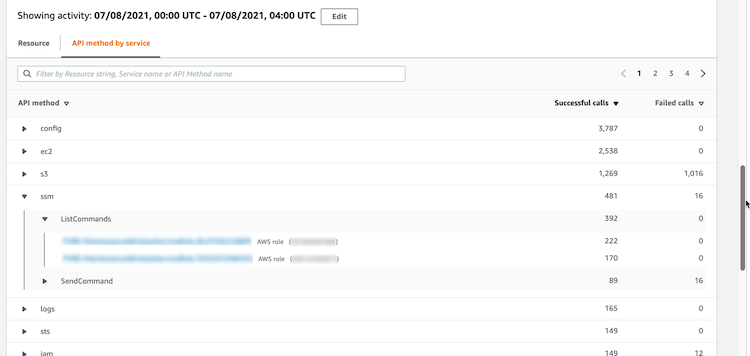
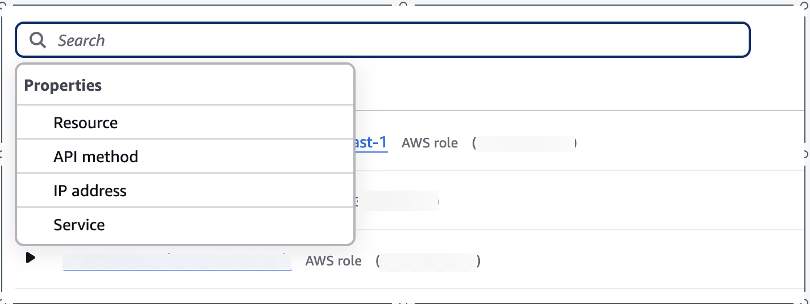

# Activity details for Overall API

call volume

The activity details for **Overall API call volume** show the API calls
that were issued during a selected time range.

To display the activity details for a single time interval, choose the time interval on the
chart.

To display the activity details for the current scope time, choose **Display
details for scope time**.

Note that Detective began to store and display the service name for API calls as of July 14, 2021. That date is highlighted on the profile panel timeline. For activity that occurs before
that date, the service name is **Unknown service**.

## Content of the activity details (users, roles,

accounts, role sessions, EC2 instances, S3 buckets)

For IAM users, IAM roles, accounts, role sessions, EC2 instances, and S3 buckets, the
activity details contain the following information:

- Each tab provides information about the set of API calls that were issued during the
  selected time range.

For S3 buckets, the information reflects API calls that were made to the S3
bucket.

The API calls are grouped by the services that called them. For S3 buckets, the service
is always Amazon S3. If Detective cannot determine the service that issued a call, the call is listed
under **Unknown service**.

- For each entry, the activity details show the number of successful and failed calls. The
  **Observed IP addresses** tab also shows the location of each IP
  address.
- Each entry shows information about who made the calls. For accounts, the activity
  details identify the users or roles. For roles, the activity details identify the role
  sessions. For users and role sessions, the activity details identify the access key
  identifiers (AKIDs).

Note that as of July 14, 2021, for account profiles, the activity details show users or
roles instead of AKIDs. For role profiles, the activity details show role sessions instead of
AKIDs. For activity that occurs before July 14, 2021, the caller is listed as **Unknown resource**.

The activity details contain the following tabs:

**Observed IP addresses**

Initially displays the list of IP addresses used to issue API calls.

You can expand each IP address to display the list of API calls that were issued from
that IP address. The API calls are grouped by the services that called them. For S3 buckets,
the service is always Amazon S3. If Detective cannot determine the service that issued a call, the
call is listed under **Unknown service**.

You can then expand each API call to display the list of callers from that IP address.
Depending on the profile, the caller might be a user, role, role session, or AKID.

**API method by service**

Initially displays the list of API calls that were issued. The API calls are grouped by
the services that issued the calls. For S3 buckets, the service is always Amazon S3. If Detective
cannot determine the service that issued a call, the call is listed under **Unknown service**.

You can expand each API method to display the list of IP addresses from which the calls
were issued.

You can then expand each IP address to display the list of AKIDs that issued that API
call from that IP address.

**Resource or Access Key ID**

Initially displays the list of users, roles, role sessions, or AKIDs that were used to
issue API calls.

You can expand each caller to display the list of IP addresses from which the caller
issued API calls.

You can then expand each IP address to display the list of API calls that were issued
from that IP address by that caller. The API calls are grouped by the services that issued
the calls. For S3 buckets, the service is always Amazon S3. If Detective cannot determine the service
that issued a call, the call is listed under **Unknown
service**.

## Content of the activity details (IP

addresses)

For IP addresses, the activity details contain the following information:

- Each tab provides information about the set of API calls that were issued during the
  selected time range. The API calls are grouped by the services that issued the calls. If
  Detective cannot determine the service that issued a call, the call is listed under **Unknown service**.
- For each entry, the activity details show the number of successful and failed
  calls.

The activity details contain the following tabs:

**Resource**

Initially displays the list of resources that issued API calls from the IP
address.

For each resource, the list includes the resource name, the type, and the AWS
account.

You can expand each resource to display the list of API calls that the resource issued
from the IP address. The API calls are grouped by the services that issued the calls. If
Detective cannot determine the service that issued a call, the call is listed under **Unknown service**.

**API method by service**

Initially displays the list of API calls that were issued. The API calls are grouped by
the services that issued the calls. If Detective cannot determine the service that issued a
call, the call is listed under **Unknown service**.

You can expand each API call to display the list of resources that issued the API call
from the IP address during the selected time period.

## Sorting the activity details

You can sort the activity details by any of the list columns.

When you sort using the first column, only the top-level list is sorted. The lower-level
lists are always sorted by the count of successful API calls.

## Filtering the activity details

You can use the filtering options to focus on specific subsets or aspects of the activity
represented in the activity details.

On all of the tabs, you can filter the list by any of the values in the first
column.

###### To add a filter

1. Choose the filter box.
2. From **Properties**, choose the property to use for the
   filtering.
3. Provide the value to use for the filtering. The filter supports partial values. For
   example, when you filter by API method, if you filter by `Instance`, the
   results include any API operation that has `Instance` in its name. So both
   `ListInstanceAssociations` and `UpdateInstanceInformation` would
   match.

For service names, API methods, and IP addresses, you can either specify a value or
choose a built-in filter.

For **Common API substrings**, choose the substring that represents the
type of operation, such as `List`,
`Create`, or `Delete`. Each API method
name starts with the operation type.

For **CIDR patterns**, you can choose to include only public IP
addresses, private IP addresses, or IP addresses that match a specific CIDR pattern. 4. Choose a Boolean option `Resource` or `Service` **: Contains** or **!: Does not
contain**; or `API method` or `IP address` **= Equals** or **!: Does not equal** to set filters.

To remove a filter, choose the **x** icon in the top-right
corner.

To clear all of the filters, choose **Clear filter**.

## Selecting the time range for the activity

details

When you first display the activity details, the time range is either the scope time or a
selected time interval. You can change the time range for the activity details.

###### To change the time range for the activity details

1. Choose **Edit**.
2. On **Edit time window**, choose the start and end time to use.

To set the time window to the default scope time for the profile, choose **Set
to default scope time**. 3. Choose **Update time window**.

The time range for the activity details is highlighted on the profile panel charts.

## Querying raw logs

Amazon Detective integrates with Amazon Security Lake, which means that you can query and retrieve the raw
log data stored by Security Lake. For more details about this integration, see [Amazon Detective Integration with Amazon Security Lake](securitylake-integration.md "securitylake-integration.md").

Using this integration, you can collect and query logs and events from the following
sources which Security Lake natively supports.

- AWS CloudTrail management events version 1.0 and after
- Amazon Virtual Private Cloud (Amazon VPC) Flow Logs version 1.0 and after
- Amazon Elastic Kubernetes Service (Amazon EKS) Audit Log version 2.0

###### Note

There are no additional charges to
query raw data logs in Detective. Usage charges for other AWS Services, including Amazon Athena, still apply
at published rates.

###### To query raw logs

1. Choose **display details for scope time**.
2. From here, you can start to **Query raw logs**.
3. In the **Raw log preview** table, you can view the logs and events retrieved by querying data from Security Lake. For more details about the raw event logs, you can view the data displayed in Amazon Athena.

From the Query raw logs table, you can **Cancel query request**,
**See results in Amazon Athena**, and **Download results**
as a comma-separated values (.csv) file.

If you see logs in Detective, but the query returned no results, it could happen because of the following reasons.

- Raw logs may become available in Detective before showing up in Security Lake log
  tables. Try again later.
- Logs may be missing from Security Lake. If you waited for an extended period of time,
  it indicates that logs are missing from Security Lake. Contact your Security Lake
  administrator to resolve the issue.
