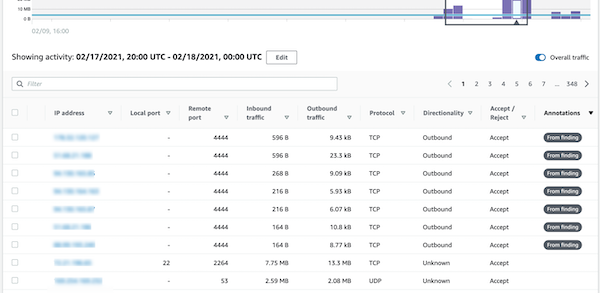
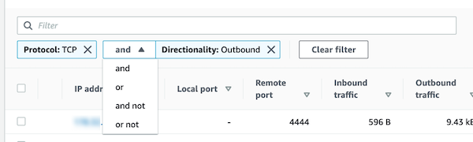
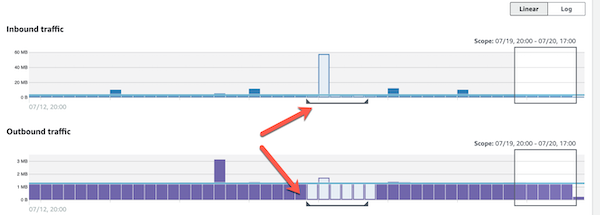
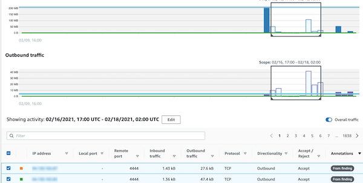
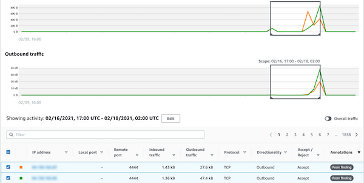

# Activity details for overall VPC

flow volume

For an EC2 instance, the activity details for **Overall VPC flow
volume** show the interactions between the EC2 instance and IP addresses during a
selected time range.

For a Kubernetes pod, **Overall VPC flow volume** displays the overall
volume of bytes into and out of the Kubernetes pod's assigned IP address for all destination IP
addresses. The Kubernetes pod's IP address is not unique when `hostNetwork:true`. In
this case, the panel shows traffic to other pods with the same configuration and the node
hosting them.

For an IP address, the activity details for **Overall VPC flow
volume** show the interactions between the IP address and EC2 instances during a
selected time range.

To display the activity details for a single time interval, choose the time interval on the
chart.

To display the activity details for the current scope time, choose **display details for scope time**.

## Content of the activity details

The content reflects the activity during the selected time range.

For an EC2 instance, the activity details contain an entry for each unique combination of
IP address, local port, remote port, protocol, and direction.

For an IP address, the activity details contain an entry for each unique combination of
EC2 instance, local port, remote port, protocol, and direction.

Each entry displays the volume of inbound traffic, the volume of outbound traffic, and
whether the access request was accepted or rejected. On finding profiles, the
**Annotations** column indicates when an IP address is related to the current
finding.

## Sorting the activity details

You can sort the activity details by any of the columns in the table.

By default, the activity details are sorted first by the annotations, then by the inbound
traffic.

## Filtering the activity details

To focus on specific activity, you can filter the activity details by the following
values:

- IP address or EC2 instance
- Local or remote port
- Direction
- Protocol
- Whether the request was accepted or rejected

###### To add and remove filters

1. Choose the filter box.
2. From **Properties**, choose the property to use for the
   filtering.
3. Provide the value to use for the filtering. The filter supports partial values.

To filter by IP address, you can either specify a value or choose a built-in
filter.

For **CIDR patterns**, you can choose to include only public IP
addresses, private IP addresses, or IP addresses that match a specific CIDR pattern. 4. If you have multiple filters, choose a Boolean option to set how those filters are
connected.

 5. To remove a filter, choose the **x** icon in the top-right
corner. 6. To clear all of the filters, choose **Clear filter**.

## Selecting the time range for the activity

details

When you first display the activity details, the time range is either the scope time or a
selected time interval. You can change the time range for the activity details.

###### To change the time range for the activity details

1. Choose **Edit**.
2. On **Edit time window**, choose the start and end time to use.

To set the time window to the default scope time for the profile, choose **Set
to default scope time**. 3. Choose **Update time window**.

The time range for the activity details is highlighted on the profile panel charts.

## Displaying the volume of traffic for

selected rows

When you identify rows that are of interest, you can display on the main charts the volume
of traffic over time for those rows.

For each row to add to the charts, select the check box. For each selected row, the volume
is displayed as a line on the inbound or outbound charts.

To focus on the traffic volume for the selected entries, you can hide the overall volume.
To show or hide the overall traffic volume, toggle **Overall traffic**.

## Displaying the VPC flow traffic for EKS

clusters

Detective has visibility into your Amazon Virtual Private Cloud (Amazon VPC) flow logs, which represent the traffic
that traverses your Amazon Elastic Kubernetes Service (Amazon EKS) clusters. For Kubernetes resources, the content of the
VPC flow logs depends on the Container Network Interface (CNI) deployed in the EKS
cluster.

An EKS cluster with a default configuration uses the Amazon VPC CNI plugin. For more details,
see [Managing VPC
CNI](../../../eks/latest/userguide/managing-vpc-cni.md "../../../eks/latest/userguide/managing-vpc-cni.md") in the **Amazon EKS User Guide**. The Amazon VPC CNI plugin sends internal
traffic with the IP address of the pod and translates the source IP address to the IP address
of the node for external communication. Detective can capture and correlate internal traffic to the
correct pod but it can’t do the same for external traffic.

If you want Detective to have visibility into the external traffic of your pods, enable
External Source Network Address Translation (SNAT). Enabling SNAT comes with limitations and
drawbacks. For more details, see [SNAT for
pods](../../../eks/latest/userguide/external-snat.md "../../../eks/latest/userguide/external-snat.md") in the **Amazon EKS User Guide**.

If you use a different CNI plugin, Detective has limited visibility to pods with
`hostNetwork:true`. For these pods, the **VPC Flow** panel
displays all traffic to the IP address of the pod. This includes the traffic to the host node
and any pod on the node with the `hostNetwork:true` configuration.

Detective displays traffic in the **VPC flow** panel of an EKS pod for the
following EKS cluster configurations:

- In a cluster with the Amazon VPC CNI plugin, any pod with the configuration
  `hostNetwork:false` sending traffic inside the VPC of the cluster.
- In a cluster with the Amazon VPC CNI plugin and the configuration
  `AWS_VPC_K8S_CNI_EXTERNALSNAT=**true**`, any pod
  with `hostNetwork:false` sending traffic outside the VPC of the cluster.
- Any pod with the configuration `hostNetwork:true`. Traffic from the node is
  mixed with traffic from other pods that have the configuration
  `hostNetwork:true`.

Detective does not display traffic in the **VPC flow** panel for:

- In a cluster with the Amazon VPC CNI plugin and the configuration
  `AWS_VPC_K8S_CNI_EXTERNALSNAT=false`, any pod with the configuration
  `hostNetwork:false` sending traffic outside the VPC of the cluster.
- In a cluster without the Amazon VPC CNI plugin for Kubernetes, any pod with the
  configuration `hostNetwork:false`.
- Any pod sending traffic to another pod that is hosted in the same node.

## Displaying the VPC flow traffic for shared

Amazon VPCs

Detective has visibility into your Amazon Virtual Private Cloud (Amazon VPC) flow logs for shared VPCs:

- If a Detective member account has a shared Amazon VPC and there are other non-Detective accounts using the shared VPC, Detective monitors all traffic from that VPC, and provides visualization on all the traffic flow within the VPC.
- If you have an Amazon EC2 instance inside a shared Amazon VPC and the shared VPC owner is not a Detective member, Detective will not monitor any traffic from the VPC. If you want to view the traffic flow within the VPC, you must add the Amazon VPC owner as a member of your Detective graph.
