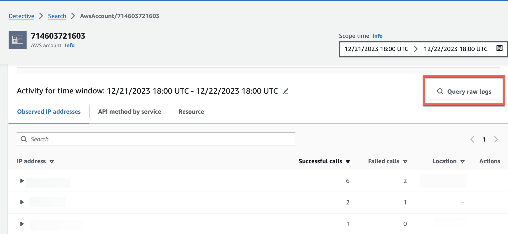
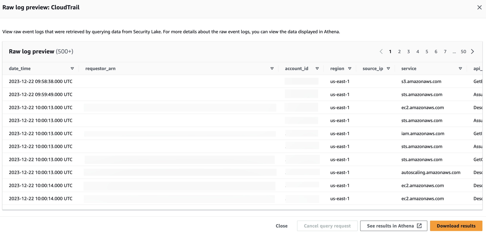
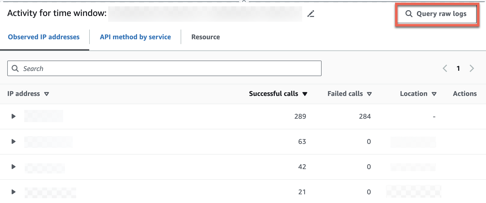
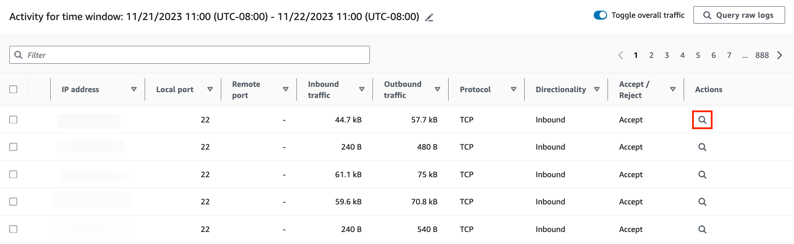

# Querying raw logs in Detective

After you integrate Detective with Security Lake, Detective begins pulling raw logs from Security Lake related to AWS CloudTrail management events and Amazon Virtual Private Cloud (Amazon VPC) Flow Logs.

###### Note

There are no additional charges to
query raw logs in Detective. Usage charges for other AWS Services, including Amazon Athena, still apply
at published rates.

AWS CloudTrail management events are available for the following profiles:

- AWS account
- AWS user
- AWS role
- AWS role Session
- Amazon EC2 instance
- Amazon S3 bucket
- IP address
- Kubernetes cluster
- Kubernetes pod
- Kubernetes subject
- IAM role
- IAM role session
- IAM user
  Amazon VPC FLow Logs are available for the following profiles:

- Amazon EC2 instance
- Kubernetes pod
  For a demonstration of how to use Amazon Detective with Amazon Security Lake using the Detective console, watch the following video:

###### To query raw logs for an AWS account

1. Open the Detective console at [https://console.aws.amazon.com/detective/](https://console.aws.amazon.com/detective/ "https://console.aws.amazon.com/detective/").
2. In the navigation pane, choose **Search** and search for an
   `AWS account`.
3. In the **Overall API call volume** section, choose
   **display details for scope time**.
4. From here, you can start to **Query raw logs**.

In the **Raw log preview** table, you can view the logs and events retrieved by querying data from Security Lake. For more details about the raw event logs, you can view the data displayed in Amazon Athena.

From the Query raw logs table, you can **Cancel query request**,
**See results in Amazon Athena**, and **Download results**
as a comma-separated values (.csv) file.

If you see logs in Detective, but the query returned no results, it could happen because of the following reasons.

- Raw logs may become available in Detective before showing up in Security Lake log
  tables. Try again later.
- Logs may be missing from Security Lake. If you waited for an extended period of time,
  it indicates that logs are missing from Security Lake. Contact your Security Lake
  administrator to resolve the issue.

###### Examples

- [Querying raw logs for an AWS role](#query-log-geo-location "#query-log-geo-location")
- [Querying raw logs for an Amazon EKS cluster](#query-log-eks-cluster "#query-log-eks-cluster")
- [Querying raw logs for an Amazon EC2 instance](#query-log-vpc "#query-log-vpc")

## Querying raw logs for an AWS role

If you want to understand the activity of an AWS role in a new geolocation, you can do so within the Detective console.

###### To query raw logs for an AWS role

1. Open the Detective console at [https://console.aws.amazon.com/detective/](https://console.aws.amazon.com/detective/ "https://console.aws.amazon.com/detective/").
2. From the Detective **Summary** page **Newly observed
   geolocations** section, note down the AWS role.
3. In the navigation pane, choose **Search** and search for the
   `AWS role`.
4. For the AWS role, expand the resource to display the specific API calls that were issued from that IP address by that resource.
5. Choose the magnifier icon next to the API call that you want to investigate to open the **Raw log preview** table.

## Querying raw logs for an Amazon EKS cluster

1. Open the Detective console at [https://console.aws.amazon.com/detective/](https://console.aws.amazon.com/detective/ "https://console.aws.amazon.com/detective/").
2. From the Detective **Summary** page **Container clusters with the most pods created** section, navigate to an Amazon EKS cluster.
3. In the **Amazon EKS cluster details** page, select the **Kubernetes API activity** tab.
4. In the **Overall Kubernetes API activity involving this Amazon EKS
   cluster** section, choose **display details for scope
   time**.
5. From here, you can start to **Query raw logs**.

## Querying raw logs for an Amazon EC2 instance

1. Open the Detective console at [https://console.aws.amazon.com/detective/](https://console.aws.amazon.com/detective/ "https://console.aws.amazon.com/detective/").
2. In the navigation pane, choose **Search** and search for an
   `Amazon EC2 instance`.
3. In the **Overall VPC Flow volume** section, choose the magnifier icon next to the API call that you want to investigate to open the **Raw log preview** table.
4. From here, you can start to **Query raw logs**.

In the **Raw log preview** table, you can view the logs and events retrieved by querying data from Security Lake. For more details about the raw event logs, you can view the data displayed in Amazon Athena.

From the Query raw logs table, you can **Cancel query request**,
**See results in Amazon Athena**, and **Download results**
as a comma-separated values (.csv) file.
