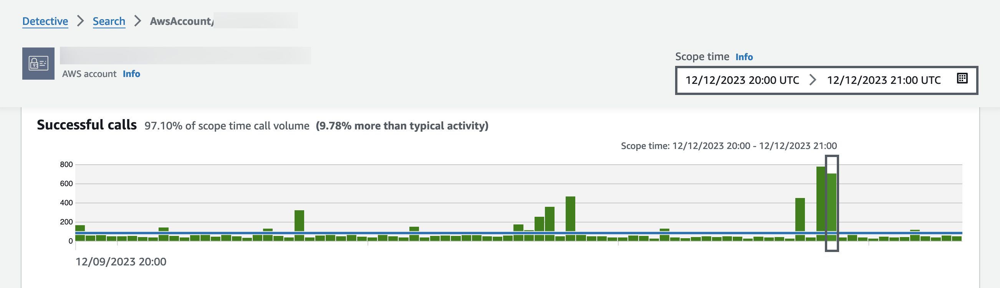

# Using entity profiles

An entity profile appears when you perform one of the following actions:

- From the Amazon GuardDuty console, choose the option to investigate an entity that is related to
  a selected finding.

See [Pivoting to an entity profile or finding overview
from Amazon GuardDuty or AWS Security Hub](navigate-to-profile.md#profile-pivot-from-service "navigate-to-profile.md#profile-pivot-from-service").

- Go to the Detective URL for the entity profile.

See [Navigating to an entity profile or finding overview using
a URL](navigate-to-profile.md#profile-navigate-url "navigate-to-profile.md#profile-navigate-url").

- Use the Detective search in the Detective console to look up an entity.
- Choose a link to the entity profile from another entity profile or from a finding
  overview.

## Scope time for an entity profile

When you navigate directly to an entity profile without providing the scope time, the scope
time is set to the previous 24 hours.

When you navigate to an entity profile from another entity profile, the currently selected
scope time remains in place.

When you navigate to an entity profile from a finding overview, the scope time is set to the
finding time window.

For information on customizing the scope time to limit the data displayed on entity profiles, see [Managing the scope time](scope-time-managing.md "scope-time-managing.md").

## Entity identifier and type

At the top of the profile are the entity identifier and the entity type. Each entity type
has a corresponding icon, to provide a visual indicator of the type of profile.

## Involved findings

Each profile contains a list of findings that the entity was involved in during the scope
time.

You can see the details for each finding, change the scope time to reflect the finding time
window, and go to the finding overview to look for other involved resources.

See [Viewing details for associated findings in Detective](entity-finding-list.md "entity-finding-list.md").

## Finding groups involving this entity

Each profile contains a list of finding groups that an entity is included in.

A finding group is made up of findings, entities, and evidence that Detective collects into a group to provide more context on possible security issues.

For more information on finding groups, see [Analyzing finding groups](groups-about.md "groups-about.md").

## Profile panels containing entity details and analytics

results

Each entity profile contains a set of one or more tabs. Each tab contains one or more
profile panels. Each profile panel contains text and visualizations that are generated from the
behavior graph data. The specific tabs and profile panels are tailored to the entity type.

For most entities, the panel at the top of the first tab provides high-level summary
information about the entity.

Other profile panels highlight different types of activity. For an entity that is involved
with a finding, the information on the entity profile panels can provide additional supporting
evidence to help complete an investigation. Each profile panel provides access to guidance on how
to use the information. For more information, see [Using profile panel guidance during an
investigation](profile-panel-drilldown-kubernetes-api-volume.md#profile-panel-guidance "profile-panel-drilldown-kubernetes-api-volume.md#profile-panel-guidance").

For more details about profile panels, the types of data they contain, and available options
for interacting with them, see [Viewing and interacting with Detective profile panels](profile-panels.md "profile-panels.md").

## Navigating in an entity profile

An entity profile contains a set of one or more tabs. Each tab contains one or more profile
panels. Each profile panel contains text and visualizations that are generated from the behavior
graph data.

As you scroll down through a profile tab, the following information remains visible at the
top of the profile:

- Entity type
- Entity identifier
- Scope time

