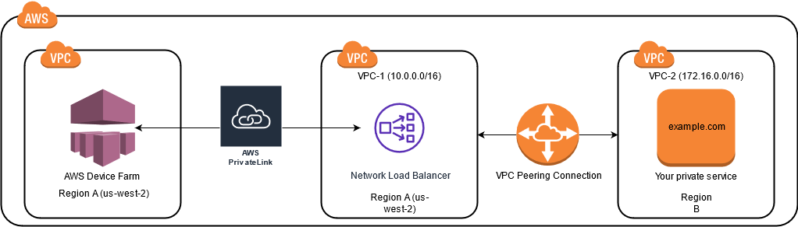

# Amazon VPC across AWS Regions in AWS Device Farm

Device Farm services are located only in the US West (Oregon) (`us-west-2`) Region. You can use
Amazon Virtual Private Cloud (Amazon VPC) to reach a service in your Amazon Virtual Private Cloud in another AWS Region using Device Farm. If Device Farm and your
service are in the same Region, see [Using Amazon VPC endpoint services with Device Farm - Legacy
(not recommended)](amazon-vpc-endpoints.md "amazon-vpc-endpoints.md").

There are two ways to access your private services located in a different Region. If you
have services located in one other Region that's not `us-west-2`, you can use VPC
Peering in order to peer that Region’s VPC to another VPC that is interfacing with Device
Farm in `us-west-2`. However, if you have services in multiple Regions, a Transit Gateway
will allow you to access those services with a simpler network configuration.

For more information, see [VPC peering scenarios](../../../vpc/latest/peering/peering-scenarios.md "../../../vpc/latest/peering/peering-scenarios.md") in the
_Amazon VPC Peering Guide_.

## VPC peering overview for VPCs in

different Regions in AWS Device Farm

You can peer any two VPCs in different Regions as long as they have distinct, non-overlapping CIDR blocks.
This ensures that all of the private IP addresses are unique, and it allows all of the resources in the VPCs
to address each other without the need for any form of network address translation (NAT). For more
information about CIDR notation, see [RFC
4632](https://tools.ietf.org/html/rfc4632 "https://tools.ietf.org/html/rfc4632").

This topic includes a cross-Region example scenario in which Device Farm (referred to as
_VPC-1_) is located in the US West (Oregon)
(`us-west-2`) Region. The second VPC in this example (referred to as
_VPC-2_) is in another Region.

| Device Farm VPC cross-Region example | VPC Component         | VPC-1                 | VPC-2                                                                                                                                                                                                                                                                                                                                                                                                                                                                                                                                                                                                                                                                                                                                                                                                                                                                                                                                                                                                                                                                                                                                                                                                                                                                                                                                                                                                                                                                                                                                                                                                                                                                                                                                                                                                                                                                                                                                                                                                                                                                                                                                                                                                                                                                                                                                                                                                                                                                                                                                                                                                                                                                                                                                                                                                                                                                                                                                                                                                                                                                                                                                                                                                                                                                                                                                                                                                                                                                                                                                                                                                                                                                                                                                                                                                                                                                                                                                                                                                                                                                                                                                                                                                                                                                                                                                                                                                                                                                                                                                                                                                                                                                                                                                                                                                                                                                                                                                                                                                                                                                                                                                                                                                                                                                                                                                                                                                                                                                                                                                                                                                                                                                                                                                                                                                                                                                                                                                                                                                                                                                                                                                                                                                                                                                                                                                                                                                                                                                                                                                                                                                                                      |
| ------------------------------------ | --------------------- | --------------------- | ------------------------------------------------------------------------------------------------------------------------------------------------------------------------------------------------------------------------------------------------------------------------------------------------------------------------------------------------------------------------------------------------------------------------------------------------------------------------------------------------------------------------------------------------------------------------------------------------------------------------------------------------------------------------------------------------------------------------------------------------------------------------------------------------------------------------------------------------------------------------------------------------------------------------------------------------------------------------------------------------------------------------------------------------------------------------------------------------------------------------------------------------------------------------------------------------------------------------------------------------------------------------------------------------------------------------------------------------------------------------------------------------------------------------------------------------------------------------------------------------------------------------------------------------------------------------------------------------------------------------------------------------------------------------------------------------------------------------------------------------------------------------------------------------------------------------------------------------------------------------------------------------------------------------------------------------------------------------------------------------------------------------------------------------------------------------------------------------------------------------------------------------------------------------------------------------------------------------------------------------------------------------------------------------------------------------------------------------------------------------------------------------------------------------------------------------------------------------------------------------------------------------------------------------------------------------------------------------------------------------------------------------------------------------------------------------------------------------------------------------------------------------------------------------------------------------------------------------------------------------------------------------------------------------------------------------------------------------------------------------------------------------------------------------------------------------------------------------------------------------------------------------------------------------------------------------------------------------------------------------------------------------------------------------------------------------------------------------------------------------------------------------------------------------------------------------------------------------------------------------------------------------------------------------------------------------------------------------------------------------------------------------------------------------------------------------------------------------------------------------------------------------------------------------------------------------------------------------------------------------------------------------------------------------------------------------------------------------------------------------------------------------------------------------------------------------------------------------------------------------------------------------------------------------------------------------------------------------------------------------------------------------------------------------------------------------------------------------------------------------------------------------------------------------------------------------------------------------------------------------------------------------------------------------------------------------------------------------------------------------------------------------------------------------------------------------------------------------------------------------------------------------------------------------------------------------------------------------------------------------------------------------------------------------------------------------------------------------------------------------------------------------------------------------------------------------------------------------------------------------------------------------------------------------------------------------------------------------------------------------------------------------------------------------------------------------------------------------------------------------------------------------------------------------------------------------------------------------------------------------------------------------------------------------------------------------------------------------------------------------------------------------------------------------------------------------------------------------------------------------------------------------------------------------------------------------------------------------------------------------------------------------------------------------------------------------------------------------------------------------------------------------------------------------------------------------------------------------------------------------------------------------------------------------------------------------------------------------------------------------------------------------------------------------------------------------------------------------------------------------------------------------------------------------------------------------------------------------------------------------------------------------------------------------------------------------------------------------------------------------------------------ | ------------- | ----- | ----- |
| CIDR                                 | 10.0.0.0/16           | 172.16.0.0/16         | ###### Important Establishing a peering connection between two VPCs can change the security posture of the VPCs. In addition, adding new entries to their route tables can change the security posture of the resources within the VPCs. It is your responsibility to implement these configurations in a way that meets your organization's security requirements. For more information, please see the [Shared responsibility model](https://aws.amazon.com/compliance/shared-responsibility-model/ "https://aws.amazon.com/compliance/shared-responsibility-model/"). The following diagram shows the components in the example and the interactions between these components.  ###### Topics  • [Prerequisites for using Amazon VPC in AWS Device Farm](#device-farm-vpce-configuration-cross-region-prerequisites "#device-farm-vpce-configuration-cross-region-prerequisites")  • [Step 1: Setting up a peering connection between VPC-1 and VPC-2](#device-farm-vpce-configuration-cross-region-step1 "#device-farm-vpce-configuration-cross-region-step1")  • [Step 2: Updating the route tables in VPC-1 and VPC-2](#device-farm-vpce-configuration-cross-region-step2 "#device-farm-vpce-configuration-cross-region-step2")  • [Step 3: Creating a target group](#device-farm-vpce-configuration-cross-region-step3 "#device-farm-vpce-configuration-cross-region-step3")  • [Step 4: Creating a Network Load Balancer](#device-farm-vpce-configuration-cross-region-step4 "#device-farm-vpce-configuration-cross-region-step4")  • [Step 5: Creating a VPC endpoint service to connect your VPC to Device Farm](#device-farm-vpce-configuration-cross-region-step5 "#device-farm-vpce-configuration-cross-region-step5")  • [Step 6: Create a VPC endpoint configuration between your VPC and Device Farm](#device-farm-vpce-configuration-cross-region-step6 "#device-farm-vpce-configuration-cross-region-step6")  • [Step 7: Creating a test run to use the VPC endpoint configuration](#device-farm-vpce-configuration-cross-region-step7 "#device-farm-vpce-configuration-cross-region-step7")  • [Creating a scalable network with Transit Gateway](#device-farm-vpce-configuration-cross-region-transit-gateways "#device-farm-vpce-configuration-cross-region-transit-gateways") ## Prerequisites for using Amazon VPC in AWS Device Farm This example requires the following:  • Two VPCs that are configured with subnets containing non-overlapping CIDR blocks.  • _VPC-1_ must be in the `us-west-2` Region and contain subnets for Availability Zones `us-west-2a`, `us-west-2b`, and `us-west-2c`. For more information on creating VPCs and configuring subnets, see [Working with VPCs and subnets](../../../vpc/latest/userguide/working-with-vpcs.md "../../../vpc/latest/userguide/working-with-vpcs.md") in the _Amazon VPC Peering Guide_. ## Step 1: Setting up a peering connection between VPC-1 and VPC-2 Establish a peering connection between the two VPCs containing non-overlapping CIDR blocks. To do this, see [Create and accept VPC peering connections](../../../vpc/latest/peering/create-vpc-peering-connection.md "../../../vpc/latest/peering/create-vpc-peering-connection.md") in the _Amazon VPC Peering Guide_. Using this topic's cross-Region scenario and the _Amazon VPC Peering Guide_, the following example peering connection configuration is created: **Name** `Device-Farm-Peering-Connection-1` **VPC ID (Requester)** `vpc-0987654321gfedcba (VPC-2)` **Account** `My account` **Region** `US West (Oregon) (us-west-2)` **VPC ID (Accepter)** `vpc-1234567890abcdefg (VPC-1)` ###### Note Ensure that you consult your VPC peering connection quotas when establishing any new peering connections. For more information, please see [Amazon VPC quotas](../../../vpc/latest/userguide/amazon-vpc-limits.md#vpc-limits-peering "../../../vpc/latest/userguide/amazon-vpc-limits.md#vpc-limits-peering") in the _Amazon VPC Peering Guide_. ## Step 2: Updating the route tables in VPC-1 and VPC-2 After setting up a peering connection, you must establish a destination route between the two VPCs to transfer data between them. To establish this route, you can manually update the route table of _VPC-1_ to point to the subnet of _VPC-2_ and vice versa. To do this, see [Update your route tables for a VPC peering connection](../../../vpc/latest/peering/vpc-peering-routing.md "../../../vpc/latest/peering/vpc-peering-routing.md") in the _Amazon VPC Peering Guide_. Using this topic's cross-Region scenario and the _Amazon VPC Peering Guide_, the following example route table configuration is created: Device Farm VPC route table example                                                                                                                                                                                                                                                                                                                                                                                                                                                                                                                                                                                                                                                                                                                                                                                                                                                                                                                                                                                                                                                                                                                                                                                                                                                                                                                                                                                                                                                                                                                                                                                                                                                                                                                                                                    | VPC component | VPC-1 | VPC-2 |
| ---                                  | ---                   | ---                   |
| Route table ID                       | rtb-1234567890abcdefg | rtb-0987654321gfedcba |
| Local address range                  | 10.0.0.0/16           | 172.16.0.0/16         |
| Destination address range            | 172.16.0.0/16         | 10.0.0.0/16           | ## Step 3: Creating a target group After you set up your destination routes, you can configure a Network Load Balancer in _VPC-1_ to route requests to _VPC-2_. The Network Load Balancer must first contain a target group that contains the IP addresses to which requests are sent. **To create a target group** 1. Identify the IP addresses of the service that you want to target in _VPC-2_.  • These IP addresses must be members of the subnet used in the peering connection.  • The targeted IP addresses must be static and immutable. If your service has dynamic IP addresses, consider targeting a static resource (such as a Network Load Balancer) and having that static resource route requests to your true target. ###### Note + If you're targeting one or more stand-alone Amazon Elastic Compute Cloud (Amazon EC2) instances, open the Amazon EC2 console at [https://console.aws.amazon.com/ec2/](https://console.aws.amazon.com/ec2 "https://console.aws.amazon.com/ec2"), then choose **Instances**. + If you're targeting an Amazon EC2 Auto Scaling group of Amazon EC2 instances, you must associate the Amazon EC2 Auto Scaling group to a Network Load Balancer. For more information, see [Attaching a load balancer to your Auto Scaling group](../../../autoscaling/ec2/userguide/attach-load-balancer-asg.md "../../../autoscaling/ec2/userguide/attach-load-balancer-asg.md") in the _Amazon EC2 Auto Scaling User Guide_. Then, you can open the Amazon EC2 console at [https://console.aws.amazon.com/ec2/](https://console.aws.amazon.com/ec2 "https://console.aws.amazon.com/ec2"), and then choose **Network Interfaces**. From there you can view the IP addresses for each of the Network Load Balancer's network interfaces in each **Availability Zone**. 2. Create a target group in _VPC-1_. To do this, see [Create a target group for your Network Load Balancer](../../../elasticloadbalancing/latest/network/create-target-group.md "../../../elasticloadbalancing/latest/network/create-target-group.md") in the _User Guide for Network Load Balancers_. Target groups for services in a different VPC require the following configuration:  • For **Choose a target type**, choose **IP addresses**.  • For **VPC**, choose the VPC that will host the load balancer. For the topic example, this will be _VPC-1_.  • On the **Register targets** page, register a target for each IP address in _VPC-2_. For **Network**, choose **Other private IP address**. For **Availability Zone**, choose your desired zones in _VPC-1_. For **IPv4 address**, choose the _VPC-2_ IP address. For **Ports**, choose your ports.  • Choose **Include as pending below**. When you're finished specifying addresses, choose **Register pending targets**. Using this topic's cross-Region scenario and the _User Guide for Network Load Balancers_, the following values are used in the target group configuration: **Target type** `IP addresses` **Target group name** `my-target-group` **Protocol/Port** `TCP : 80` **VPC** `vpc-1234567890abcdefg (VPC-1)` **Network** `Other private IP address` **Availability Zone** `all` **IPv4 address** `172.16.100.60` **Ports** `80` ## Step 4: Creating a Network Load Balancer Create a Network Load Balancer using the target group described in [step 3](#device-farm-vpce-configuration-cross-region-step3 "#device-farm-vpce-configuration-cross-region-step3"). To do this, see [Creating a Network Load Balancer](amazon-vpc-endpoints.md#device-farm-create-nlb "amazon-vpc-endpoints.md#device-farm-create-nlb"). Using this topic's cross-Region scenario, the following values are used in an example Network Load Balancer configuration: **Load balancer name** `my-nlb` **Scheme** `Internal` **VPC** `vpc-1234567890abcdefg (VPC-1)` **Mapping** `us-west-2a` - `subnet-4i23iuufkdiufsloi` `us-west-2b` - `subnet-7x989pkjj78nmn23j` `us-west-2c` - `subnet-0231ndmas12bnnsds` **Protocol/Port** `TCP : 80` **Target Group** `my-target-group` ## Step 5: Creating a VPC endpoint service to connect your VPC to Device Farm You can use the Network Load Balancer to create a VPC endpoint service. Through this VPC endpoint service, Device Farm can connect to your service in _VPC-2_ without any additional infrastructure, such as an internet gateway, NAT instance, or VPN connection. To do this, see [Creating an Amazon VPC endpoint service](amazon-vpc-endpoints.md#device-farm-vpce-configuration-vpc-endpoint "amazon-vpc-endpoints.md#device-farm-vpce-configuration-vpc-endpoint"). ## Step 6: Create a VPC endpoint configuration between your VPC and Device Farm Now you can establish a private connection between your VPC and Device Farm. You can use Device Farm to test private services without exposing them through the public internet. To do this, see [Creating a VPC endpoint configuration in Device Farm](amazon-vpc-endpoints.md#device-farm-edit-devicefarm-settings-vpc-endpoint "amazon-vpc-endpoints.md#device-farm-edit-devicefarm-settings-vpc-endpoint"). Using this topic's cross-Region scenario, the following values are used in an example VPC endpoint configuration: **Name** `My VPCE Configuration` **VPCE service name** `com.amazonaws.vpce.us-west-2.vpce-svc-1234567890abcdefg` **Service DNS name** `devicefarm.com` ## Step 7: Creating a test run to use the VPC endpoint configuration You can create test runs that use the VPC endpoint configuration described in [step 6](#device-farm-vpce-configuration-cross-region-step6 "#device-farm-vpce-configuration-cross-region-step6"). For more information, see [Creating a test run in Device Farm](how-to-create-test-run.md "how-to-create-test-run.md") or [Creating a session](how-to-create-session.md "how-to-create-session.md"). ## Creating a scalable network with Transit Gateway To create a scalable network using more than two VPCs, you can use Transit Gateway to act as a network transit hub to interconnect your VPCs and on-premises networks. To configure a VPC in the same region as Device Farm to use a Transit Gateway, you can follow the [Amazon VPC endpoint services with Device Farm](amazon-vpc-endpoints.md "amazon-vpc-endpoints.md") guide to target resources in another region based on their private IP addresses. For more information about Transit Gateway, see [What is a transit gateway?](../../../vpc/latest/tgw/what-is-transit-gateway.md "../../../vpc/latest/tgw/what-is-transit-gateway.md") in the _Amazon VPC Transit Gateways Guide_. |
