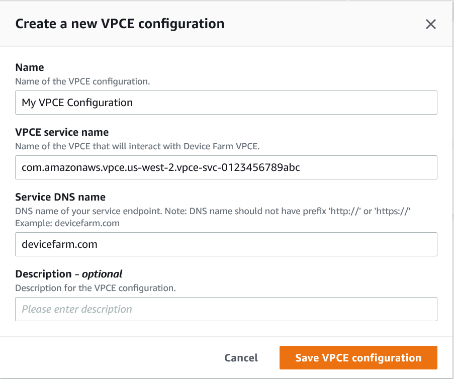

# Using Amazon VPC endpoint services with Device Farm - Legacy

(not recommended)

###### Warning

We strongly recommend using the VPC-ENI connectivity described on [this](vpc-eni.md "vpc-eni.md") page for
private endpoint connectivity as VPCE is now considered a legacy feature. VPC-ENI
provides more flexibility, simpler configurations, is more cost efficient, and requires
significantly less maintenance overhead when compared to the VPCE connectivity
method.

###### Note

Using Amazon VPC Endpoint Services with Device Farm is only supported for customers with
configured private devices. To enable your AWS account to use this feature with private
devices, please [contact
us](mailto:aws-devicefarm-support@amazon.com "mailto:aws-devicefarm-support@amazon.com").

Amazon Virtual Private Cloud (Amazon VPC) is an AWS service that you can use to launch AWS resources in a
virtual network that you define. With a VPC, you have control over your network settings,
such as the IP address range, subnets, routing tables, and network gateways.

If you use Amazon VPC to host private applications in the US West (Oregon)
(`us-west-2`) AWS Region, you can establish a private connection between
your VPC and Device Farm. With this connection, you can use Device Farm to test private applications
without exposing them through the public internet. To enable your AWS account to use this
feature with private devices, [contact
us](mailto:aws-devicefarm-support@amazon.com "mailto:aws-devicefarm-support@amazon.com").

To connect a resource in your VPC to Device Farm, you can use the Amazon VPC console to create a VPC
endpoint service. This endpoint service lets you provide the resource in your VPC to Device Farm
through a Device Farm VPC endpoint. The endpoint service provides reliable, scalable connectivity
to Device Farm without requiring an internet gateway, network address translation (NAT) instance,
or VPN connection. For more information, see [VPC endpoint services (AWS
PrivateLink)](../../../vpc/latest/privatelink/endpoint-service.md "../../../vpc/latest/privatelink/endpoint-service.md") in the _AWS PrivateLink Guide_.

###### Important

The Device Farm VPC endpoint feature helps you securely connect private internal services in
your VPC to the Device Farm public VPC by using AWS PrivateLink connections. Although the
connection is secure and private, that security depends on your protection of your AWS
credentials. If your AWS credentials are compromised, an attacker can access or expose
your service data to the outside world.

After you create a VPC endpoint service in Amazon VPC, you can use the Device Farm console to create
a VPC endpoint configuration in Device Farm. This topic shows you how to create the Amazon VPC
connection and the VPC endpoint configuration in Device Farm.

## Before you

begin

The following information is for Amazon VPC users in the US West (Oregon)
(`us-west-2`) Region, with a subnet in each of the following Availability
Zones: us-west-2a, us-west-2b, and us-west-2c.

Device Farm has additional requirements for the VPC endpoint services that you can use it
with. When you create and configure a VPC endpoint service to work with Device Farm, make sure
that you choose options that meet the following requirements:

- The Availability Zones for the service must include us-west-2a,
  us-west-2b, and us-west-2c. The Network Load Balancer that's associated with a VPC endpoint
  service determines the Availability Zones for that VPC endpoint service. If your
  VPC endpoint service doesn't show all three of these Availability Zones, you
  must re-create your Network Load Balancer to enable these three zones, and then reassociate the
  Network Load Balancer with your endpoint service.
- The allowed principals for the endpoint service must include the Amazon
  Resource Name (ARN) of the Device Farm VPC endpoint (service ARN). After you create
  your endpoint service, add the Device Farm VPC endpoint service ARN to your allow list
  to give Device Farm permission to access your VPC endpoint service. To get the Device Farm
  VPC endpoint service ARN, [contact us](mailto:aws-devicefarm-support@amazon.com "mailto:aws-devicefarm-support@amazon.com").

In addition, if you keep the **Acceptance required** setting turned
on when you create your VPC endpoint service, you must manually accept each connection
request that Device Farm sends to the endpoint service. To change this setting for an existing
endpoint service, choose the endpoint service on the Amazon VPC console, choose
**Actions**, and then choose **Modify endpoint acceptance
setting**. For more information, see [Change the load balancers
and acceptance settings](../../../vpc/latest/privatelink/modify-endpoint-service.md "../../../vpc/latest/privatelink/modify-endpoint-service.md") in the
_AWS PrivateLink Guide_.

The next section explains how to create an Amazon VPC endpoint service that meets these
requirements.

## Step 1: Creating a Network Load Balancer

The first step in establishing a private connection between your VPC and Device Farm is to
create a Network Load Balancer to route requests to a target group.

New console
**To create a Network Load Balancer using the new
console**

1. Open the Amazon Elastic Compute Cloud (Amazon EC2) console at [https://console.aws.amazon.com/ec2/](https://console.aws.amazon.com/ec2 "https://console.aws.amazon.com/ec2").
2. In the navigation pane, under **Load
   balancing**, choose **Load
   balancers**.
3. Choose **Create load
   balancer**.
4. Under **Network load balancer**, choose
   **Create**.
5. On the **Create network load balancer** page,
   under **Basic configuration**, do the
   following:
   1. Enter a load balancer **Name**.
   2. For **Scheme**, choose
      **Internal**.

6. Under **Network mapping**, do the
   following:
   1. Choose the **VPC** for your target
      group.
   2. Select the following **Mappings**:
      - `us-west-2a`
      - `us-west-2b`
      - `us-west-2c`

7. Under **Listeners and routing**, use the
   **Protocol** and **Port**
   options to choose your target group.

###### Note

By default, cross-availability zone load balancing is
disabled.

Because the load balancer uses the Availability Zones
`us-west-2a`, `us-west-2b`, and
`us-west-2c`, it either requires targets to be
registered in each of those Availability Zones, or, if you
register targets in less than all three zones, it requires that
you enable cross-zone load balancing. Otherwise, the load
balancer might not work as expected. 8. Choose **Create load balancer**.

Old console
**To create a Network Load Balancer using the old
console**

1. Open the Amazon Elastic Compute Cloud (Amazon EC2) console at [https://console.aws.amazon.com/ec2/](https://console.aws.amazon.com/ec2 "https://console.aws.amazon.com/ec2").
2. In the navigation pane, under **Load
   balancing**, choose **load
   balancers**.
3. Choose **Create load
   balancer**.
4. Under **Network load balancer**, choose
   **Create**.
5. On the **Configure load balancer** page, under
   **Basic configuration**, do the
   following:
   1. Enter a load balancer **Name**.
   2. For **Scheme**, choose
      **Internal**.

6. Under **Listeners**, select the
   **Protocol** and **Port** that
   your target group is using.
7. Under **Availability zones**, do the
   following:
   1. Choose the **VPC** for your target
      group.
   2. Select the following **Availability
      zones**:
      - `us-west-2a`
      - `us-west-2b`
      - `us-west-2c`

   3. Choose **Next: configure security
      settings**.

8. (Optional) Configure your security settings, then choose
   **Next: configure routing**.
9. On the **Configure Routing** page, do the
   following:
   1. For **Target group**, choose
      **Existing target group**.
   2. For **Name**, choose your target
      group.
   3. Choose **Next: register targets**.

10. On the **Register targets** page, review your
    targets, then choose **Next: review**.

###### Note

By default, cross-availability zone load balancing is
disabled.

Because the load balancer uses the Availability Zones
`us-west-2a`, `us-west-2b`, and
`us-west-2c`, it either requires targets to be
registered in each of those Availability Zones, or, if you
register targets in less than all three zones, it requires that
you enable cross-zone load balancing. Otherwise, the load
balancer might not work as expected. 11. Review your load balancer configuration, then choose
**Create**.

## Step 2: Creating an Amazon VPC

endpoint service

After creating the Network Load Balancer, use the Amazon VPC console to create an endpoint service in your
VPC.

1. Open the Amazon VPC console at
   [https://console.aws.amazon.com/vpc/](https://console.aws.amazon.com/vpc/ "https://console.aws.amazon.com/vpc/").
2. Under **Resources by region**, choose **Endpoint
   services**.
3. Choose **Create endpoint service**.
4. Do one of the following:
   - If you already have a Network Load Balancer that you want the endpoint service to use,
     choose it under **Available load balancers**, and then
     continue to step 5.
   - If you haven't yet created a Network Load Balancer, choose **Create new load
     balancer**. The Amazon EC2 console opens. Follow the steps in
     [Creating a Network Load Balancer](#device-farm-create-nlb "#device-farm-create-nlb")
     beginning with step 3, then continue with these steps in the Amazon VPC
     console.

5. For **Included availability zones**, verify that
   `us-west-2a`, `us-west-2b`, and
   `us-west-2c` appear in the list.
6. If you don't want to manually accept or deny each connection request that is
   sent to the endpoint service, under **Additional settings**,
   clear **Acceptance required**. If you clear this check box, the
   endpoint service automatically accepts each connection request that it
   receives.
7. Choose **Create**.
8. In the new endpoint service, choose **Allow
   principals**.
9. [Contact us](mailto:aws-devicefarm-support@amazon.com "mailto:aws-devicefarm-support@amazon.com") to
   get the ARN of the Device Farm VPC endpoint (service ARN) to add to the allow list for
   the endpoint service, and then add that service ARN to the allow list for the
   service.
10. On the **Details** tab for the endpoint service, make a note
    of the name of the service (**service name**). You need this
    name when you create the VPC endpoint configuration in the next step.

Your VPC endpoint service is now ready to use with Device Farm.

## Step 3: Creating a

VPC endpoint configuration in Device Farm

After you create an endpoint service in Amazon VPC, you can create an Amazon VPC endpoint
configuration in Device Farm.

1. Sign in to the Device Farm console at [https://console.aws.amazon.com/devicefarm](https://console.aws.amazon.com/devicefarm "https://console.aws.amazon.com/devicefarm").
2. In the navigation pane, choose **Mobile device testing**,
   then **Private devices**.
3. Choose **VPCE configurations**.
4. Choose **Create VPCE configuration**.
5. Under **Create a new VPCE configuration**, enter a
   **Name** for the VPC endpoint configuration.
6. For **VPCE service name**, enter the name of the Amazon VPC
   endpoint service (**service name**) that you noted in the Amazon VPC
   console. The name looks like
   `com.amazonaws.vpce.us-west-2.vpce-svc-id`.
7. For **Service DNS name**, enter the service DNS name for the
   app that you want to test (for example, `devicefarm.com`). Don't
   specify `http` or `https` before the service DNS
   name.

The domain name is not accessible through the public internet. In addition,
this new domain name, which maps to your VPC endpoint service, is generated by
Amazon Route 53 and is available exclusively for you in your Device Farm session. 8. Choose **Save**.

## Step 4:

Creating a test run

After you save the VPC endpoint configuration, you can use the configuration to create
test runs or remotely access sessions. For more information, see [Creating a test run in Device Farm](how-to-create-test-run.md "how-to-create-test-run.md") or [Creating a session](how-to-create-session.md "how-to-create-session.md").
