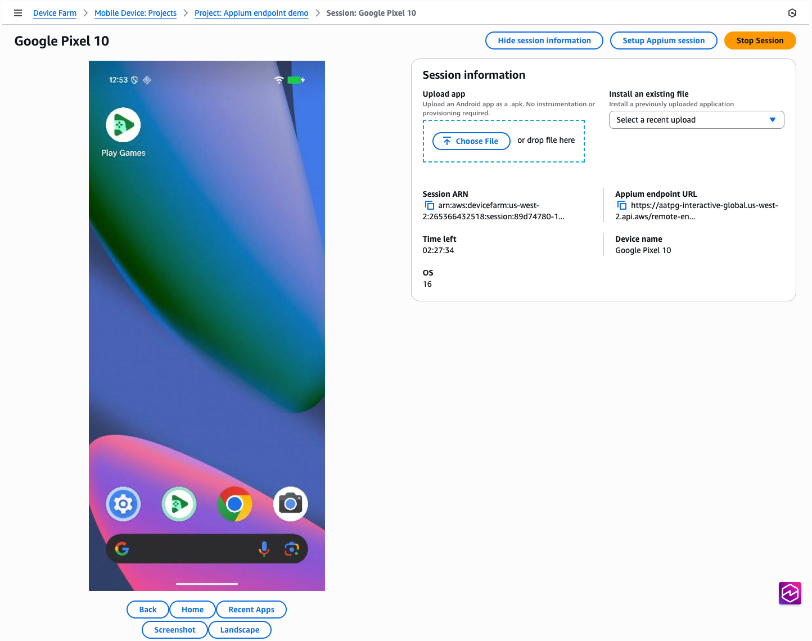

# Interacting with the device using Appium

Once you've [created a remote access session](how-to-create-session.md "how-to-create-session.md"), the device will be available for Appium testing.
For the entire duration of the remote access session, you can run as many Appium sessions as you'd like on the device, with no limits on what clients you use.
For example, you can start by running a test using your local Appium code from your IDE, then switch over to using Appium Inspector to troubleshoot any issues you encounter.
The session can last up to [150-minutes](limits.md#service-limits "limits.md#service-limits"), however, if there is no activity for over 5 minutes
(either through the interactive console or through the Appium endpoint), the session will time out.

## Using Apps for testing with your Appium session

Device Farm allows you to use your app(s) as a part of your remote access session creation request, or to install apps during the remote access session itself.
These apps are automatically installed onto the device under test and are injected as default capabilities for any Appium session requests.
When you create a remote access session, you have the option to pass in an app ARN, which will be used by default as the `appium:app`
capability for all subsequent Appium sessions, as well as auxiliary app ARNs, which will be used as the `appium:otherApps` capability.

For example, if you create a remote access session using an app `com.aws.devicefarm.sample` as your app, and `com.aws.devicefarm.other.sample` as one of your auxiliary apps, then when you go to create an Appium session, it will have capabilities similar to the following:

```
{
    "value":
    {
        "sessionId": "abcdef123456-1234-5678-abcd-abcdef123456",
        "capabilities":
        {
            "app": "/tmp/com.aws.devicefarm.sample.apk",
            "otherApps": "[\"/tmp/com.aws.devicefarm.other.sample.apk\"]",
            ...
        }
    }
}
```

During your session, you can install additional apps (either within the console, or using the [`InstallToRemoteAccessSession`](../APIReference/API_InstallToRemoteAccessSession.md "../APIReference/API_InstallToRemoteAccessSession.md") API). These will override any existing apps previously used as the `appium:app` capability. If those previously used apps have a distinct package name, they will stay on the device and be used as a part of the `appium:otherApps` capability.

For example, if you initially use an app `com.aws.devicefarm.sample` when creating your remote access session, but then install a new app named `com.aws.devicefarm.other.sample` during the session, then your Appium sessions will have capabilities similar to the following:

```
{
    "value":
    {
        "sessionId": "abcdef123456-1234-5678-abcd-abcdef123456",
        "capabilities":
        {
            "app": "/tmp/com.aws.devicefarm.other.sample.apk",
            "otherApps": "[\"/tmp/com.aws.devicefarm.sample.apk\"]",
            ...
        }
    }
}
```

If you'd prefer, you can explicitly specify the capabilities for your app using the app name (using the `appium:appPackage` or `appium:bundleId` capabilities for Android and iOS respectively).

If you are testing a web app, specify the `browserName` capability for your Appium session creation request. The `Chrome` browser is available on all Android devices, and the `Safari` browser is available on all iOS devices.

Device Farm does not support passing a remote URL or local filesystem path in `appium:app` during a remote access session. Upload apps to Device Farm and include them in the session instead.

###### Note

For more information about automatically uploading apps as a part of your remote access session, please see [automating app uploads.](api-ref.md#upload-example "api-ref.md#upload-example")

## How to use the Appium endpoint

Here are the steps to access the session's Appium endpoint from the console, the AWS CLI, and the AWS SDKs. These steps include how to get started with running tests using various Appium client testing frameworks:

Console

1. Open your remote access session page in your web browser:

 2. For running a session using Appium Inspector, do the following:

    1. Click the button **Setup Appium session**
    2. Follow along with the instructions on the page for how to start a session using Appium Inspector.

3. For running an Appium test from your local IDE, do the following:
   1. Click the "copy" icon next to the text **Appium endpoint URL**
   2. Paste this URL into your local Appium code wherever you currently specify your remote address or command executor. For language-specific examples, please click one of the tabs in this example window for your language of choice.

AWS CLI
First, verify that your AWS CLI version is up-to-date by [downloading and installing the latest version](../../../cli/latest/userguide/getting-started-install.md "../../../cli/latest/userguide/getting-started-install.md").

###### Important

The Appium endpoint field isn't available in older versions of the AWS CLI.

Once your session is up and running, the Appium endpoint URL will be available via a field named `remoteDriverEndpoint` in the response to a call to the [`GetRemoteAccessSession`](../APIReference/API_GetRemoteAccessSession.md "../APIReference/API_GetRemoteAccessSession.md") API:

```
`$` `aws devicefarm get-remote-access-session \
 --arn "arn:aws:devicefarm:us-west-2:123456789876:session:abcdef123456-1234-5678-abcd-abcdef123456/abcdef123456-1234-5678-abcd-abcdef123456/00000"`
```

This will show output such as the following:

```
`{
 "remoteAccessSession": {
 "arn": "arn:aws:devicefarm:us-west-2:111122223333:session:abcdef123456-1234-5678-abcd-abcdef123456/abcdef123456-1234-5678-abcd-abcdef123456/00000",
 "name": "Google Pixel 8",
 "status": "RUNNING",
 "endpoints": {
 "remoteDriverEndpoint": "https://devicefarm-interactive-global.us-west-2.api.aws/remote-endpoint/ABCD1234...",
 ...
}`
```

You can use this URL in your local Appium code wherever you currently specify your remote address or command executor. For language-specific examples, please click one of the tabs in this example window for your language of choice.

For an example of how to interact with the endpoint directly from the command line, you can use the [command-line tool curl](https://curl.se/ "https://curl.se/") to call a WebDriver endpoint directly:

```
`$` `curl "https://devicefarm-interactive-global.us-west-2.api.aws/remote-endpoint/ABCD1234.../status"`
```

This will show output such as the following:

```
`{
 "value":
 {
 "ready": true,
 "message": "The server is ready to accept new connections",
 "build":
 {
 "version": "2.5.1"
 }
 }
}`
```

Python
Once your session is up and running, the Appium endpoint URL will be available via a field named `remoteDriverEndpoint` in the response to a call to the [`GetRemoteAccessSession`](../APIReference/API_GetRemoteAccessSession.md "../APIReference/API_GetRemoteAccessSession.md") API:

```
# To get the URL
import sys
import boto3
from botocore.exceptions import ClientError

def get_appium_endpoint() -> str:
    session_arn = "arn:aws:devicefarm:us-west-2:111122223333:session:abcdef123456-1234-5678-abcd-abcdef123456/abcdef123456-1234-5678-abcd-abcdef123456/00000"
    device_farm_client = boto3.client("devicefarm", region_name="us-west-2")

    try:
        resp = device_farm_client.get_remote_access_session(arn=session_arn)
    except ClientError as exc:
        sys.exit(f"Failed to call Device Farm: {exc}")

    remote_access_session = resp.get("remoteAccessSession", {})
    endpoints = remote_access_session.get("endpoints", {})
    endpoint = endpoints.get("remoteDriverEndpoint")

    if not endpoint:
        sys.exit("Device Farm response did not include endpoints.remoteDriverEndpoint")

    return endpoint

# To use the URL
from appium import webdriver
from appium.options.android import UiAutomator2Options

opts = UiAutomator2Options()
driver = webdriver.Remote(get_appium_endpoint(), options=opts)
# ...
driver.quit()
```

Java
_Note: this example uses the AWS SDK for Java v2, and is compatible with JDK versions 11 and higher._

Once your session is up and running, the Appium endpoint URL will be available via a field named `remoteDriverEndpoint` in the response to a call to the [`GetRemoteAccessSession`](../APIReference/API_GetRemoteAccessSession.md "../APIReference/API_GetRemoteAccessSession.md") API:

```
// To get the URL
import software.amazon.awssdk.auth.credentials.DefaultCredentialsProvider;
import software.amazon.awssdk.regions.Region;
import software.amazon.awssdk.services.devicefarm.DeviceFarmClient;
import software.amazon.awssdk.services.devicefarm.model.GetRemoteAccessSessionRequest;
import software.amazon.awssdk.services.devicefarm.model.GetRemoteAccessSessionResponse;

public class AppiumEndpointBuilder {
    public static String getAppiumEndpoint() throws Exception {
        String session_arn = "arn:aws:devicefarm:us-west-2:111122223333:session:abcdef123456-1234-5678-abcd-abcdef123456/abcdef123456-1234-5678-abcd-abcdef123456/00000";

        try (DeviceFarmClient client = DeviceFarmClient.builder()
                .region(Region.US_WEST_2)
                .credentialsProvider(DefaultCredentialsProvider.create())
                .build()) {

            GetRemoteAccessSessionResponse resp = client.getRemoteAccessSession(
                    GetRemoteAccessSessionRequest.builder().arn(session_arn).build()
            );

            String endpoint = resp.remoteAccessSession().endpoints().remoteDriverEndpoint();
            if (endpoint == null || endpoint.isEmpty()) {
                throw new IllegalStateException("remoteDriverEndpoint missing from response");
            }
            return endpoint;
        }
    }
}

// To use the URL
import io.appium.java_client.android.AndroidDriver;
import io.appium.java_client.android.options.UiAutomator2Options;

import java.net.URL;

public class ExampleTest {
    public static void main(String[] args) throws Exception {
        String endpoint = AppiumEndpointBuilder.getAppiumEndpoint();
        UiAutomator2Options options = new UiAutomator2Options();
        AndroidDriver driver = new AndroidDriver(new URL(endpoint), options);

        try {
            // ... your test ...
        } finally {
            driver.quit();
        }
    }
}
```

JavaScript
_Note: this example uses AWS SDK for JavaScript v3 and WebdriverIO v8+ using Node 18+._

Once your session is up and running, the Appium endpoint URL will be available via a field named `remoteDriverEndpoint` in the response to a call to the [`GetRemoteAccessSession`](../APIReference/API_GetRemoteAccessSession.md "../APIReference/API_GetRemoteAccessSession.md") API:

```
// To get the URL
import { DeviceFarmClient, GetRemoteAccessSessionCommand } from "@aws-sdk/client-device-farm";

export async function getAppiumEndpoint() {
  const sessionArn = "arn:aws:devicefarm:us-west-2:111122223333:session:abcdef123456-1234-5678-abcd-abcdef123456/abcdef123456-1234-5678-abcd-abcdef123456/00000";

  const client = new DeviceFarmClient({ region: "us-west-2" });
  const resp = await client.send(new GetRemoteAccessSessionCommand({ arn: sessionArn }));

  const endpoint = resp?.remoteAccessSession?.endpoints?.remoteDriverEndpoint;
  if (!endpoint) throw new Error("remoteDriverEndpoint missing from response");
  return endpoint;
}

// To use the URL with WebdriverIO
import { remote } from "webdriverio";

(async () => {
  const endpoint = await getAppiumEndpoint();
  const u = new URL(endpoint);

  const driver = await remote({
    protocol: u.protocol.replace(":", ""),
    hostname: u.hostname,
    port: u.port ? Number(u.port) : (u.protocol === "https:" ? 443 : 80),
    path: u.pathname + u.search,
    capabilities: {
      platformName: "Android",
      "appium:automationName": "UiAutomator2",
      // ...other caps...
    },
  });

  try {
    // ... your test ...
  } finally {
    await driver.deleteSession();
  }
})();
```

C#
Once your session is up and running, the Appium endpoint URL will be available via a field named `remoteDriverEndpoint` in the response to a call to the [`GetRemoteAccessSession`](../APIReference/API_GetRemoteAccessSession.md "../APIReference/API_GetRemoteAccessSession.md") API:

```
// To get the URL
using System;
using System.Threading.Tasks;
using Amazon;
using Amazon.DeviceFarm;
using Amazon.DeviceFarm.Model;

public static class AppiumEndpointBuilder
{
    public static async Task<string> GetAppiumEndpointAsync()
    {
        var sessionArn = "arn:aws:devicefarm:us-west-2:111122223333:session:abcdef123456-1234-5678-abcd-abcdef123456/abcdef123456-1234-5678-abcd-abcdef123456/00000";

        var config = new AmazonDeviceFarmConfig
        {
            RegionEndpoint = RegionEndpoint.USWest2
        };
        using var client = new AmazonDeviceFarmClient(config);

        var resp = await client.GetRemoteAccessSessionAsync(new GetRemoteAccessSessionRequest { Arn = sessionArn });
        var endpoint = resp?.RemoteAccessSession?.Endpoints?.RemoteDriverEndpoint;

        if (string.IsNullOrWhiteSpace(endpoint))
            throw new InvalidOperationException("RemoteDriverEndpoint missing from response");

        return endpoint;
    }
}

// To use the URL
using OpenQA.Selenium.Appium;
using OpenQA.Selenium.Appium.Android;

class Example
{
    static async Task Main()
    {
        var endpoint = await AppiumEndpointBuilder.GetAppiumEndpointAsync();

        var options = new AppiumOptions();
        options.PlatformName = "Android";
        options.AutomationName = "UiAutomator2";

        using var driver = new AndroidDriver(new Uri(endpoint), options);
        try
        {
            // ... your test ...
        }
        finally
        {
            driver.Quit();
        }
    }
}
```

Ruby
Once your session is up and running, the Appium endpoint URL will be available via a field named `remoteDriverEndpoint` in the response to a call to the [`GetRemoteAccessSession`](../APIReference/API_GetRemoteAccessSession.md "../APIReference/API_GetRemoteAccessSession.md") API:

```
# To get the URL
require 'aws-sdk-devicefarm'

def get_appium_endpoint
  session_arn = "arn:aws:devicefarm:us-west-2:111122223333:session:abcdef123456-1234-5678-abcd-abcdef123456/abcdef123456-1234-5678-abcd-abcdef123456/00000"

  client = Aws::DeviceFarm::Client.new(region: 'us-west-2')
  resp = client.get_remote_access_session(arn: session_arn)
  endpoint = resp.remote_access_session.endpoints.remote_driver_endpoint
  raise "remote_driver_endpoint missing from response" if endpoint.nil? || endpoint.empty?
  endpoint
end

# To use the URL
require 'appium_lib_core'

endpoint = get_appium_endpoint
opts = {
  server_url: endpoint,
  capabilities: {
    'platformName' => 'Android',
    'appium:automationName' => 'UiAutomator2'
  }
}

driver = Appium::Core.for(opts).start_driver
begin
  # ... your test ...
ensure
  driver.quit
end
```
