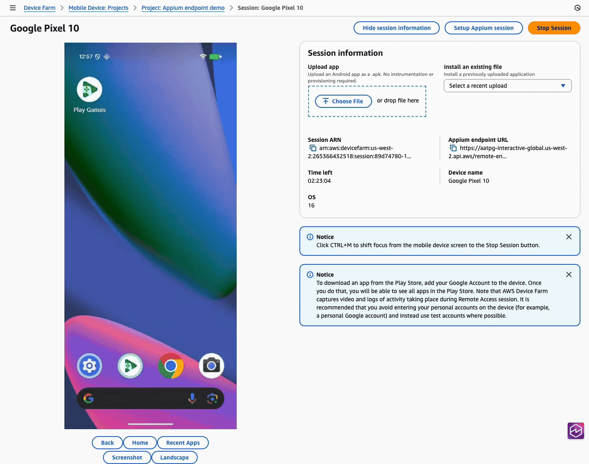

# Reviewing your Appium server logs

Once you've [started an Appium session](appium-endpoint-interaction.md "appium-endpoint-interaction.md"), you can view the Appium server logs live in the Device Farm console, or download them after the remote access session ends. Here are the instructions for doing so:

Console

1. In the Device Farm console, open the Remote access session for your device.
2. Start an Appium endpoint session with the device from your local IDE or Appium Inspector
3. Then, the Appium server log will appear alongside the device in the remote access session page, with the "session information" available at the bottom of the page below the device:



AWS CLI
_Note: this example uses the [command-line tool `curl`](https://curl.se/ "https://curl.se/") to pull the log from Device Farm._

During or after the session, you can use Device Farm's [`ListArtifacts`](../APIReference/API_ListArtifacts.md "../APIReference/API_ListArtifacts.md") API to download the Appium server log.

```
`$` `aws devicefarm list-artifacts \
 --type FILE \
 --arn arn:aws:devicefarm:us-west-2:111122223333:session:12345678-1111-2222-333-456789abcdef/12345678-1111-2222-333-456789abcdef/00000`
```

This will show output such as the following during the session:

```
`{
 "artifacts": [
 {
 "arn": "arn:aws:devicefarm:us-west-2:111122223333:artifact:12345678-1111-2222-333-456789abcdef/12345678-1111-2222-333-456789abcdef/00000",
 "name": "AppiumServerLogOutput",
 "type": "APPIUM_SERVER_LOG_OUTPUT",
 "extension": "",
 "url": "https://prod-us-west-2-results.s3.dualstack.us-west-2.amazonaws.com/111122223333/12345678..."
 }
 ]
}`
```

And the following after the session is done:

```
`{
 "artifacts": [
 {
 "arn": "arn:aws:devicefarm:us-west-2:111122223333:artifact:12345678-1111-2222-333-456789abcdef/12345678-1111-2222-333-456789abcdef/00000",
 "name": "Appium Server Output",
 "type": "APPIUM_SERVER_OUTPUT",
 "extension": "log",
 "url": "https://prod-us-west-2-results.s3.dualstack.us-west-2.amazonaws.com/111122223333/12345678..."
 }
 ]
}`
```

```
`$` `curl "https://prod-us-west-2-results.s3.dualstack.us-west-2.amazonaws.com/111122223333/12345678..."`
```

This will show output such as the following:

```
`info Appium Welcome to Appium v2.5.4
info Appium Non-default server args:
info Appium { address: '127.0.0.1',
info Appium allowInsecure:
info Appium [ 'execute_driver_script',
info Appium 'session_discovery',
info Appium 'perf_record',
info Appium 'adb_shell',
info Appium 'chromedriver_autodownload',
info Appium 'get_server_logs' ],
info Appium keepAliveTimeout: 0,
info Appium logNoColors: true,
info Appium logTimestamp: true,
info Appium longStacktrace: true,
info Appium sessionOverride: true,
info Appium strictCaps: true,
info Appium useDrivers: [ 'uiautomator' ] }`
```

Python
_Note: this example uses the third-party `requests` package to download the log, as well as the AWS SDK for Python `boto3`._

During or after the session, you can use Device Farm's [`ListArtifacts`](../APIReference/API_ListArtifacts.md "../APIReference/API_ListArtifacts.md") API to retrieve the Appium server log URL, then download it.

```
import pathlib
import requests
import boto3

def download_appium_log():
    session_arn = "arn:aws:devicefarm:us-west-2:111122223333:session:12345678-1111-2222-333-456789abcdef/12345678-1111-2222-333-456789abcdef/00000"
    client = boto3.client("devicefarm", region_name="us-west-2")

    # 1) List artifacts for the session (FILE artifacts), handling pagination
    artifacts = []
    token = None
    while True:
        kwargs = {"arn": session_arn, "type": "FILE"}
        if token:
            kwargs["nextToken"] = token
        resp = client.list_artifacts(**kwargs)
        artifacts.extend(resp.get("artifacts", []))
        token = resp.get("nextToken")
        if not token:
            break

    if not artifacts:
        raise RuntimeError("No artifacts found in this session")

    # Filter strictly to Appium server logs
    allowed = {"APPIUM_SERVER_OUTPUT", "APPIUM_SERVER_LOG_OUTPUT"}
    filtered = [a for a in artifacts if a.get("type") in allowed]
    if not filtered:
        raise RuntimeError("No Appium server log artifacts found (expected APPIUM_SERVER_OUTPUT or APPIUM_SERVER_LOG_OUTPUT)")

    # Prefer the final 'OUTPUT' log, else the live 'LOG_OUTPUT'
    chosen = (next((a for a in filtered if a.get("type") == "APPIUM_SERVER_OUTPUT"), None)
              or next((a for a in filtered if a.get("type") == "APPIUM_SERVER_LOG_OUTPUT"), None))

    url = chosen["url"]
    ext = chosen.get("extension") or "log"
    out = pathlib.Path(f"./appium_server_log.{ext}")

    # 2) Download the artifact
    with requests.get(url, stream=True) as r:
        r.raise_for_status()
        with open(out, "wb") as fh:
            for chunk in r.iter_content(chunk_size=1024 * 1024):
                if chunk:
                    fh.write(chunk)

    print(f"Saved Appium server log to: {out.resolve()}")

download_appium_log()
```

This will show output such as the following:

```
`info Appium Welcome to Appium v2.5.4
info Appium Non-default server args:
info Appium { address: '127.0.0.1', allowInsecure: [ 'execute_driver_script', ... ], useDrivers: [ 'uiautomator' ] }`
```

Java
_Note: this example uses the AWS SDK for Java v2 and `HttpClient` to download the log, and is compatible with JDK versions 11 and higher._

During or after the session, you can use Device Farm's [`ListArtifacts`](../APIReference/API_ListArtifacts.md "../APIReference/API_ListArtifacts.md") API to retrieve the Appium server log URL, then download it.

```
import java.io.IOException;
import java.net.URI;
import java.net.http.HttpClient;
import java.net.http.HttpRequest;
import java.net.http.HttpResponse;
import java.nio.file.Path;
import java.time.Duration;
import java.util.ArrayList;
import java.util.Comparator;
import java.util.List;

import software.amazon.awssdk.regions.Region;
import software.amazon.awssdk.services.devicefarm.DeviceFarmClient;
import software.amazon.awssdk.services.devicefarm.model.Artifact;
import software.amazon.awssdk.services.devicefarm.model.ArtifactCategory;
import software.amazon.awssdk.services.devicefarm.model.ListArtifactsRequest;
import software.amazon.awssdk.services.devicefarm.model.ListArtifactsResponse;

public class AppiumLogDownloader {

    public static void main(String[] args) throws Exception {
        String sessionArn = "arn:aws:devicefarm:us-west-2:111122223333:session:12345678-1111-2222-333-456789abcdef/12345678-1111-2222-333-456789abcdef/00000";

        try (DeviceFarmClient client = DeviceFarmClient.builder()
                .region(Region.US_WEST_2)
                .build()) {

            // 1) List artifacts for the session (FILE artifacts) with pagination
            List<Artifact> all = new ArrayList<>();
            String token = null;
            do {
                ListArtifactsRequest.Builder b = ListArtifactsRequest.builder()
                        .arn(sessionArn)
                        .type(ArtifactCategory.FILE);
                if (token != null) b.nextToken(token);
                ListArtifactsResponse page = client.listArtifacts(b.build());
                all.addAll(page.artifacts());
                token = page.nextToken();
            } while (token != null && !token.isBlank());

            // Filter strictly to Appium logs
            List<Artifact> filtered = all.stream()
                    .filter(a -> {
                        String t = a.typeAsString();
                        return "APPIUM_SERVER_OUTPUT".equals(t) || "APPIUM_SERVER_LOG_OUTPUT".equals(t);
                    })
                    .toList();

            if (filtered.isEmpty()) {
                throw new RuntimeException("No Appium server log artifacts found (expected APPIUM_SERVER_OUTPUT or APPIUM_SERVER_LOG_OUTPUT).");
            }

            // Prefer OUTPUT; else LOG_OUTPUT
            Artifact chosen = filtered.stream()
                    .filter(a -> "APPIUM_SERVER_OUTPUT".equals(a.typeAsString()))
                    .findFirst()
                    .orElseGet(() -> filtered.stream()
                            .filter(a -> "APPIUM_SERVER_LOG_OUTPUT".equals(a.typeAsString()))
                            .findFirst()
                            .get());

            String url = chosen.url();
            String ext = (chosen.extension() == null || chosen.extension().isBlank()) ? "log" : chosen.extension();
            Path out = Path.of("appium_server_log." + ext);

            // 2) Download the artifact with HttpClient
            HttpClient http = HttpClient.newBuilder()
                    .connectTimeout(Duration.ofSeconds(10))
                    .build();

            HttpRequest get = HttpRequest.newBuilder(URI.create(url))
                    .timeout(Duration.ofMinutes(5))
                    .GET()
                    .build();

            HttpResponse<Path> resp = http.send(get, HttpResponse.BodyHandlers.ofFile(out));
            if (resp.statusCode() / 100 != 2) {
                throw new IOException("Failed to download log, HTTP " + resp.statusCode());
            }
            System.out.println("Saved Appium server log to: " + out.toAbsolutePath());
        }
    }
}
```

This will show output such as the following:

```
`info Appium Welcome to Appium v2.5.4
info Appium Non-default server args:
info Appium { address: '127.0.0.1', ..., useDrivers: [ 'uiautomator' ] }`
```

JavaScript
_Note: this example uses AWS SDK for JavaScript (v3) and Node 18+ `fetch` to download the log._

During or after the session, you can use Device Farm's [`ListArtifacts`](../APIReference/API_ListArtifacts.md "../APIReference/API_ListArtifacts.md") API to retrieve the Appium server log URL, then download it.

```
import { DeviceFarmClient, ListArtifactsCommand } from "@aws-sdk/client-device-farm";
import { createWriteStream } from "fs";
import { pipeline } from "stream";
import { promisify } from "util";

const pipe = promisify(pipeline);
const client = new DeviceFarmClient({ region: "us-west-2" });

const sessionArn = "arn:aws:devicefarm:us-west-2:111122223333:session:12345678-1111-2222-333-456789abcdef/12345678-1111-2222-333-456789abcdef/00000";

// 1) List artifacts for the session (FILE artifacts), handling pagination
const artifacts = [];
let nextToken;
do {
  const page = await client.send(new ListArtifactsCommand({
    arn: sessionArn,
    type: "FILE",
    nextToken
  }));
  artifacts.push(...(page.artifacts ?? []));
  nextToken = page.nextToken;
} while (nextToken);

if (!artifacts.length) throw new Error("No artifacts found");

// Strict filter to Appium logs
const filtered = (artifacts ?? []).filter(a =>
  a.type === "APPIUM_SERVER_OUTPUT" || a.type === "APPIUM_SERVER_LOG_OUTPUT"
);
if (!filtered.length) {
  throw new Error("No Appium server log artifacts found (expected APPIUM_SERVER_OUTPUT or APPIUM_SERVER_LOG_OUTPUT).");
}

// Prefer OUTPUT; else LOG_OUTPUT
const chosen =
  filtered.find(a => a.type === "APPIUM_SERVER_OUTPUT") ??
  filtered.find(a => a.type === "APPIUM_SERVER_LOG_OUTPUT");

const url = chosen.url;
const ext = chosen.extension || "log";
const outPath = `./appium_server_log.${ext}`;

// 2) Download the artifact
const resp = await fetch(url);
if (!resp.ok) {
  throw new Error(`Failed to download log: ${resp.status} ${await resp.text().catch(()=>"")}`);
}
await pipe(resp.body, createWriteStream(outPath));
console.log("Saved Appium server log to:", outPath);
```

This will show output such as the following:

```
`info Appium Welcome to Appium v2.5.4
info Appium Non-default server args:
info Appium { address: '127.0.0.1', allowInsecure: [ 'execute_driver_script', ... ], useDrivers: [ 'uiautomator' ] }`
```

C#
_Note: this example uses the AWS SDK for .NET and `HttpClient` to download the log._

During or after the session, you can use Device Farm's [`ListArtifacts`](../APIReference/API_ListArtifacts.md "../APIReference/API_ListArtifacts.md") API to retrieve the Appium server log URL, then download it.

```
using System;
using System.Collections.Generic;
using System.IO;
using System.Net.Http;
using System.Threading.Tasks;
using System.Linq;
using Amazon;
using Amazon.DeviceFarm;
using Amazon.DeviceFarm.Model;

class AppiumLogDownloader
{
    static async Task Main()
    {
        var sessionArn = "arn:aws:devicefarm:us-west-2:111122223333:session:12345678-1111-2222-333-456789abcdef/12345678-1111-2222-333-456789abcdef/00000";

        using var client = new AmazonDeviceFarmClient(RegionEndpoint.USWest2);

        // 1) List artifacts for the session (FILE artifacts), handling pagination
        var all = new List<Artifact>();
        string? token = null;
        do
        {
            var page = await client.ListArtifactsAsync(new ListArtifactsRequest
            {
                Arn = sessionArn,
                Type = ArtifactCategory.FILE,
                NextToken = token
            });
            if (page.Artifacts != null) all.AddRange(page.Artifacts);
            token = page.NextToken;
        } while (!string.IsNullOrEmpty(token));

        if (all.Count == 0)
            throw new Exception("No artifacts found");

        // Strict filter to Appium logs
        var filtered = all.Where(a =>
            a.Type == "APPIUM_SERVER_OUTPUT" || a.Type == "APPIUM_SERVER_LOG_OUTPUT").ToList();

        if (filtered.Count == 0)
            throw new Exception("No Appium server log artifacts found (expected APPIUM_SERVER_OUTPUT or APPIUM_SERVER_LOG_OUTPUT).");

        // Prefer OUTPUT; else LOG_OUTPUT
        var chosen = filtered.FirstOrDefault(a => a.Type == "APPIUM_SERVER_OUTPUT")
                    ?? filtered.First(a => a.Type == "APPIUM_SERVER_LOG_OUTPUT");

        var url = chosen.Url;
        var ext = string.IsNullOrWhiteSpace(chosen.Extension) ? "log" : chosen.Extension;
        var outPath = $"./appium_server_log.{ext}";

        // 2) Download the artifact
        using var http = new HttpClient();
        using var resp = await http.GetAsync(url, HttpCompletionOption.ResponseHeadersRead);
        resp.EnsureSuccessStatusCode();
        await using (var fs = File.Create(outPath))
        {
            await resp.Content.CopyToAsync(fs);
        }
        Console.WriteLine($"Saved Appium server log to: {Path.GetFullPath(outPath)}");
    }
}
```

This will show output such as the following:

```
`info Appium Welcome to Appium v2.5.4
info Appium Non-default server args:
info Appium { address: '127.0.0.1', ..., useDrivers: [ 'uiautomator' ] }`
```

Ruby
_Note: this example uses the AWS SDK for Ruby and `Net::HTTP` to download the log._

During or after the session, you can use Device Farm's [`ListArtifacts`](../APIReference/API_ListArtifacts.md "../APIReference/API_ListArtifacts.md") API to retrieve the Appium server log URL, then download it.

```
require "aws-sdk-devicefarm"
require "net/http"
require "uri"

client = Aws::DeviceFarm::Client.new(region: "us-west-2")
session_arn = "arn:aws:devicefarm:us-west-2:111122223333:session:12345678-1111-2222-333-456789abcdef/12345678-1111-2222-333-456789abcdef/00000"

# 1) List artifacts for the session (FILE artifacts), handling pagination
artifacts = []
token = nil
loop do
  page = client.list_artifacts(arn: session_arn, type: "FILE", next_token: token)
  artifacts.concat(page.artifacts || [])
  token = page.next_token
  break if token.nil? || token.empty?
end

raise "No artifacts found" if artifacts.empty?

# Strict filter to Appium logs
filtered = (artifacts || []).select { |a| ["APPIUM_SERVER_OUTPUT", "APPIUM_SERVER_LOG_OUTPUT"].include?(a.type) }
raise "No Appium server log artifacts found (expected APPIUM_SERVER_OUTPUT or APPIUM_SERVER_LOG_OUTPUT)." if filtered.empty?

# Prefer OUTPUT; else LOG_OUTPUT
chosen = filtered.find { |a| a.type == "APPIUM_SERVER_OUTPUT" } ||
         filtered.find { |a| a.type == "APPIUM_SERVER_LOG_OUTPUT" }

url = chosen.url
ext = (chosen.extension && !chosen.extension.empty?) ? chosen.extension : "log"
out_path = "./appium_server_log.#{ext}"

# 2) Download the artifact
uri = URI.parse(url)
Net::HTTP.start(uri.host, uri.port, use_ssl: (uri.scheme == "https")) do |http|
  req = Net::HTTP::Get.new(uri)
  http.request(req) do |resp|
    raise "Failed GET: #{resp.code} #{resp.body}" unless resp.code.to_i / 100 == 2
    File.open(out_path, "wb") { |f| resp.read_body { |chunk| f.write(chunk) } }
  end
end
puts "Saved Appium server log to: #{File.expand_path(out_path)}"
```

This will show output such as the following:

```
`info Appium Welcome to Appium v2.5.4
info Appium Non-default server args:
info Appium { address: '127.0.0.1', allowInsecure: [ 'execute_driver_script', ... ], useDrivers: [ 'uiautomator' ] }`
```
