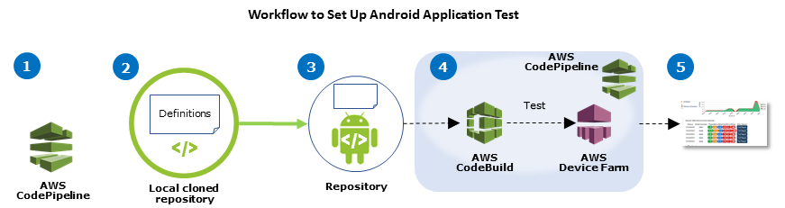
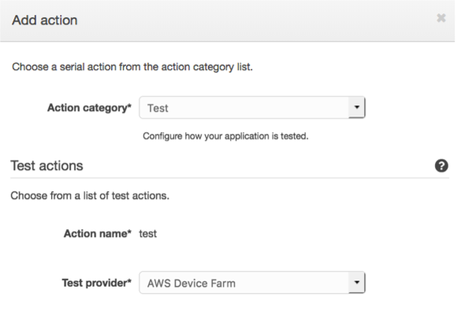
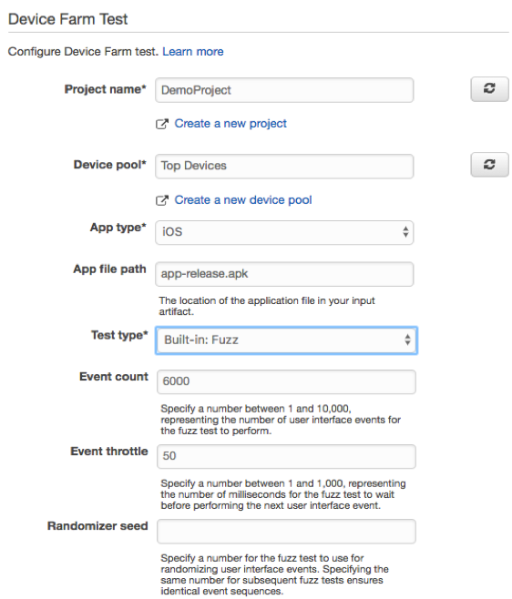
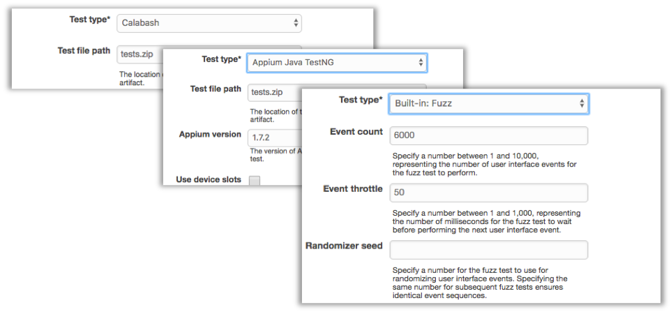
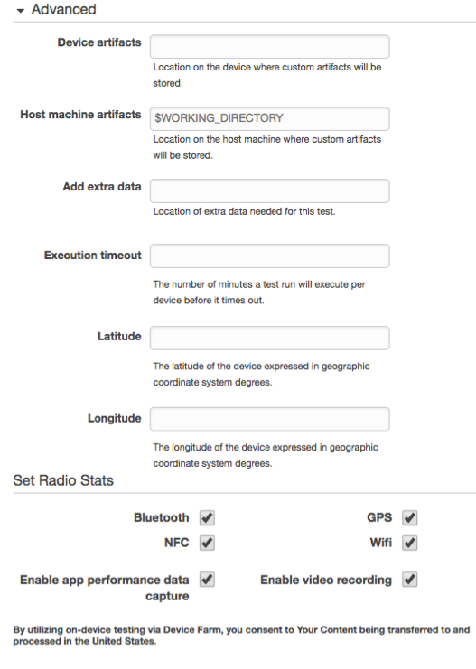
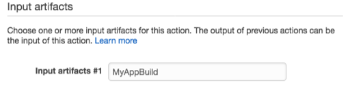
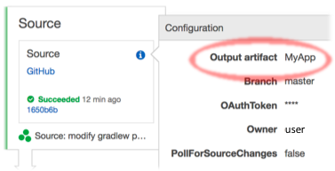

# Integrating AWS Device Farm in a CodePipeline test stage

You can use [AWS CodePipeline](../../../codepipeline/latest/userguide.md "../../../codepipeline/latest/userguide.md") to incorporate mobile app tests configured in Device Farm
into an AWS-managed automated release pipeline. You can configure your pipeline to run tests on demand, on a
schedule, or as part of a continuous integration flow.

The following diagram shows the continuous integration flow in which an Android app is built and tested each
time a push is committed to its repository. To create this pipeline configuration, see the [Tutorial: Build and Test an Android App When Pushed
to GitHub](../../../codepipeline/latest/userguide/tutorials-codebuild-devicefarm.md "../../../codepipeline/latest/userguide/tutorials-codebuild-devicefarm.md").

|                                |                                                  |                                     |                                                                        |                     |
| ------------------------------ | ------------------------------------------------ | ----------------------------------- | ---------------------------------------------------------------------- | ------------------- | -------------------------------------------------------------------------------------------------------------------------------------------------------------------------------------------------------------------------------------------------------------------------------------------------------------------------------------------------------------------------------------------------------------------------------------------------------------------------------------------------------------------------------------------------------------------------------------------------------------------------------------------------------------------------------------------------------------------------------------------------------------------------------------------------------------------------------------------------------------------------------------------------------------------------------------------------------------------------------------------------------------------------------------------------------------------------------------------------------------------------------------------------------------------------------------------------------------------------------------------------------------------------------------------------------------------------------------------------------------------------------------------------------------------------------------------------------------------------------------------------------------------------------------------------------------------------------------------------------------------------------------------------------------------------------------------------------------------------------------------------------------------------------------------------------------------------------------------------------------------------------------------------------------------------------------------------------------------------------------------------------------------------------------------------------------------------------------------------------------------------------------------------------------------------------------------------------------------------------------------------------------------------------------------------------------------------------------------------------------------------------------------------------------------------------------------------------------------------------------------------------------------------------------------------------------------------------------------------------------------------------------------------------------------------------------------------------------------------------------------------------------------------------------------------------------------------------------------------------------------------------------------------------------------------------------------------------------------------------------------------------------------------------------------------------------------------------------------------------------------------------------------------------------------------------------------------------------------------------------------------------------------------------------------------------------------------------------------------------------------------------------------------------------------------------------------------------------------------------------------------------------------------------------------------------------------------------------------------------------------------------------------------------------------------------------------------------------------------------------------------------------------------------------------------------------------------------------------------------------------------------------------------------------------------------------------------------------------------------------------------------------------------------------------------------------------------------------------------------------------------------------------------------------------------------------------------------- |
| **1. Configure**               | **2. Add definitions**                           | **3. Push**                         | **4. Build and test**                                                  | **5. Report**       |
| _Configure pipeline resources_ | _Add build and test definitions to your package_ | _Push a package to your repository_ | _App build and test of build output artifact kicked off automatically_ | _View test results_ | To learn how to configure a pipeline that continually tests a compiled app (such as an iOS `.ipa` or Android `.apk` file) as its source, see [Tutorial: Test an iOS App Each Time You Upload an .ipa File to an Amazon S3 Bucket](../../../codepipeline/latest/userguide/tutorials-codebuild-devicefarm-S3.md "../../../codepipeline/latest/userguide/tutorials-codebuild-devicefarm-S3.md"). ## Configure CodePipeline to use your Device Farm tests In these steps, we assume that you have [configured a Device Farm project](how-to-create-project.md "how-to-create-project.md") and [created a pipeline](../../../codepipeline/latest/userguide/getting-started-codepipeline.md "../../../codepipeline/latest/userguide/getting-started-codepipeline.md"). The pipeline should be configured with a test stage that receives an [input artifact](../../../codepipeline/latest/userguide/welcome.md#welcome-introducing-artifacts "../../../codepipeline/latest/userguide/welcome.md#welcome-introducing-artifacts") that contains your test definition and compiled app package files. The test stage input artifact can be the output artifact of either a source or build stage configured in your pipeline. ###### To configure a Device Farm test run as an CodePipeline test action 1. Sign in to the AWS Management Console and open the CodePipeline console at [https://console.aws.amazon.com/codepipeline/](https://console.aws.amazon.com/codepipeline/ "https://console.aws.amazon.com/codepipeline/"). 2. Choose the pipeline for your app release. 3. On the test stage panel, choose the pencil icon, and then choose **Action**. 4. On the **Add action** panel, for **Action category**, choose **Test**. 5. In **Action name**, enter a name. 6. In **Test provider**, choose **AWS Device Farm**.  7. In **Project name**, choose your existing Device Farm project or choose **Create a new project**. 8. In **Device pool**, choose your existing device pool or choose **Create a new device pool**. If you create a device pool, you need to select a set of test devices. 9. In **App type**, choose the platform for your app.  10. In **App file path**, enter the path of the compiled app package. The path is relative to the root of the input artifact for your test. 11. In **Test type**, do one of the following:  • If you're using one of the built-in Device Farm tests, choose the type of test configured in your Device Farm project.  • If you aren't using one of the Device Farm built-in tests, in the **Test file path**, enter the path of the test definition file. The path is relative to the root of the input artifact for your test.  12. In the remaining fields, provide the configuration that is appropriate for your test and application type. 13. (Optional) In **Advanced**, provide detailed configuration for your test run.  14. In **Input artifacts**, choose the input artifact that matches the output artifact of the stage that comes before the test stage in the pipeline.  In the CodePipeline console, you can find the name of the output artifact for each stage by hovering over the information icon in the pipeline diagram. If your pipeline tests your app directly from the **Source** stage, choose **MyApp**. If your pipeline includes a **Build** stage, choose **MyAppBuild**.  15. At the bottom of the panel, choose **Add Action**. 16. In the CodePipeline pane, choose **Save pipeline change**, and then choose **Save change**. 17. To submit your changes and start a pipeline build, choose **Release change**, and then choose **Release**. |
