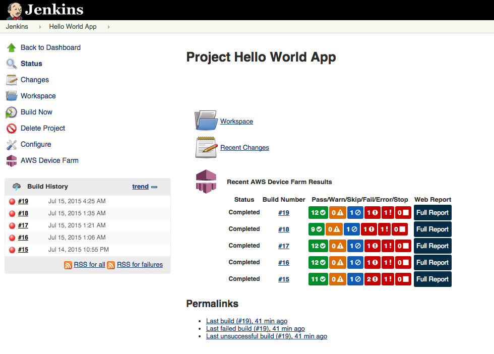
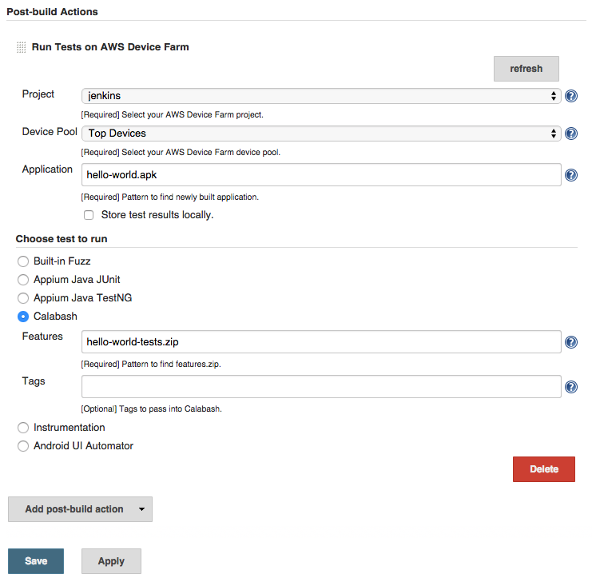
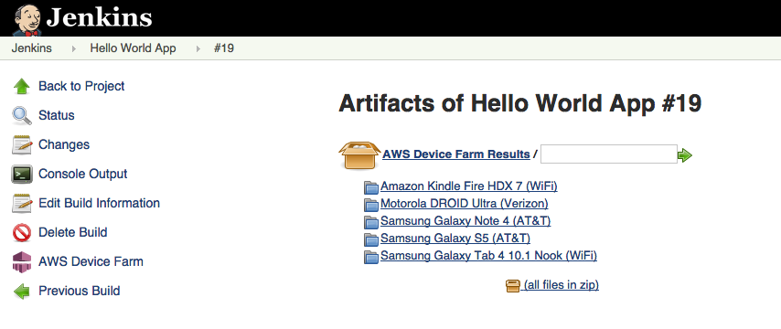

# Integrating Device Farm with a Jenkins CI server

The Jenkins CI plugin provides AWS Device Farm functionality from your own Jenkins continuous integration (CI) server. For
more information, see [Jenkins
(software)](https://en.wikipedia.org/wiki/Jenkins_%28software%29 "https://en.wikipedia.org/wiki/Jenkins_%28software%29").

###### Note

To download the Jenkins plugin, go to [GitHub](https://github.com/awslabs/aws-device-farm-jenkins-plugin "https://github.com/awslabs/aws-device-farm-jenkins-plugin") and follow the instructions in [Step 1: Installing the Jenkins CI plugin for AWS Device Farm](#jenkins-ci-installing-the-plugin "#jenkins-ci-installing-the-plugin").

This section contains a series of procedures to set up and use the Jenkins CI plugin with AWS Device Farm.

The following images show the features of the Jenkins CI plugin.




The plugin can also pull down all the test artifacts (logs, screenshots, etc.) locally:



###### Topics

- [Dependencies](#jenkins-plugin-dependencies "#jenkins-plugin-dependencies")
- [Step 1: Installing the Jenkins CI plugin for AWS Device Farm](#jenkins-ci-installing-the-plugin "#jenkins-ci-installing-the-plugin")
- [Step 2: Creating an AWS Identity and Access Management user for your Jenkins CI Plugin for AWS Device Farm](#jenkins-ci-set-up-iam-user "#jenkins-ci-set-up-iam-user")
- [Step 3: Configuring the Jenkins CI plugin for the first time in AWS Device Farm](#jenkins-ci-first-time-configuration-instructions "#jenkins-ci-first-time-configuration-instructions")
- [Step 4: Using the plugin in a Jenkins job](#jenkins-ci-using-plugin-jenkins-job "#jenkins-ci-using-plugin-jenkins-job")

## Dependencies

The Jenkins CI Plugin requires the AWS Mobile SDK 1.10.5 or later. For more information and to install
the SDK, see [AWS Mobile SDK](https://aws.amazon.com/mobile/sdk/ "https://aws.amazon.com/mobile/sdk/").

## Step 1: Installing the Jenkins CI plugin for AWS Device Farm

There are two options for installing the Jenkins continuous integration (CI)
plugin for AWS Device Farm. You can search for the plugin from within the **Available
Plugins** dialog in the Jenkins Web UI, or you can download the `hpi` file and install it from
within Jenkins.

### Install from within the Jenkins UI

1. Find the plugin within the Jenkins UI by choosing **Manage Jenkins**, **Manage Plugins**,
   and then choose **Available**.
2. Search for **aws-device-farm**.
3. Install the AWS Device Farm plugin.
4. Ensure that the plugin is owned by the `Jenkins` user.
5. Restart Jenkins.

### Download the plugin

1. Download the `hpi` file directly from [http://updates.jenkins-ci.org/latest/aws-device-farm.hpi](http://updates.jenkins-ci.org/latest/aws-device-farm.hpi "http://updates.jenkins-ci.org/latest/aws-device-farm.hpi").
2. Ensure that the plugin is owned by the `Jenkins` user.
3. Install the plugin using one of the following options:
   - Upload the plugin by choosing **Manage Jenkins**, **Manage Plugins**,
     **Advanced**, and then choose **Upload plugin**.
   - Place the `hpi` file in the Jenkins plugin directory (usually
     `/var/lib/jenkins/plugins`).

4. Restart Jenkins.

## Step 2: Creating an AWS Identity and Access Management user for your Jenkins CI Plugin for AWS Device Farm

We recommend that you do not use your AWS root account to access Device Farm. Instead,
create a new AWS Identity and Access Management (IAM) user (or use an existing IAM user) in your AWS
account, and then access Device Farm with that IAM user.

To create a new IAM user, see [Creating an
IAM User (AWS Management Console)](../../../IAM/latest/UserGuide/Using_SettingUpUser.md#Using_CreateUser_console "../../../IAM/latest/UserGuide/Using_SettingUpUser.md#Using_CreateUser_console"). Be sure to generate an access key for each user and download or save the user security credentials. You will need the credentials later.

### Give the IAM user permission to access Device Farm

To give the IAM user permission to access Device Farm, create a new access policy
in IAM, and then assign the access policy to the IAM user as follows.

###### Note

The AWS root account or IAM user that you use to complete the following steps
must have permission to create the following IAM policy and attach it to the IAM
user. For more information, see [Working with Policies](../../../IAM/latest/UserGuide/policies_manage.md "../../../IAM/latest/UserGuide/policies_manage.md")

###### To create the access policy in IAM

1. Open the IAM console at
   [https://console.aws.amazon.com/iam/](https://console.aws.amazon.com/iam/ "https://console.aws.amazon.com/iam/").
2. Choose **Policies**.
3. Choose **Create Policy**. (If a **Get
   Started** button appears, choose it, and then choose
   **Create Policy**.)
4. Next to **Create Your Own Policy**, choose
   **Select**.
5. For **Policy Name**, type a name for the policy (for example,
   `AWSDeviceFarmAccessPolicy`).
6. For **Description**, type a description that helps you associate this IAM user with your Jenkins project.
7. For **Policy Document**, type the following statement:

JSON

```
`{
 "Version":"2012-10-17",
 "Statement": [
 {
 "Sid": "DeviceFarmAll",
 "Effect": "Allow",
 "Action": [ "devicefarm:*" ],
 "Resource": [ "*" ]
 }
 ]
}`

```

8. Choose **Create Policy**.

###### To assign the access policy to the IAM user

1. Open the IAM console at [https://console.aws.amazon.com/iam/](https://console.aws.amazon.com/iam/ "https://console.aws.amazon.com/iam/").
2. Choose **Users**.
3. Choose the IAM user to whom you will assign the access policy.
4. In the **Permissions** area, for **Managed
   Policies**, choose **Attach Policy**.
5. Select the policy you just created (for example,
   **AWSDeviceFarmAccessPolicy**).
6. Choose **Attach Policy**.

## Step 3: Configuring the Jenkins CI plugin for the first time in AWS Device Farm

The first time you run your Jenkins server, you will need to configure the system as follows.

###### Note

If you are using [device slots](how-to-purchase-device-slots.md "how-to-purchase-device-slots.md"), the device
slots feature is disabled by default.

1. Log into your Jenkins Web user interface.
2. On the left-hand side of the screen, choose **Manage Jenkins**.
3. Choose **Configure System**.
4. Scroll down to the **AWS Device Farm** header.
5. Copy your security credentials from [Creating an IAM user for your Jenkins CI Plugin](#jenkins-ci-set-up-iam-user "#jenkins-ci-set-up-iam-user") and paste your Access Key ID and Secret Access Key into their respective boxes.
6. Choose **Save**.

## Step 4: Using the plugin in a Jenkins job

Once you have installed the Jenkins plugin, follow these instructions to use the plugin in a Jenkins job.

1. Log into your Jenkins web UI.
2. Click the job you want to edit.
3. On the left-hand side of the screen, choose **Configure**.
4. Scroll down to the **Post-build Actions** header.
5. Click **Add post-build action** and select **Run Tests on AWS Device Farm**.
6. Select the project you would like to use.
7. Select the device pool you would like to use.
8. Select whether you'd like to have the test artifacts (such as the logs and screenshots) archived locally.
9. In **Application**, fill in the path to your compiled application.
10. Select the test you would like run and fill in all the required fields.
11. Choose **Save**.
