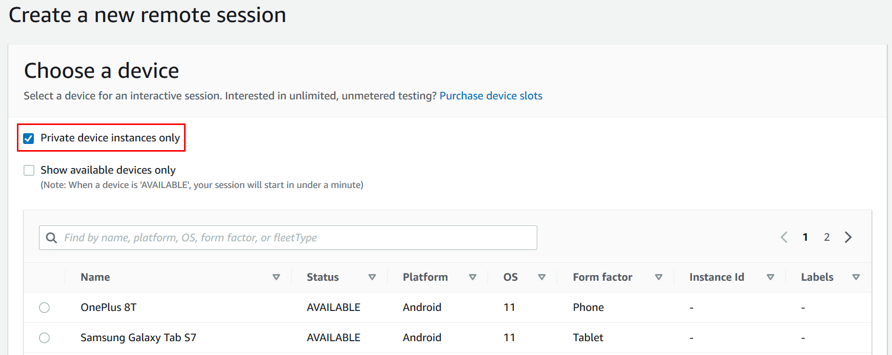

# Creating a test run or starting a remote access

session in AWS Device Farm

In AWS Device Farm, after you set up a private device fleet, you can create test runs or start remote access
sessions with one or more private devices in your fleet. For more information about private devices, see
[Private devices in AWS Device Farm](working-with-private-devices.md "working-with-private-devices.md").

###### To create a test run or start a remote access session

1. Open the Device Farm console at
   [https://console.aws.amazon.com/devicefarm/](https://console.aws.amazon.com/devicefarm/ "https://console.aws.amazon.com/devicefarm/").
2. On the Device Farm navigation panel, choose **Mobile Device Testing**, then choose
   **Projects**.
3. Choose an existing project from the list or create a new one. To create a new project, choose
   **New project**, enter a name for the project, and then choose
   **Submit**.
4. Do one of the following:
   - To create a test run, choose **Automated tests**, and then choose
     **Create a new run**. The wizard guides you through the steps to create
     the run. For the **Select devices** step, you can edit an existing device
     pool or create a new device pool that includes only those private devices that the Device Farm
     team set up and associated with your AWS account. For more information, see [Creating a private device pool with private devices
     (console)](selecting-private-devices.md#create-new-device-pool "selecting-private-devices.md#create-new-device-pool").
   - To start a remote access session, choose **Remote access**, and then
     choose **Start a new session**. On the **Choose a device**
     page, select **Private device instances only** to limit the list to only
     those private devices that the Device Farm team set up and associated with your AWS account.
     Then, choose the device that you want to access, enter a name for the remote access session,
     and choose **Confirm and start session**.

   
