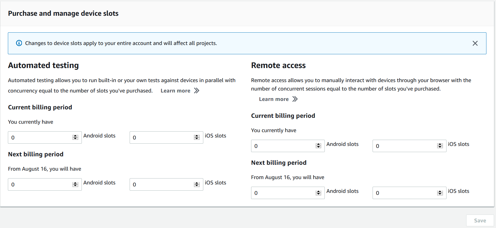
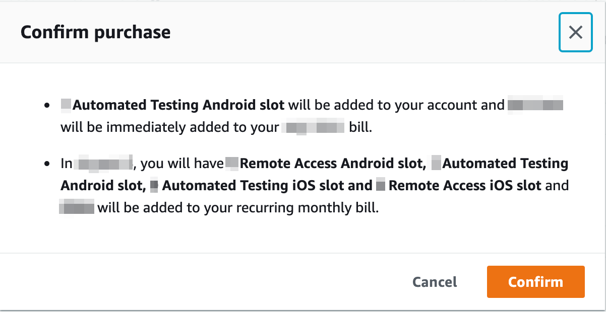

# Purchasing a device slot in Device Farm

You can use the Device Farm console, AWS Command Line Interface (AWS CLI), or Device Farm API to purchase a device slot.

## Purchase device slots (console)

1. Sign in to the Device Farm console at [https://console.aws.amazon.com/devicefarm](https://console.aws.amazon.com/devicefarm "https://console.aws.amazon.com/devicefarm").
2. In the navigation pane, choose **Mobile Device Testing**, and then choose
   **Device slots**.
3. On the **Purchase and manage device slots** page, you can create your own custom package
   by choosing the number of slots of **Automated testing** and **Remote
   access** devices that you want to purchase.
   Specify slot
   amounts for both the current and next billing periods.

As you change the slot amount, the text dynamically updates with the billing amount. For more information,
see [AWS Device Farm pricing](https://aws.amazon.com/device-farm/pricing/ "https://aws.amazon.com/device-farm/pricing/").

###### Important

If you change the number of device slots but see a **contact us** or **contact
us to purchase** message, your AWS account is not yet approved to purchase the number of device
slots that you requested.

These options prompt you to send an email to the Device Farm support team. In the email, specify the number of
each device type that you want to purchase and for which billing cycle.

###### Note

Changes to the device slots apply to your entire account and affect all projects.

 4. Choose **Purchase**. A **Confirm purchase** window will appear. Review
the information and then choose **Confirm** to complete the transaction.



On the **Purchase and manage device slots** page, you can see the number of device slots that
you currently have. If you increased or decreased the number of slots, you'll see the number of slots that you'll
have one month after the date you made the change.

## Purchase a device slot (AWS CLI)

You can run the **purchase-offering** command to purchase the offering.

To list your Device Farm account settings, including the maximum number of device slots that you can purchase and
the number of remaining free trial minutes, run the **get-account-settings** command. You'll see
output similar to the following:

```
{
    "accountSettings": {
        "maxSlots": {
            "`GUID`": 1,
            "`GUID`": 1,
            "`GUID`": 1,
            "`GUID`": 1
        },
        "unmeteredRemoteAccessDevices": {
            "ANDROID": 0,
            "IOS": 0
        },
        "maxJobTimeoutMinutes": 150,
        "trialMinutes": {
            "total": 1000.0,
            "remaining": 954.1
        },
        "defaultJobTimeoutMinutes": 150,
        "awsAccountNumber": "`AWS-ACCOUNT-NUMBER`",
        "unmeteredDevices": {
            "ANDROID": 0,
            "IOS": 0
        }
    }
}
```

To list the device slot offerings that are available to you, run the **list-offerings**
command. You should see output similar to the following:

```
{
    "offerings": [
        {
            "recurringCharges": [
                {
                    "cost": {
                        "amount": 250.0,
                        "currencyCode": "USD"
                    },
                    "frequency": "MONTHLY"
                }
            ],
            "platform": "IOS",
            "type": "RECURRING",
            "id": "`GUID`",
            "description": "iOS Unmetered Device Slot"
        },
        {
            "recurringCharges": [
                {
                    "cost": {
                        "amount": 250.0,
                        "currencyCode": "USD"
                    },
                    "frequency": "MONTHLY"
                }
            ],
            "platform": "ANDROID",
            "type": "RECURRING",
            "id": "`GUID`",
            "description": "Android Unmetered Device Slot"
        },
        {
            "recurringCharges": [
                {
                    "cost": {
                        "amount": 250.0,
                        "currencyCode": "USD"
                    },
                    "frequency": "MONTHLY"
                }
            ],
            "platform": "ANDROID",
            "type": "RECURRING",
            "id": "`GUID`",
            "description": "Android Remote Access Unmetered Device Slot"
        },
        {
            "recurringCharges": [
                {
                    "cost": {
                        "amount": 250.0,
                        "currencyCode": "USD"
                    },
                    "frequency": "MONTHLY"
                }
            ],
            "platform": "IOS",
            "type": "RECURRING",
            "id": "`GUID`",
            "description": "iOS Remote Access Unmetered Device Slot"
        }
    ]
}
```

To list the available offering promotions, run the **list-offering-promotions** command.

###### Note

This command returns only promotions that you haven't yet purchased. As soon as you purchase one or more
slots across any offering using a promotion, that promotion no longer appears in the results.

You should see output similar to the following:

```
{
    "offeringPromotions": [
        {
            "id": "2FREEMONTHS",
            "description": "New device slot customers get 3 months for the price of 1."
        }
    ]
}
```

To get the offering status, run the **get-offering-status** command. You should see output
similar to the following:

```
{
    "current": {
        "`GUID`": {
            "offering": {
                "platform": "IOS",
                "type": "RECURRING",
                "id": "`GUID`",
                "description": "iOS Unmetered Device Slot"
            },
            "quantity": 1
        },
        "`GUID`": {
            "offering": {
                "platform": "ANDROID",
                "type": "RECURRING",
                "id": "`GUID`",
                "description": "Android Unmetered Device Slot"
            },
            "quantity": 1
        }
    },
    "nextPeriod": {
        "`GUID`": {
            "effectiveOn": 1459468800.0,
            "offering": {
                "platform": "IOS",
                "type": "RECURRING",
                "id": "`GUID`",
                "description": "iOS Unmetered Device Slot"
            },
            "quantity": 1
        },
        "`GUID`": {
            "effectiveOn": 1459468800.0,
            "offering": {
                "platform": "ANDROID",
                "type": "RECURRING",
                "id": "`GUID`",
                "description": "Android Unmetered Device Slot"
            },
            "quantity": 1
        }
    }
}
```

The **renew-offering** and **list-offering-transactions** commands are also
available for this feature. For more information, see the [AWS CLI reference](cli-ref.md "cli-ref.md").

## Purchase a device slot (API)

1. Call the [GetAccountSettings](../APIReference/API_GetAccountSettings.md "../APIReference/API_GetAccountSettings.md")
   operation to list your account settings.
2. Call the [ListOfferings](../APIReference/API_ListOfferings.md "../APIReference/API_ListOfferings.md") operation to
   list the device slot offerings available to you.
3. Call the [ListOfferingPromotions](../APIReference/API_ListOfferingPromotions.md "../APIReference/API_ListOfferingPromotions.md") operation to list the offering promotions that are available.

###### Note

This command returns only promotions that you haven't yet purchased. As soon as you purchase one or more
slots using an offering promotion, that promotion no longer appears in the results. 4. Call the [PurchaseOffering](../APIReference/API_PurchaseOffering.md "../APIReference/API_PurchaseOffering.md")
operation to purchase an offering. 5. Call the [GetOfferingStatus](../APIReference/API_GetOfferingStatus.md "../APIReference/API_GetOfferingStatus.md")
operation to get the offering status.

The [RenewOffering](../APIReference/API_RenewOffering.md "../APIReference/API_RenewOffering.md") and [ListOfferingTransactions](../APIReference/API_ListOfferingTransactions.md "../APIReference/API_ListOfferingTransactions.md") commands are
also available for this feature.

For information about using the Device Farm API, see [Automating Device Farm](api-ref.md "api-ref.md").
