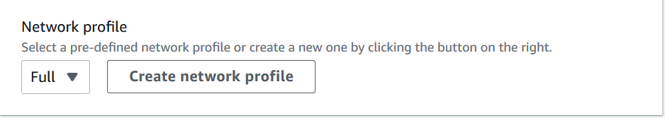
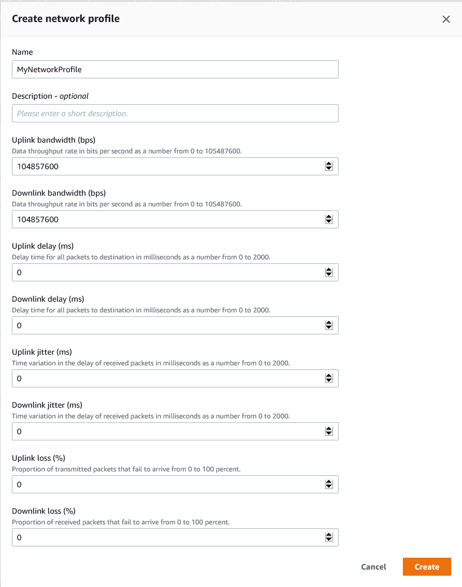
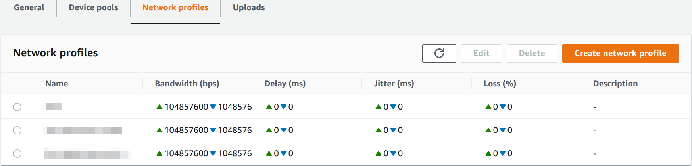

# Simulating network connections and conditions

for your AWS Device Farm runs

You can use network shaping to simulate network connections and conditions while testing
your Android, iOS and web apps in Device Farm. For example, you can simulate lossy or intermittent
internet connectivity.

When you create a run using the default network settings, each device has a full, unhindered
Wi-Fi connection with internet connectivity. When you use network shaping, you can change the
Wi-Fi connection to specify a network profile like **3G** or **Lossy
WiFi** that controls throughput, delay, jitter, and loss for both inbound and
outbound traffic.

###### Topics

- [Set up network
  shaping when scheduling a test run](#network-shaping-how-to-choose-a-curated-profile-when-scheduling-a-test-run "#network-shaping-how-to-choose-a-curated-profile-when-scheduling-a-test-run")
- [Create a network profile](#network-shaping-how-to-create-a-network-profile "#network-shaping-how-to-create-a-network-profile")
- [Change network conditions during your test](#change-network-conditions-during-test "#change-network-conditions-during-test")

## Set up network

shaping when scheduling a test run

When you schedule a run, you can choose from any of the Device Farm-curated profiles, or you can
create and manage your own.

1. From any Device Farm project, choose **Create a new run**.

If you don't have a project yet, see [Creating a project in AWS Device Farm](how-to-create-project.md "how-to-create-project.md"). 2. Choose your application, and then choose **Next**. 3. Configure your test, and then choose **Next**. 4. Select your devices, and then choose **Next**. 5. In the **Location and network settings** section, choose a network profile or choose
**Create network profile** to create your own.

 6. Choose **Next**. 7. Review and start your test run.

## Create a network profile

When you create a test run, you can create a network profile.

1. Choose **Create network profile**.

 2. Enter a name and settings for your network profile. 3. Choose **Create**. 4. Finish creating your test run and start the run.

After you have created a network profile, you'll be able to see and manage it on the **Project
settings** page.

## Change network conditions during your test

You can call an API from your device host using a framework like Appium to simulate dynamic network conditions
such as reduced bandwidth during your test run. For more information, see [CreateNetworkProfile](../APIReference/API_CreateNetworkProfile.md "../APIReference/API_CreateNetworkProfile.md").
