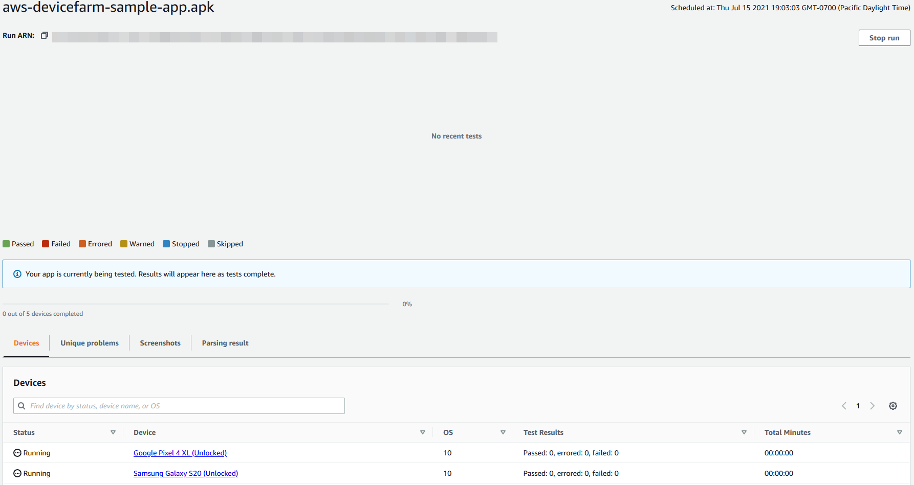
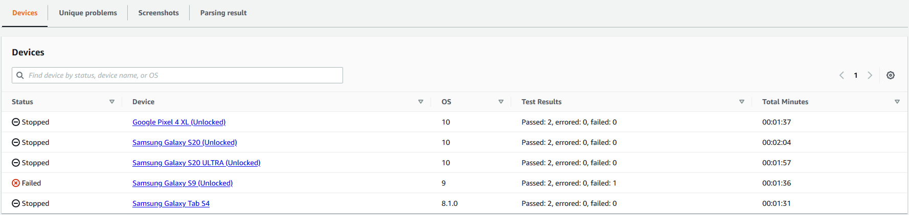

# Stopping a run in AWS Device Farm

You might want to stop a run after you have started it. For example, if you notice an issue
while your tests are running you might want to restart the run with an updated test script.

You can use the Device Farm console, AWS CLI, or API to stop a run.

###### Topics

- [Stop a run (console)](#how-to-stop-run-console "#how-to-stop-run-console")
- [Stop a run (AWS CLI)](#how-to-stop-test-run-cli "#how-to-stop-test-run-cli")
- [Stop a run (API)](#how-to-stop-test-run-api "#how-to-stop-test-run-api")

## Stop a run (console)

1. Sign in to the Device Farm console at [https://console.aws.amazon.com/devicefarm](https://console.aws.amazon.com/devicefarm "https://console.aws.amazon.com/devicefarm").
2. On the Device Farm navigation panel, choose
   **Mobile
   Device Testing**, then choose
   **Projects**.
3. Choose the project where you have an active test run.
4. On the **Automated tests** page, choose the test run.

The pending or running icon should appear to the left of the device name.

 5. Choose **Stop run**.

After a short time, an icon with a red circle with a minus inside it appears
next to the device name. When the run has been stopped, the icon color changes from red to
black.

###### Important

If a test has already been run, Device Farm cannot stop it. If a test is in progress,
Device Farm stops the test. The total minutes for which you will be billed appears in the
**Devices** section. In addition, you will also be billed for the
total minutes that Device Farm takes to run the setup suite and the teardown suite. For more
information, see [Device Farm
Pricing](http://aws.amazon.com/device-farm/faq/#pricing "http://aws.amazon.com/device-farm/faq/#pricing").

The following image shows an example **Devices** section after a
test run was successfully stopped.



## Stop a run (AWS CLI)

You can run the following command to
stop the specified test run, where `myARN` is the Amazon Resource
Name (ARN) of the test run.

```
$ aws devicefarm stop-run --arn `myARN`
```

You should see output similar to the following:

```
{
    "run": {
        "status": "STOPPING",
        "name": "Name of your run",
        "created": 1458329687.951,
        "totalJobs": 7,
        "completedJobs": 5,
        "deviceMinutes": {
            "unmetered": 0.0,
            "total": 0.0,
            "metered": 0.0
        },
        "platform": "ANDROID_APP",
        "result": "PENDING",
        "billingMethod": "METERED",
        "type": "BUILTIN_EXPLORER",
        "arn": "myARN",
        "counters": {
            "skipped": 0,
            "warned": 0,
            "failed": 0,
            "stopped": 0,
            "passed": 0,
            "errored": 0,
            "total": 0
        }
    }
}
```

To get the ARN of your run, use the `list-runs` command. The output should be
similar to the following:

```
{
    "runs": [
        {
            "status": "RUNNING",
            "name": "Name of your run",
            "created": 1458329687.951,
            "totalJobs": 7,
            "completedJobs": 5,
            "deviceMinutes": {
                "unmetered": 0.0,
                "total": 0.0,
                "metered": 0.0
            },
            "platform": "ANDROID_APP",
            "result": "PENDING",
            "billingMethod": "METERED",
            "type": "BUILTIN_EXPLORER",
            "arn": "`Your ARN will be here`",
            "counters": {
                "skipped": 0,
                "warned": 0,
                "failed": 0,
                "stopped": 0,
                "passed": 0,
                "errored": 0,
                "total": 0
            }
        }
    ]
}
```

For information about using Device Farm with the AWS CLI, see [AWS CLI reference](cli-ref.md "cli-ref.md").

## Stop a run (API)

- Call the [StopRun](../APIReference/API_StopRun.md "../APIReference/API_StopRun.md")
  operation to the test run.

For information about using the Device Farm API, see [Automating Device Farm](api-ref.md "api-ref.md").
