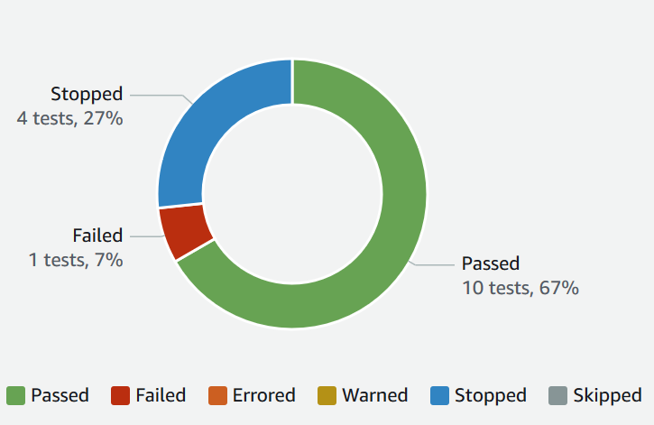

# Device Farm test result statuses

The Device Farm console displays icons that
help
you quickly assess the state of your completed test run. For more information about tests in Device Farm, see
[Reports in AWS Device Farm](reports.md "reports.md").

###### Topics

- [Statuses of an individual
  test](#how-to-use-reports-displaying-results-individual "#how-to-use-reports-displaying-results-individual")
- [Statuses for multiple tests](#how-to-use-reports-displaying-results-summary "#how-to-use-reports-displaying-results-summary")

## Statuses of an individual

test

For reports that describe an individual test, Device Farm displays an icon representing the test result
status:

| Description                     | Icon                            |
| ------------------------------- | ------------------------------- | -------------------------------------------------------------------------------------------------------------------------------------------------------------------------------------------------------------------------------------------------------------------------------------------------------------------------------------------------------------------------------------------------------- |
| The test succeeded.             | The test succeeded.             |
| The test failed.                | The test failed.                |
| Device Farm skipped the test.   | The test was skipped.           |
| The test stopped.               | The test was stopped.           |
| Device Farm returned a warning. | Device Farm returned a warning. |
| Device Farm returned an error.  | Device Farm returned an error.  | ## Statuses for multiple tests If you choose a finished run, Device Farm displays a summary graph showing the percentage of tests in various states.  For example, this test run results graph shows that the run had 4 stopped tests, 1 failed test, and 10 successful tests. Graphs are always color coded and labeled. |
