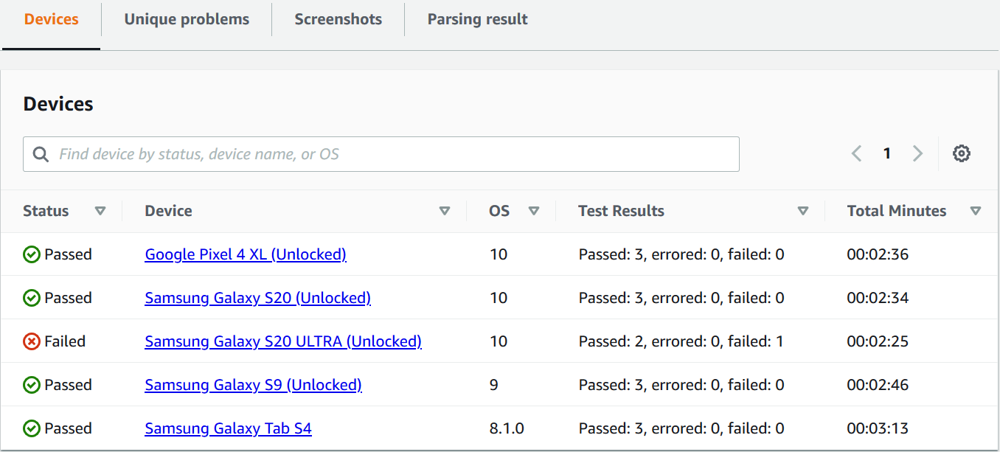

# Viewing test reports in Device Farm

Use the Device Farm console to view your test reports. For more information, see [Reports in AWS Device Farm](reports.md "reports.md").

###### Topics

- [Prerequisites](#how-to-use-reports-prerequisites "#how-to-use-reports-prerequisites")
- [View reports](#how-to-use-reports-viewing-reports "#how-to-use-reports-viewing-reports")
- [Device Farm test result statuses](how-to-use-reports-displaying-results.md "how-to-use-reports-displaying-results.md")

## Prerequisites

Set up a test run and verify that it is complete.

1. To create a run, see [Creating a test run in Device Farm](how-to-create-test-run.md "how-to-create-test-run.md"), and then return to this page.
2. Verify that the run is complete. During your test run, the Device Farm console displays a pending icon

for runs that are in progress. Each device in the run will also start with the
pending icon, then switch to the running

icon when the test begins. As each test
finishes, a test result icon is displayed next to the device name. When all tests have been
completed, the pending icon next to the run changes to a test result icon. For more information, see
[Device Farm test result statuses](how-to-use-reports-displaying-results.md "how-to-use-reports-displaying-results.md") .

## View reports

You can view the results of your test in the Device Farm console.

###### Topics

- [View the test run summary page](#how-to-use-reports-console-summary "#how-to-use-reports-console-summary")
- [View unique problem reports](#how-to-use-reports-console-unique-problems "#how-to-use-reports-console-unique-problems")
- [View device reports](#how-to-use-reports-console-by-device "#how-to-use-reports-console-by-device")
- [View test suite reports](#how-to-use-reports-console-by-suite "#how-to-use-reports-console-by-suite")
- [View test reports](#how-to-use-reports-console-by-test "#how-to-use-reports-console-by-test")
- [View performance data for a problem, device,
  suite, or test in a report](#how-to-use-reports-console-performance "#how-to-use-reports-console-performance")
- [View log information for a problem, device, suite, or
  test in a report](#how-to-use-reports-console-log "#how-to-use-reports-console-log")

### View the test run summary page

1. Sign in to the Device Farm console at [https://console.aws.amazon.com/devicefarm](https://console.aws.amazon.com/devicefarm "https://console.aws.amazon.com/devicefarm").
2. In the navigation pane, choose **Mobile Device Testing**, and then choose
   **Projects**.
3. In the list of projects, choose the project for the run.

###### Tip

To filter the project list by name, use the search bar. 4. Choose a completed run to view its summary report page. 5. The test run summary page displays an overview of your test results.

    * The **Unique problems** section lists unique warnings and failures.
     To view unique problems, follow the instructions in [View unique problem reports](#how-to-use-reports-console-unique-problems "#how-to-use-reports-console-unique-problems").
    * The **Devices** section displays the total number of tests, by
     outcome, for each device.

    

    In this example, there are several devices. In the first table entry, the Google Pixel
     4 XL device running Android version 10 reports
     three
     successful tests that took 02:36 minutes to run.

    To view the results by device, follow the instructions in [View device reports](#how-to-use-reports-console-by-device "#how-to-use-reports-console-by-device").
    * The **Screenshots** section displays a list of any screenshots that
     Device Farm captured during the run, grouped by device.
    * In the **Parsing result** section, you can download the
     parsing
     result.

### View unique problem reports

1. In **Unique problems**, choose the problem that you want to view.
2. Choose the device. The report displays information about the problem.

The **Video** section displays a downloadable video recording of the
test.

The **Result** section displays the result of the test. The status is
represented as a result icon. For more information, see [Statuses of an individual
test](how-to-use-reports-displaying-results.md#how-to-use-reports-displaying-results-individual "how-to-use-reports-displaying-results.md#how-to-use-reports-displaying-results-individual").

The **Logs** section displays any information that Device Farm logged during the
test. To view this information, follow the instructions in [View log information for a problem, device, suite, or
test in a report](#how-to-use-reports-console-log "#how-to-use-reports-console-log").

The **Performance** tab displays information about any performance data that
Device Farm generated during the test. To view this performance data, follow the instructions in [View performance data for a problem, device,
suite, or test in a report](#how-to-use-reports-console-performance "#how-to-use-reports-console-performance").

The **Files** tab displays a list of any of the test's associated files (such
as log files) that you can download. To download a file, choose the file's link in the
list.

The **Screenshots** tab displays a list of any screenshots that Device Farm
captured during the test.

### View device reports

- In the **Devices** section, choose the device.

The **Video** section displays a downloadable video recording of the
test.

The **Suites** section displays a table containing information about the
suites for the device.

In this table, the **Test results** column summarizes the number of tests by
outcome for each of the test suites that have run on the device. This data also has a graphical
component. For more information, see [Statuses for multiple tests](how-to-use-reports-displaying-results.md#how-to-use-reports-displaying-results-summary "how-to-use-reports-displaying-results.md#how-to-use-reports-displaying-results-summary").

To view the full results by suite, follow the instructions in [View test suite reports](#how-to-use-reports-console-by-suite "#how-to-use-reports-console-by-suite").

The **Logs** section displays any information that Device Farm logged for the
device during the run. To view this information, follow the instructions in [View log information for a problem, device, suite, or
test in a report](#how-to-use-reports-console-log "#how-to-use-reports-console-log").

The **Performance** section displays information about any performance data
that Device Farm generated for the device during the run. To view this performance data, follow the
instructions in [View performance data for a problem, device,
suite, or test in a report](#how-to-use-reports-console-performance "#how-to-use-reports-console-performance").

The **Files** section displays a list of suites for the device and any
associated files (such as log files) that you can download. To download a file, choose the
file's link in the list.

The **Screenshots** section displays a list of any screenshots that Device Farm
captured during the run for the device, grouped by suite.

### View test suite reports

1. In the **Devices** section, choose the device.
2. In the **Suites** section, choose the suite from the table.

The **Video** section displays a downloadable video recording of the
test.

The **Tests** section displays a table containing information about the tests
in the suite.

In the table, the **Test results** column displays the result. This data also
has a graphical component. For more information, see [Statuses for multiple tests](how-to-use-reports-displaying-results.md#how-to-use-reports-displaying-results-summary "how-to-use-reports-displaying-results.md#how-to-use-reports-displaying-results-summary").

To view the full results by test, follow the instructions in [View test reports](#how-to-use-reports-console-by-test "#how-to-use-reports-console-by-test").

The **Logs** section displays any information that Device Farm logged during the
run for the suite. To view this information, follow the instructions in [View log information for a problem, device, suite, or
test in a report](#how-to-use-reports-console-log "#how-to-use-reports-console-log").

The **Performance** section displays information about any performance data
that Device Farm generated during the run for the suite. To view this performance data, follow the
instructions in [View performance data for a problem, device,
suite, or test in a report](#how-to-use-reports-console-performance "#how-to-use-reports-console-performance").

The **Files** section displays a list of tests for the suite and any
associated files (such as log files) that you can download. To download a file, choose the
file's link in the list.

The **Screenshots** section displays a list of any screenshots that Device Farm
captured during the run for the suite, grouped by test.

### View test reports

1. In the **Devices** section, choose the device.
2. In the **Suites** section, choose the suite.
3. In the **Tests** section, choose the test.
4. The **Video** section displays a downloadable video recording of the
   test.

The
**Result** section displays the result of the test. The
status is represented as a result icon. For more information, see [Statuses of an individual
test](how-to-use-reports-displaying-results.md#how-to-use-reports-displaying-results-individual "how-to-use-reports-displaying-results.md#how-to-use-reports-displaying-results-individual").

The **Logs** section displays any information that Device Farm logged during the
test. To view this information, follow the instructions in [View log information for a problem, device, suite, or
test in a report](#how-to-use-reports-console-log "#how-to-use-reports-console-log").

The **Performance** tab displays information about any performance data that
Device Farm generated during the test. To view this performance data, follow the instructions in [View performance data for a problem, device,
suite, or test in a report](#how-to-use-reports-console-performance "#how-to-use-reports-console-performance").

The **Files** tab displays a list of any of the test's associated files (such
as log files) that you can download. To download a file, choose the file's link in the
list.

The **Screenshots** tab displays a list of any screenshots that Device Farm
captured during the test.

### View performance data for a problem, device,

suite, or test in a report

###### Note

Device Farm
collects device performance data only for legacy Android test hosts that don't
use the latest `amazon_linux_2` test host. This feature is not supported on iOS.

The
**Performance** tab displays the following information:

- The **CPU** graph displays the percentage of CPU that the app used on a
  single core during the selected problem, device, suite, or test (along the vertical axis) over
  time (along the horizontal axis).

The vertical axis is expressed in percentages, from 0% to the maximum recorded
percentage.

This percentage might exceed 100% if the app used more than one core. For example, if three
cores are at 60% usage, this percentage is displayed as 180%.

- The **Memory** graph displays the number of MB that the app used during the
  selected problem, device, suite, or test (along the vertical axis) over time (along the
  horizontal axis).

The vertical axis is expressed in MB, from 0 MB to the maximum number of recorded MB.

- The **Threads** graph displays the number of threads used during the selected
  problem, device, suite, or test (along the vertical axis) over time (along the horizontal
  axis).

The vertical axis is expressed in number of threads, from zero threads to the maximum number
of recorded threads.

In all cases, the horizontal axis is represented, in seconds, from the start and end of the run for
the selected problem, device, suite, or test.

To display information for a specific data point, pause in the desired graph at the desired second
along the horizontal axis.

### View log information for a problem, device, suite, or

test in a report

The **Logs** section displays the following information:

- **Source** represents the source of a log entry. Possible values
  include:
  - **Harness** represents a log entry that Device Farm created. These log
    entries are typically created during start and stop events.
  - **Device** represents a log entry that the device created. For
    Android, these log entries are logcat-compatible. For iOS, these log entries are
    syslog-compatible.
  - **Test** represents a log entry that either a test or its test
    framework created.

- **Time** represents the elapsed time between the first log entry and this log
  entry. The time is expressed in `MM:SS.SSS` format, where
  `M` represents minutes and `S` represents
  seconds.
- **PID** represents the process identifier (PID) that created the log entry.
  All log entries created by an app on a device have the same PID.
- **Level** represents the logging level for the log entry. For example, `Logger.debug("This is a message!")` logs a
  **Level** of `Debug`. These are the possible
  values:
  - **Alert**
  - **Critical**
  - **Debug**
  - **Emergency**
  - **Error**
  - **Errored**
  - **Failed**
  - **Info**
  - **Internal**
  - **Notice**
  - **Passed**
  - **Skipped**
  - **Stopped**
  - **Verbose**
  - **Warned**
  - **Warning**

- **Tag** represents arbitrary metadata for the log entry. For example, Android
  logcat can use this to describe which part of the system created the log entry (for example,
  `ActivityManager`).
- **Message** represents the message or data for the log entry. For example,
  `Logger.debug("Hello, World!")` logs a
  **Message** of `"Hello, World!"`.

To display only a portion of the information:

- To show all log entries that match a value for a specific column, enter the value into the
  search bar. For example, to show all log entries with a **Source** value of
  `Harness`, enter `Harness` in the search
  bar.
- To remove all of the characters from a column header box, choose the **X** in
  that column header box. Removing all of the characters from a column header box is the same as
  entering `*` in that column header box.

To download all of the log information for the device, including all of the suites and tests that you
ran, choose **Download logs**.
