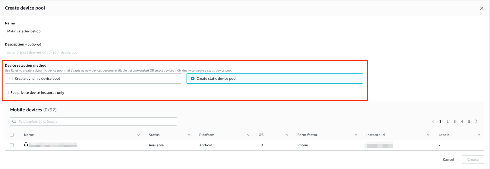
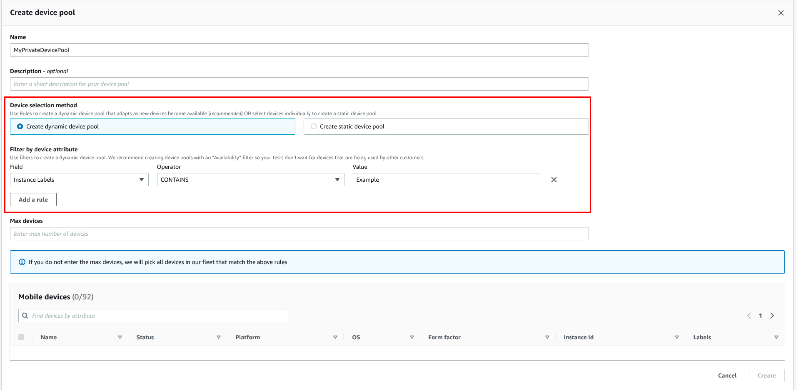
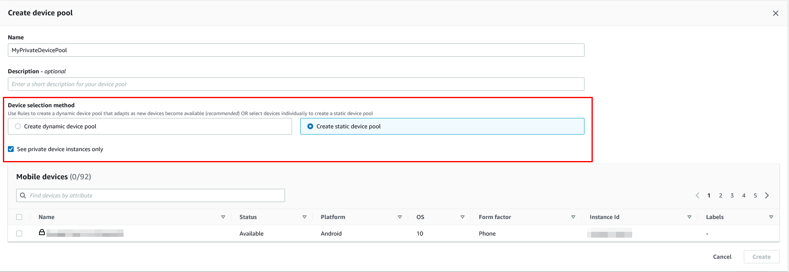

# Selecting private

devices in a device pool in AWS Device Farm

To use private devices in your test run, you can create a device pool that selects your private devices.
Device pools enable you to select private devices primarily through three types of device pool rules:

1. Rules based on the device ARN
2. Rules based on the device instance label
3. Rules based on the device instance ARN
   In the following sections, each rule type and their use cases are described in depth. You can use the Device Farm
   console, AWS Command Line Interface (AWS CLI), or the Device Farm API to create or modify a device pool with
   private devices using these rules.

###### Topics

- [Device ARN](#device-arn-rules "#device-arn-rules")
- [Device instance labels](#device-instance-labels-rules "#device-instance-labels-rules")
- [Instance ARN](#instance-arn-rules "#instance-arn-rules")
- [Creating a private device pool with private devices
  (console)](#create-new-device-pool "#create-new-device-pool")
- [Creating a private device pool with private
  devices (AWS CLI)](#how-to-create-device-pool-cli-private-devices "#how-to-create-device-pool-cli-private-devices")
- [Creating a private device pool with private
  devices (API)](#how-to-create-device-pool-api-private-devices "#how-to-create-device-pool-api-private-devices")

## Device ARN

A device ARN is an identifier representing a type of device rather than any specific physical device
instance. A device type is defined by the following attributes:

- The device’s fleet ID
- The device’s OEM
- The device’s model number
- The device’s operating system version
- The device's state that indicates whether it's rooted or not

Many physical device instances can be represented by a single device type where every instance of that
type has the same values for these attributes. For example, if you had three `Apple iPhone
 13` devices on iOS version `16.1.0` in your private fleet, each
device would share the same device ARN. If any devices were added or removed from your fleet with these same
attributes, the device ARN would continue to represent whatever available devices you had in your fleet for
that device type.

The device ARN is the most robust way of selecting private devices for a device pool because it allows the
device pool to continue selecting devices regardless of the specific device instances you have deployed at
any given time. Individual private device instances can experience hardware failures, prompting Device Farm to
automatically replace them with new working instances of the same device type. In these scenarios, the
device ARN rule ensures that your device pool can continue to select devices in the event of a hardware
failure.

When you use a device ARN rule for private devices in your device pool and schedule a test run with that
pool, Device Farm will automatically check which private device instances are represented by that device ARN. Of
the instances that are currently available, one of them will be assigned to run your test. If no instances
are currently available, Device Farm will wait for the first available instance of that device ARN to become
available, and assign it to run your test.

## Device instance labels

A device instance label is a textual identifier you can attach as metadata for a device instance. You can
attach multiple labels to each device instance and the same label to multiple device instances. For more
information about adding, modifying, or removing device labels from device instances, see [Managing
private devices](managing-private-devices.md "managing-private-devices.md").

The device instance label can be a robust way of selecting private devices for a device pool because, if
you have multiple device instances with the same label, then it allows the device pool to select from any
one of them for your test. If the device ARN isn’t a good rule for your use case (for example, if you want
to select from devices of multiple device types, or if you want to select from a subset of all devices of a
device type), then device instance labels can enable you to select from multiple devices for your device
pool with greater granularity. Individual private device instances can experience hardware failures,
prompting Device Farm to automatically replace them with new working instances of the same device type. In these
scenarios, the replacement device instance will not retain any instance label metadata of the replaced
device. So, if you apply the same device instance label to multiple device instances, then the device
instance label rule ensures that your device pool can continue to select device instances in the event of a
hardware failure.

When you use a device instance label rule for private devices in your device pool and schedule a test run
with that pool, Device Farm will automatically check which private device instances are represented by that device
instance label, and of those instances, randomly select one which is available to run your test. If none are
available, Device Farm will randomly select any device instance with the device instance label to run your test
and queue the test to run on the device once it’s available.

## Instance ARN

A device instance ARN is an identifier representing a physical bare metal device instance deployed in a
private fleet. For example, if you had three `iPhone 13` devices on OS
`15.0.0` in your private fleet, while each device would share the same device
ARN, each device would also have its own instance ARN representing that instance alone.

The device instance ARN is the least robust way to select private devices for a device pool and is only
recommended if the device ARNs and device instance labels don’t fit your use case. Device instance ARNs are
often used as rules for device pools when a specific device instance is configured in a unique and specific
way as a prerequisite for your test and if that configuration needs to be known and verified before the test
is ran on it. Individual private device instances can experience hardware failures, prompting Device Farm to
automatically replace them with new working instances of the same device type. In these scenarios, the
replacement device instance will have a different device instance ARN than the replaced device. So, if you
rely on device instance ARNs for your device pool, then you’ll need to manually change your device pool’s
rule definition from using the old ARN to using the new ARN. If you do need to manually preconfigure the
device for its test, then this can be an effective workflow (compared to device ARNs). For testing at scale,
it is recommended to try to adapt these use cases to work with device instance labels and if possible, have
multiple device instances preconfigured for testing.

When you use a device instance ARN rule for private devices in your device pool and schedule a test run
with that pool, Device Farm will automatically assign that test to that device instance. If that device instance
isn’t available, Device Farm will queue the test on the device once it’s available.

## Creating a private device pool with private devices

(console)

When you create a test run, you can create a device pool for the test run and ensure that the pool
includes only your private devices.

###### Note

When creating a device pool with private devices in the console, you can only use any one of the three
available rules for selecting private devices. If you want to create a device pool that contains
multiple types of rules for private devices (for example, device pools that contain rules for device
ARNs and device instance ARNs), then you need to create the pool through the CLI or API.

1. Open the Device Farm console at
   [https://console.aws.amazon.com/devicefarm/](https://console.aws.amazon.com/devicefarm/ "https://console.aws.amazon.com/devicefarm/").
2. On the Device Farm navigation panel, choose **Mobile Device Testing**, then choose
   **Projects**.
3. Choose an existing project from the list or create a new one. To create a new project, choose
   **New project**, enter a name for the project, and then choose
   **Submit**.
4. Choose **Project settings**, and then navigate to the **Device
   pools** tab.
5. Choose **Create device pool**, and enter a name and optional description
   for your device pool.
   1. To use device ARN rules for your device pool, choose **Create static device
      pool**, then select the specific device types from the list that you would like
      to use in the device pool. Do not select **Private device instances only**
      because this option causes the device pool to be created with device instance ARN rules
      (instead of device ARN rules).

    2. To use device instance label rules for your device pool, choose **Create dynamic
   device pool**. Then, for each label you would like to use in the device pool,
   choose **Add a rule**. For each rule, choose **Instance
   Labels** as the `Field`, choose **Contains** as the
   `Operator`, and specify your desired device instance label as the
   `Value`.

    3. To use device instance ARN rules for your device pool, choose **Create static
   device pool**, then select **Private device instances only**
   to limit the list of devices to only those private device instances that Device Farm has
   associated with your AWS account.

   

6. Choose **Create**.

## Creating a private device pool with private

devices (AWS CLI)

- Run the [**create-device-pool**](../../../cli/latest/reference/devicefarm/create-device-pool.md "../../../cli/latest/reference/devicefarm/create-device-pool.md") command.

For information about using Device Farm with the AWS CLI, see [AWS CLI reference](cli-ref.md "cli-ref.md").

## Creating a private device pool with private

devices (API)

- Call the [`CreateDevicePool`](../APIReference/API_CreateDevicePool.md "../APIReference/API_CreateDevicePool.md") API.

For information about using the Device Farm API, see [Automating Device Farm](api-ref.md "api-ref.md").
