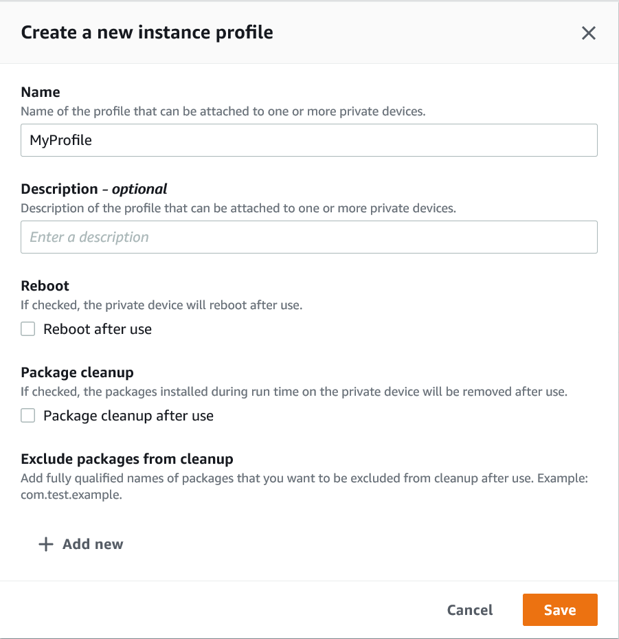

# Creating an instance profile in AWS Device Farm

You can set up a fleet that contains one or more private devices. These devices are dedicated to your
AWS account. After you set up the devices, you can optionally create one or more instance profiles for
them. Instance profiles can help you automate test runs and consistently apply the same settings to device
instances. Instances profiles can also help you control the behavior of remote access session. For more
information about private devices in Device Farm, see [Private devices in AWS Device Farm](working-with-private-devices.md "working-with-private-devices.md").

###### To create an instance

1. Open the Device Farm console at
   [https://console.aws.amazon.com/devicefarm/](https://console.aws.amazon.com/devicefarm/ "https://console.aws.amazon.com/devicefarm/").
2. On the Device Farm navigation panel, choose **Mobile Device Testing**, then choose
   **Private devices**.
3. Choose **Instance profiles**.
4. Choose **Create instance profile**.
5. Enter a name for the instance profile.

 6. (Optional) Enter a description for the instance profile. 7. (Optional) Change any of the following settings to specify which actions you want Device Farm to take on
a device after each test run or session ends:

    * **Reboot after use** – To reboot the device, select this check
     box. By default, this check box is cleared (`false`).
    * **Package cleanup** – To remove all the app packages that you
     installed on the device, select this check box. By default, this check box is cleared
     (`false`). To keep all the app packages that you installed on the device,
     leave this check box cleared.
    * **Exclude packages from cleanup** – To keep only selected app
     packages on the device, select the **Package Cleanup** check box, and then
     choose **Add new**. For the package name, enter the fully qualified name of
     the app package that you want to keep on the device (for example,
     `com.test.example`). To keep more app packages on the device, choose
     **Add new**, and then enter the fully qualified name of each
     package.

8. Choose **Save**.
