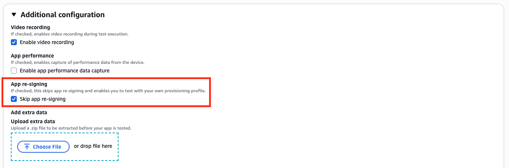
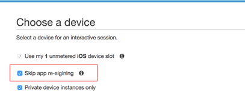

# Skipping app re-signing on private devices in

AWS Device Farm

App signing is a process that involves digitally signing an app package (e.g., [APK](https://developer.android.com/studio/publish/app-signing "https://developer.android.com/studio/publish/app-signing"), [IPA](https://support.apple.com/guide/security/app-code-signing-process-sec7c917bf14/web "https://support.apple.com/guide/security/app-code-signing-process-sec7c917bf14/web")) with a private key before it can be installed on a device or published to
an app store like the Google Play Store or the Apple App Store. To streamline testing by
reducing the number of signatures and profiles needed and increase data security on remote
devices, AWS Device Farm will re-sign your app after it has been uploaded to the service.

Once you upload your app to AWS Device Farm, the service will generate a new signature for the
app using its own signing certificates and provisioning profiles. This process replaces the
original app signature with AWS Device Farm's signature. The re-signed app is then installed on
the test devices provided by AWS Device Farm. The new signature allows the app to be installed and
run on these devices without the need for the original developer's certificates.

On iOS, we replace the embedded provisioning profile with a wildcard profile and resign
the app. If you provide it, we will add auxiliary data to the application package before
installation so the data will be present in your app’s sandbox. Resigning the iOS app
results in the removal of certain entitlements. This includes App Group, Associated Domains,
Game Center, HealthKit, HomeKit, Wireless Accessory Configuration, In-App Purchase,
Inter-App Audio, Apple Pay, Push Notifications, and VPN Configuration & Control.

On Android, we resign the app. This may break functionality that depends on the app
signature, such as the Google Maps Android API. It may also trigger anti-piracy and
anti-tamper detection available from products such as DexGuard. For built-in tests, we may
modify the manifest to include permissions required to capture and save screenshots.

When you use private devices, you can skip the step where AWS Device Farm re-signs your app.
This is different from public devices, where Device Farm always re-signs your app on the Android
and iOS platforms.

You can skip app re-signing when you create a remote access session or a test run. This
can be helpful if your app has functionality that breaks when Device Farm re-signs your app. For
example, push notifications might not work after re-signing. For more information about the
changes that Device Farm makes when it tests your app, see the [AWS Device Farm FAQs](https://aws.amazon.com/device-farm/faq/ "https://aws.amazon.com/device-farm/faq/") or the [Apps](apps.md "apps.md") page.

To skip app re-signing for a test run, select **Skip app re-signing** under
**Additional configuration**. This option is only available for private devices.

###### Note

If you're using the XCTest framework, the **Skip app re-signing** option is not
available. For more information, see [Integrating Device Farm with XCTest for iOS](test-types-ios-xctest.md "test-types-ios-xctest.md").

Additional steps for configuring your app-signing settings vary, depending on whether you're using private
Android or iOS devices.

## Skipping app re-signing on Android devices

If you're testing your app on a private Android device, select **Skip app re-signing**
when you create your test run or your remote access session. No other configuration is required.

## Skipping app re-signing on iOS devices

Apple requires you to sign an app for testing before you load it onto a device. For iOS devices, you have
two options for signing your app.

- If you're using an in-house (Enterprise) developer profile, you can skip to the next section,
  [Creating a remote access session to trust your iOS
  app](#create-remote-session-trust-your-app "#create-remote-session-trust-your-app").
- If you're using an ad hoc iOS app development profile, you must first register the device with
  your Apple developer account, and then update your provisioning profile to include the private
  device. You must then re-sign your app with the provisioning profile that you updated. You can then
  run your re-signed app in Device Farm.

###### To register a device with an ad hoc iOS app development provisioning profile

1. Sign in to your Apple developer account.
2. Navigate to the **Certificates, IDs, and Profiles** section of the
   console.
3. Go to **Devices**.
4. Register the device in your Apple developer account. To get the name and UDID
   of the device, use the `ListDeviceInstances` operation of the Device Farm
   API.
5. Go to your provisioning profile and choose **Edit**.
6. Choose the device from the list.
7. In Xcode, fetch your updated provisioning profile, and then re-sign the app.

No other configuration is required. You can now create a remote access session or a test run and select
**Skip app re-signing**.

## Creating a remote access session to trust your iOS

app

If you're using an in-house (Enterprise) developer provisioning profile, you must perform a one-time
procedure to trust the in-house app developer certificate on each of your private devices.

To do so, you can either install the app that you want to test on the private device, or you can install a
dummy app that's signed with the same certificate as the app that you want to test. There is an advantage to
installing a dummy app that's signed with the same certificate. After you trust the configuration profile or
enterprise app developer, all apps from that developer are trusted on the private device until you delete
them. Therefore, when you upload a new version of the app that you want to test, you won't have to trust the
app developer again. This is particularly useful if you run test automations and you don't want to create a
remote access session each time you test your app.

Before you start your remote access session, follow the steps in [Creating an instance profile in AWS Device Farm](set-up-private-devices-account-settings.md "set-up-private-devices-account-settings.md") to create or modify an
instance profile in Device Farm. In the instance profile, add the bundle ID of the test app or
dummy app to the **Exclude packages from cleanup** setting. Then,
attach the instance profile to the private device instance to ensure that Device Farm doesn't
remove this app from the device before it starts a new test run. This ensures that your
developer certificate remains trusted.

You can upload the dummy app to the device by using a remote access session, which allows you to launch
the app and trust the developer.

1. Follow the instructions in [Creating a session](how-to-create-session.md "how-to-create-session.md") to create a remote access session that uses the private
   device instance profile that you created. When you create your session, be sure to select
   **Skip app re-signing**.

###### Important

To filter the list of devices to include only private devices, select **Private device
instances only** to ensure that you use a private device with the correct instance
profile.

Be sure to also add the dummy app or the app that you want to test to the
**Exclude packages from cleanup** setting for the instance
profile that's attached to this instance. 2. When your remote session starts, choose **Choose File** to
install an application that uses your in-house provisioning profile. 3. Launch the app that you just uploaded. 4. Follow the instructions to trust the developer certificate.

All apps from this configuration profile or enterprise app developer are now trusted on this private
device until you delete them.
