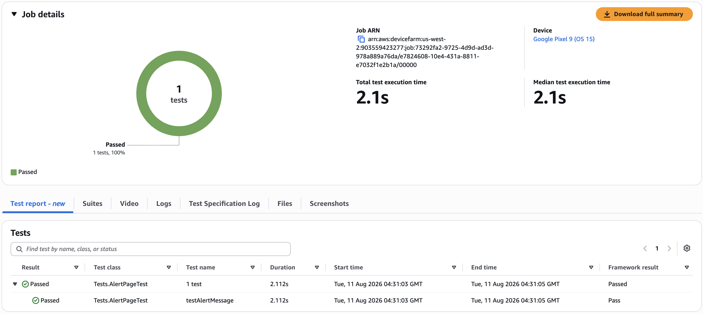
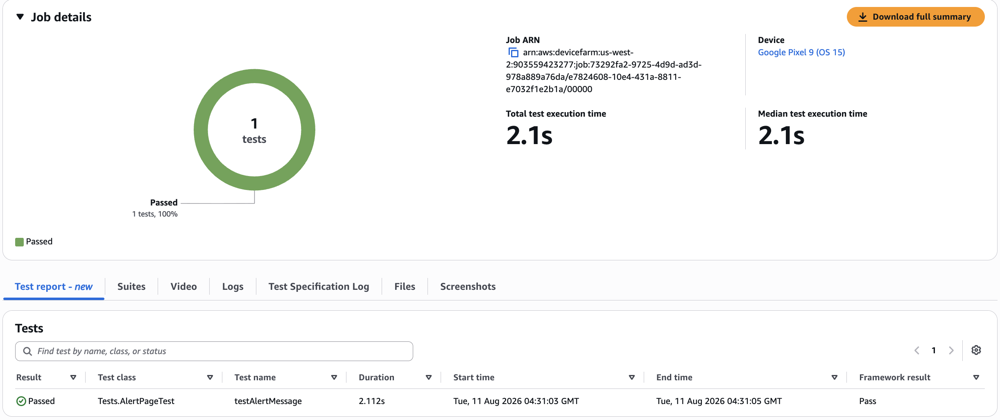

# Integrating Appium tests with Device Farm

Use the following instructions to integrate Appium tests with AWS Device Farm. For more information about using Appium
tests in Device Farm, see [Automatically run Appium tests in Device Farm](test-types-appium.md "test-types-appium.md").

## Configure your Appium test package

Use the following instructions to configure your test package.

Java (JUnit)

1. Modify `pom.xml` to set packaging to a JAR file:

```
<groupId>com.acme</groupId>
<artifactId>acme-myApp-appium</artifactId>
<version>1.0-SNAPSHOT</version>
<packaging>jar</packaging>
```

2. Modify `pom.xml` to use `maven-jar-plugin` to
   build your tests into a JAR file.

The following plugin builds your test source code (anything in the
`src/test` directory) into a JAR file:

```
<plugin>
  <groupId>org.apache.maven.plugins</groupId>
  <artifactId>maven-jar-plugin</artifactId>
  <version>2.6</version>
  <executions>
    <execution>
      <goals>
        <goal>test-jar</goal>
      </goals>
    </execution>
  </executions>
</plugin>
```

3. Modify `pom.xml` to use
   `maven-dependency-plugin` to build dependencies as JAR
   files.

The following plugin copies your dependencies into the
`dependency-jars` directory:

```
<plugin>
  <groupId>org.apache.maven.plugins</groupId>
  <artifactId>maven-dependency-plugin</artifactId>
  <version>2.10</version>
  <executions>
    <execution>
      <id>copy-dependencies</id>
      <phase>package</phase>
      <goals>
        <goal>copy-dependencies</goal>
      </goals>
      <configuration>
        <outputDirectory>${project.build.directory}/dependency-jars/</outputDirectory>
      </configuration>
    </execution>
  </executions>
</plugin>
```

4. Save the following XML assembly to
   `src/main/assembly/zip.xml`.

The following XML is an assembly definition that, when configured, instructs Maven
to build a .zip file that contains everything in the root of your build output directory and
the `dependency-jars` directory:

```
<assembly
    xmlns="http://maven.apache.org/plugins/maven-assembly-plugin/assembly/1.1.0"
    xmlns:xsi="http://www.w3.org/2001/XMLSchema-instance"
    xsi:schemaLocation="http://maven.apache.org/plugins/maven-assembly-plugin/assembly/1.1.0 http://maven.apache.org/xsd/assembly-1.1.0.xsd">
  <id>zip</id>
  <formats>
    <format>zip</format>
  </formats>
  <includeBaseDirectory>false</includeBaseDirectory>
  <fileSets>
    <fileSet>
      <directory>${project.build.directory}</directory>
      <outputDirectory>./</outputDirectory>
      <includes>
        <include>*.jar</include>
      </includes>
    </fileSet>
    <fileSet>
      <directory>${project.build.directory}</directory>
      <outputDirectory>./</outputDirectory>
      <includes>
        <include>/dependency-jars/</include>
      </includes>
    </fileSet>
  </fileSets>
</assembly>
```

5. Modify `pom.xml` to use `maven-assembly-plugin`
   to package tests and all dependencies into a single .zip file.

The following plugin uses the preceding assembly to create a .zip file named
`zip-with-dependencies` in the build output directory every time
**mvn package** is run:

```
<plugin>
  <artifactId>maven-assembly-plugin</artifactId>
  <version>2.5.4</version>
  <executions>
    <execution>
      <phase>package</phase>
      <goals>
        <goal>single</goal>
      </goals>
      <configuration>
        <finalName>zip-with-dependencies</finalName>
        <appendAssemblyId>false</appendAssemblyId>
        <descriptors>
          <descriptor>src/main/assembly/zip.xml</descriptor>
        </descriptors>
      </configuration>
    </execution>
  </executions>
</plugin>
```

###### Note

If you receive an error that says annotation is not supported in 1.3, add the following to
`pom.xml`:

```
<plugin>
  <artifactId>maven-compiler-plugin</artifactId>
  <configuration>
    <source>1.7</source>
    <target>1.7</target>
  </configuration>
</plugin>
```

Java (TestNG)

1. Modify `pom.xml` to set packaging to a JAR file:

```
<groupId>com.acme</groupId>
<artifactId>acme-myApp-appium</artifactId>
<version>1.0-SNAPSHOT</version>
<packaging>jar</packaging>
```

2. Modify `pom.xml` to use `maven-jar-plugin` to
   build your tests into a JAR file.

The following plugin builds your test source code (anything in the
`src/test` directory) into a JAR file:

```
<plugin>
  <groupId>org.apache.maven.plugins</groupId>
  <artifactId>maven-jar-plugin</artifactId>
  <version>2.6</version>
  <executions>
    <execution>
      <goals>
        <goal>test-jar</goal>
      </goals>
    </execution>
  </executions>
</plugin>
```

3. Modify `pom.xml` to use
   `maven-dependency-plugin` to build dependencies as JAR
   files.

The following plugin copies your dependencies into the
`dependency-jars` directory:

```
<plugin>
  <groupId>org.apache.maven.plugins</groupId>
  <artifactId>maven-dependency-plugin</artifactId>
  <version>2.10</version>
  <executions>
    <execution>
      <id>copy-dependencies</id>
      <phase>package</phase>
      <goals>
        <goal>copy-dependencies</goal>
      </goals>
      <configuration>
        <outputDirectory>${project.build.directory}/dependency-jars/</outputDirectory>
      </configuration>
    </execution>
  </executions>
</plugin>
```

4. Save the following XML assembly to
   `src/main/assembly/zip.xml`.

The following XML is an assembly definition that, when configured, instructs Maven
to build a .zip file that contains everything in the root of your build output directory and
the `dependency-jars` directory:

```
<assembly
    xmlns="http://maven.apache.org/plugins/maven-assembly-plugin/assembly/1.1.0"
    xmlns:xsi="http://www.w3.org/2001/XMLSchema-instance"
    xsi:schemaLocation="http://maven.apache.org/plugins/maven-assembly-plugin/assembly/1.1.0 http://maven.apache.org/xsd/assembly-1.1.0.xsd">
  <id>zip</id>
  <formats>
    <format>zip</format>
  </formats>
  <includeBaseDirectory>false</includeBaseDirectory>
  <fileSets>
    <fileSet>
      <directory>${project.build.directory}</directory>
      <outputDirectory>./</outputDirectory>
      <includes>
        <include>*.jar</include>
      </includes>
    </fileSet>
    <fileSet>
      <directory>${project.build.directory}</directory>
      <outputDirectory>./</outputDirectory>
      <includes>
        <include>/dependency-jars/</include>
      </includes>
    </fileSet>
  </fileSets>
</assembly>
```

5. Modify `pom.xml` to use `maven-assembly-plugin`
   to package tests and all dependencies into a single .zip file.

The following plugin uses the preceding assembly to create a .zip file named
`zip-with-dependencies` in the build output directory every time
**mvn package** is run:

```
<plugin>
  <artifactId>maven-assembly-plugin</artifactId>
  <version>2.5.4</version>
  <executions>
    <execution>
      <phase>package</phase>
      <goals>
        <goal>single</goal>
      </goals>
      <configuration>
        <finalName>zip-with-dependencies</finalName>
        <appendAssemblyId>false</appendAssemblyId>
        <descriptors>
          <descriptor>src/main/assembly/zip.xml</descriptor>
        </descriptors>
      </configuration>
    </execution>
  </executions>
</plugin>
```

###### Note

If you receive an error that says annotation is not supported in 1.3, add the following to
`pom.xml`:

```
<plugin>
  <artifactId>maven-compiler-plugin</artifactId>
  <configuration>
    <source>1.7</source>
    <target>1.7</target>
  </configuration>
</plugin>
```

Node.JS
To package your Appium Node.js tests and upload them to Device Farm, you must install the following on your local
machine:

- [Node Version Manager (nvm)](https://github.com/nvm-sh/nvm "https://github.com/nvm-sh/nvm")

Use this tool when you develop and package your tests so that unnecessary dependencies are not included in
your test package.

- Node.js
- npm-bundle (installed globally)

1. Verify that nvm is present

```
command -v nvm
```

You should see `nvm` as output.

For more information, see [nvm](https://github.com/nvm-sh/nvm "https://github.com/nvm-sh/nvm") on GitHub. 2. Run this command to install Node.js:

```
nvm install node
```

You can specify a particular version of Node.js:

```
nvm install 11.4.0
```

3. Verify that the correct version of Node is in use:

```
node -v
```

4. Install **npm-bundle** globally:

```
npm install -g npm-bundle
```

Python

1. We strongly recommend that you set up [Python
   virtualenv](https://pypi.python.org/pypi/virtualenv "https://pypi.python.org/pypi/virtualenv") for developing and packaging tests so that unnecessary dependencies are not included in
   your app package.

```
`$` virtualenv workspace
`$` cd workspace
`$` source bin/activate
```

###### Tip

    * Do not create a Python virtualenv with the `--system-site-packages` option, because it
     inherits packages from your global site-packages directory. This can result in including dependencies in
     your virtual environment that are not required by your tests.
    * You should also verify that your tests do not use dependencies that are dependent on native libraries,
     because these native libraries might not be present on the instance where these tests run.

2. Install **py.test** in your virtual environment.

```
`$` pip install pytest
```

3. Install the Appium Python client in your virtual environment.

```
`$` pip install Appium-Python-Client
```

4. Unless you specify a different path in custom mode, Device Farm expects your tests to be stored in
   `tests/`. You can use `find` to show all files inside a folder:

```
`$` find tests/
```

Confirm that these files contain test suites you wand to run on Device Farm

```
tests/
tests/`my-first-tests.py`
tests/`my-second-tests/py`
```

5. Run this command from your virtual environment workspace folder to show a list of your tests without
   running them.

```
`$` py.test --collect-only tests/
```

Confirm the output shows the tests that you want to run on Device Farm. 6. Clean all cached files under your tests/ folder:

```
`$` find . -name '__pycache__' -type d -exec rm -r {} +
`$` find . -name '*.pyc' -exec rm -f {} +
`$` find . -name '*.pyo' -exec rm -f {} +
`$` find . -name '*~' -exec rm -f {} +
```

7. Run the following command in your workspace to generate the requirements.txt file:

```
`$` pip freeze > requirements.txt
```

Ruby
To package your Appium Ruby tests and upload them to Device Farm, you must install the following on your local
machine:

- [Ruby Version Manager (RVM)](https://rvm.io/rvm/install "https://rvm.io/rvm/install")

Use this command-line tool when you develop and package your tests so that unnecessary dependencies are
not included in your test package.

- Ruby
- Bundler (This gem is typically installed with Ruby.)

1. Install the required keys, RVM, and Ruby. For instructions, see [Installing RVM](https://rvm.io/rvm/install "https://rvm.io/rvm/install") on the RVM website.

After the installation is complete, reload your terminal by signing out and then signing in again.

###### Note

RVM is loaded as a function for the bash shell only. 2. Verify that **rvm** is installed correctly

```
command -v rvm
```

You should see `rvm` as output. 3. If you want to install a specific version of Ruby, such as `2.5.3`, run the
following command:

```
rvm install ruby 2.5.3 --autolibs=0
```

Verify that you are on the requested version of Ruby:

```
ruby -v
```

4. Configure the bundler to compile packages for your desired testing platforms:

```
bundle config specific_platform true
```

5. Update your .lock file to add the platforms needed to run tests.

   - If you're compiling tests to run on Android devices, then run this command to configure the Gemfile to
     use dependencies for the Android test host:

   ```
   bundle lock --add-platform x86_64-linux
   ```
   - If you're compiling tests to run on iOS devices, then run this command to configure the Gemfile to use
     dependencies for the iOS test host:

   ```
   bundle lock --add-platform x86_64-darwin
   ```

6. The **bundler** gem is usually installed by default. If it is not, install it:

```
gem install bundler -v 2.3.26
```

## Create a zipped test package file

###### Warning

In Device Farm, the folder structure of files in your zipped test package matters, and some archival tools
will change the structure of your ZIP file implicitly. We recommend that you follow the specified command-line
utilities below rather than use the archival utilities built into the file manager of your local desktop (such as
Finder or Windows Explorer).

Now, bundle your tests for Device Farm.

Java (JUnit)
Build and package your tests:

```
$ mvn clean package -DskipTests=true
```

The file `zip-with-dependencies.zip` will be created as a result. This is your test
package.

Java (TestNG)
Build and package your tests:

```
$ mvn clean package -DskipTests=true
```

The file `zip-with-dependencies.zip` will be created as a result. This is your test
package.

Node.JS

1. Check out your project.

Make sure you are at the root directory of your project. You can see `package.json` at
the root directory. 2. Run this command to install your local dependencies.

```
npm install
```

This command also creates a `node_modules` folder inside your current directory.

###### Note

At this point, you should be able to run your tests locally. 3. Run this command to package the files in your current folder into a \*.tgz file. The file is named using
the `name` property in your `package.json` file.

```
npm-bundle
```

This tarball (.tgz) file contains all your code and dependencies. 4. Run this command to bundle the tarball (\*.tgz file) generated in the previous step into a single zipped
archive:

```
zip -r `MyTests.zip` *.tgz
```

This is the `MyTests.zip` file that you upload to Device Farm in the following
procedure.

Python

Python 2

Generate an archive of the required Python packages (called a "wheelhouse") using pip:

```
`$` pip wheel --wheel-dir wheelhouse -r requirements.txt
```

Package your wheelhouse, tests, and pip requirements into a zip archive for Device Farm:

```
`$` zip -r `test_bundle.zip` tests/ wheelhouse/ requirements.txt
```

Python 3

Package your tests and pip requirements into a zip file:

```
`$` zip -r `test_bundle.zip` tests/ requirements.txt
```

Ruby

1. Run this command to create a virtual Ruby environment:

```
# myGemset is the name of your virtual Ruby environment
rvm gemset create `myGemset`
```

2. Run this command to use the environment you just created:

```
rvm gemset use `myGemset`
```

3. Check out your source code.

Make sure you are at the root directory of your project. You can see `Gemfile` at the
root directory. 4. Run this command to install your local dependencies and all gems from the
`Gemfile`:

```
bundle install
```

###### Note

At this point, you should be able to run your tests locally. Use this command to run a test
locally:

```
bundle exec $test_command
```

5. Package your gems in the `vendor/cache` folder.

```
# This will copy all the .gem files needed to run your tests into the vendor/cache directory
bundle package --all-platforms
```

6. Run the following command to bundle your source code, along with all your dependencies, into a single
   zipped archive:

```
zip -r MyTests.zip Gemfile vendor/ $(any other source code directory files)
```

This is the `MyTests.zip` file that you upload to Device Farm in the following
procedure.

## Run your Appium tests

You can use the Device Farm console to upload your tests.

1. Sign in to the Device Farm console at [https://console.aws.amazon.com/devicefarm](https://console.aws.amazon.com/devicefarm "https://console.aws.amazon.com/devicefarm").
2. In the navigation pane, choose **Mobile Device Testing**, and then choose
   **Projects**.
3. If you are a new user, choose **New project**, enter a name for the project, and then choose
   **Submit**. If you already have a project, you can choose it to upload your tests to it.
4. Open your project, and then choose **Create run**.
5. Under **Select app and run type**, in the **Run type** section, select your
   run type. Select **Android app** if you are testing an Android app (.apk file format). Select
   **iOS app** if you are testing an iOS app (.ipa file format). Select **Web App**
   if you are testing a mobile web application.
6. Under **Select app**, in the **App selection options** section, choose
   **Select sample app provided by Device Farm** if you do not have an app. If you are bringing your
   own app, select **Upload own app**. Then choose your APK (.apk file format) for Android or your IPA
   (.ipa file format) for iOS. If you are uploading an iOS app, make sure that you choose **iOS
   device**, not a simulator.
7. Under **Configure test**, in the **Select test framework** section, choose
   the Appium framework that you test with, and then select **Upload your own test package**. Browse
   to and choose the .zip file that contains your tests. The .zip file must follow the format described in [Configure your Appium test package](#test-types-appium-prepare "#test-types-appium-prepare").
8. You can use the default test spec, or choose **Upload own test spec** to provide your
   own.
9. Under **Select devices**, choose a device selection method. Select **Use Device
   Pool** to choose from a curated collection of devices or a custom device pool you created. Select
   **Manually select devices** to pick individual devices to run your tests against. The
   **Device compatibility** section shows how many devices in the selected pool are compatible with
   your app. For more information, see [Device support in AWS Device Farm](devices.md "devices.md").
10. (Optional) To configure run-level properties, update the **Run settings** section:

    - Device Farm currently supports test insights only for Appium TestNG. To have Device Farm generate a test report
      after your run completes, select **Generate test report**. This option is available in a custom
      test environment only.

    The following prerequisites apply:

        + Your tests must generate a `testng-results.xml` file and write it to
         `$DEVICEFARM_LOG_DIR`. For example, pass `-d $DEVICEFARM_LOG_DIR/test-output` to the
         TestNG command in your test spec file. The default Appium Java
         TestNG test spec produces
         and stores this file automatically if you keep the default configuration.

11. Choose **Confirm and start run**. For more information, see [Creating a test run in Device Farm](how-to-create-test-run.md "how-to-create-test-run.md").

###### Note

Device Farm does not modify Appium tests.

## View a test report

After your run completes, Device Farm generates a test report for each device. The report shows a per-test
breakdown, including each test's name, class, result, and duration, plus a stack trace for any failed test. You
can view the test report in the console or retrieve it through the API.

To open a completed job in the Device Farm console:

1. Sign in to the Device Farm console at [https://console.aws.amazon.com/devicefarm](https://console.aws.amazon.com/devicefarm "https://console.aws.amazon.com/devicefarm").
2. In the navigation pane, choose **Mobile Device Testing**, and then choose
   **Projects**.
3. Choose the project that contains the run you want to inspect.
4. Choose the completed run to open its details.
5. Choose one of the completed jobs to open the results for that device.

What you see in the job results depends on the test framework and whether you enabled test insights. Choose your
framework tab to view the results.

Java (TestNG)

###### With test insights enabled

The job results include a **Test report** tab. Choose it to see a per-test breakdown. The
following screenshot shows the **Test report** tab.



The tab shows the following fields for each test:

`testName`
The name of the test method.

`testClass`
The name of the test class.

`result`
The Device Farm result for the test.

`frameworkResult`
The result that TestNG reported (`PASS`, `FAIL`, or `SKIP`).
Device Farm maps this value to the normalized `result` field.

`durationSeconds`
The duration of the test, in seconds.

`startTimestamp`
The time when the test started.

`endTimestamp`
The time when the test ended.

`params`
For a parameterized test, the parameter values that TestNG passed to the
test.

`stackTrace`
For a failed test, the stack trace of the failure.

To download the full test report as a JSON file, choose **Download full summary** at the top
of the job details.

To choose which columns appear, choose the gear icon. In the settings, you can select the columns to display
and turn **Group by class** on or off. **Group by class** is on by default,
which groups the tests by their test class. Turn it off to see a flat list of all tests, as shown in the
following screenshot.



###### Without test insights enabled

The job results show the standard test output and artifacts, but no **Test report** tab. To
generate a test report, schedule a new run with test insights enabled.


###### View a test report (AWS CLI)

Run **get-job** and specify the job ARN:

```
aws devicefarm get-job --arn `arn:aws:devicefarm:us-west-2:123456789012:job:PROJECT_ID/RUN_ID/00000`
```

If you did not enable test insights, the response contains the standard job fields, such as the job status,
result, counters, and device:

```
{
    "job": {
        "arn": "arn:aws:devicefarm:us-west-2:123456789012:job:EXAMPLE-PROJECT/EXAMPLE-RUN/00000",
        "name": "Example Android Phone",
        "created": "2026-07-31T16:58:20.000000-07:00",
        "status": "COMPLETED",
        "result": "FAILED",
        "counters": {
            "total": 3,
            "passed": 1,
            "failed": 1,
            "warned": 0,
            "errored": 0,
            "stopped": 0,
            "skipped": 1
        },
        "device": {
            "arn": "arn:aws:devicefarm:us-west-2::device:EXAMPLEDEVICEID",
            "name": "Example Android Phone",
            "platform": "ANDROID",
            "os": "14",
            "formFactor": "PHONE",
            "fleetType": "PUBLIC"
        },
        "deviceMinutes": {
            "total": 1.42,
            "metered": 0.0,
            "unmetered": 1.17
        },
        "videoCapture": true
    }
}
```

If you enabled test insights, the response also includes an `insights` object. This object
contains the test report status, high-level metrics, and a presigned URL to the detailed report:

```
{
    "job": {
        "arn": "arn:aws:devicefarm:us-west-2:123456789012:job:EXAMPLE-PROJECT/EXAMPLE-RUN/00000",
        "status": "COMPLETED",
        "result": "FAILED",
        "counters": { ... },
        "device": { ... },
        "deviceMinutes": { ... },
        "videoCapture": true,
        "insights": {
            "status": "COMPLETED",
            "testReport": {
                "message": "Results: 3 Executed | 1 passed, 1 failed, 1 skipped. Median test duration: 1.83 seconds.",
                "metrics": {
                    "testsTotal": 3,
                    "testsPassed": 1,
                    "testsFailed": 1,
                    "testsSkipped": 1,
                    "testsErrored": 0,
                    "testsOther": 0,
                    "testsPassedPercentage": 33.33
                },
                "testDetailsUrl": "https://EXAMPLE-PRESIGNED-URL"
            }
        }
    }
}
```

The `testDetailsUrl` field is a presigned URL to the full test report JSON. Download it to get the
per-test breakdown:

```
curl -o test-report.json "`PRESIGNED_URL`"
```

The following is an example test report for an Appium Java TestNG job:

```
{
  "version": "1.0",
  "jobArn": "arn:aws:devicefarm:us-west-2:123456789012:job:EXAMPLE-PROJECT/EXAMPLE-RUN/00000",
  "deviceName": "Google Pixel 7",
  "deviceArn": "arn:aws:devicefarm:us-west-2::device:EXAMPLEDEVICEID",
  "deviceOsVersion": "14",
  "metrics": {
    "testsTotal": 3,
    "testsPassed": 1,
    "testsFailed": 1,
    "testsSkipped": 1,
    "testsErrored": 0,
    "testsOther": 0,
    "testsPassedPercentage": 33.33,
    "totalTestExecutionDurationSeconds": 5.421,
    "medianTestExecutionDurationSeconds": 1.83
  },
  "testDetails": [
    {
      "testName": "testValidLogin",
      "testClass": "com.example.app.LoginTest",
      "frameworkResult": "PASS",
      "result": "PASSED",
      "durationSeconds": 1.83,
      "startTimestamp": "2026-07-31T16:58:26.646000Z",
      "endTimestamp": "2026-07-31T16:58:28.476000Z"
    },
    {
      "testName": "testCheckout",
      "testClass": "com.example.app.CheckoutTest",
      "frameworkResult": "FAIL",
      "result": "FAILED",
      "durationSeconds": 3.102,
      "startTimestamp": "2026-07-31T16:58:28.500000Z",
      "endTimestamp": "2026-07-31T16:58:31.602000Z",
      "stackTrace": "java.lang.AssertionError: expected [true] but found [false]\n\tat org.testng.Assert.fail(Assert.java:99)\n\t...",
      "params": ["premium-user", "US"]
    },
    {
      "testName": "testLogout",
      "testClass": "com.example.app.LoginTest",
      "frameworkResult": "SKIP",
      "result": "SKIPPED",
      "durationSeconds": 0.489,
      "startTimestamp": "2026-07-31T16:58:31.700000Z",
      "endTimestamp": "2026-07-31T16:58:32.189000Z"
    }
  ]
}
```

The report contains the following top-level fields:

`version`
The report schema version.

`jobArn`
The ARN of the job.

`deviceName`, `deviceArn`, `deviceOsVersion`
The device that the tests ran on, and its operating system version.

`metrics`

Aggregate results for the job. The `metrics` object contains the following fields:

`testsTotal`
The total number of tests in the job.

`testsPassed`
The number of tests that passed.

`testsFailed`
The number of tests that failed.

`testsSkipped`
The number of tests that were skipped.

`testsErrored`
The number of tests that errored.

`testsOther`
The number of tests with another result.

`testsPassedPercentage`
The percentage of tests that passed.

`totalTestExecutionDurationSeconds`
The total duration of all tests, in seconds.

`medianTestExecutionDurationSeconds`
The median duration of a test, in seconds.

`testDetails`

A list of per-test results. Each entry in `testDetails` contains the following fields:

`testName`
The name of the test method.

`testClass`
The name of the test class.

`result`
The Device Farm result for the test.

`frameworkResult`
The result that TestNG reported (`PASS`, `FAIL`, or `SKIP`).
Device Farm maps this value to the normalized `result` field.

`durationSeconds`
The duration of the test, in seconds.

`startTimestamp`
The time when the test started.

`endTimestamp`
The time when the test ended.

`params`
For a parameterized test, the parameter values that TestNG passed to the
test.

`stackTrace`
For a failed test, the stack trace of the failure.

## Take screenshots of your tests (Optional)

You can take screenshots as part of your tests.

Device Farm sets the `DEVICEFARM_SCREENSHOT_PATH` property to a fully qualified path on the local
file system where Device Farm expects Appium screenshots to be saved. The test-specific directory where the
screenshots are stored is defined at runtime. The screenshots are pulled into your Device Farm reports
automatically. To view the screenshots, in the Device Farm console, choose the **Screenshots** section.

For more information on taking screenshots in Appium tests, see [Take Screenshot](http://appium.io/docs/en/commands/session/screenshot/ "http://appium.io/docs/en/commands/session/screenshot/") in the Appium API
documentation.
