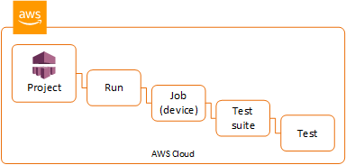

# Downloading artifacts in a custom test

environment

In a custom test environment, Device Farm gathers artifacts such as custom reports, log
files, and images. These artifacts are available for each device in the test
run.

You can download these artifacts created during your test run:

**Test spec output**

The output from running the commands in the test spec YAML
file.

**Customer artifacts**

A zipped file that contains the artifacts from the test run. It is
configured in the **artifacts:** section of your test
spec YAML file.

**Test spec shell script**

An intermediate shell script file created from your YAML file. Because
it is used in the test run, the shell script file can be used for
debugging the YAML file.

**Test spec file**

The YAML file used in the test run.

For more information, see [Downloading artifacts in Device Farm](artifacts.md "artifacts.md").

