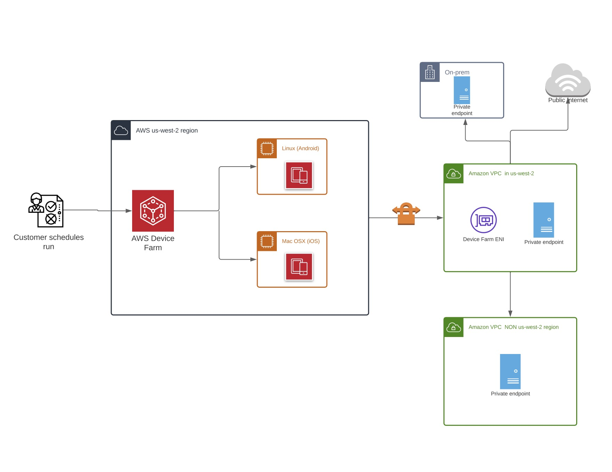

# VPC-ENI in AWS Device Farm

###### Warning

This feature is only available on [private devices](working-with-private-devices.md "working-with-private-devices.md"). To request private device use on your AWS account, please [contact us](mailto:aws-devicefarm-support@amazon.com "mailto:aws-devicefarm-support@amazon.com"). If you already have private devices
added to your AWS account, we strongly recommend using this method of VPC connectivity.

AWS Device Farm's VPC-ENI connectivity feature helps customers securely connect to their private endpoints
hosted on AWS, on-premise software, or another cloud provider.

You can connect both Device Farm mobile devices and their host machines to an Amazon Virtual Private Cloud (Amazon VPC) environment in
the `us-west-2` Region, which enables access to isolated, non-internet-facing services and
applications through an [elastic network
interface](../../../vpc/latest/userguide/VPC_ElasticNetworkInterfaces.md "../../../vpc/latest/userguide/VPC_ElasticNetworkInterfaces.md"). For more information on VPCs, see the [Amazon VPC User Guide](../../../vpc/latest/userguide.md "../../../vpc/latest/userguide.md").

If your private endpoint or VPC is not in the `us-west-2` Region, you can link it with a VPC in the
`us-west-2` Region using solutions such as a [Transit Gateway](../../../whitepapers/latest/building-scalable-secure-multi-vpc-network-infrastructure/transit-gateway.md "../../../whitepapers/latest/building-scalable-secure-multi-vpc-network-infrastructure/transit-gateway.md") or [VPC Peering](../../../vpc/latest/peering/what-is-vpc-peering.md "../../../vpc/latest/peering/what-is-vpc-peering.md"). In such
situations, Device Farm will create an ENI in a subnet you provide for your `us-west-2` Region VPC, and
you'll be responsible for ensuring that a connection can be established between the `us-west-2`
Region VPC and the VPC in the other Region.

For information on using AWS CloudFormation to automatically create and peer VPCs, see the [VPCPeering templates](https://github.com/awslabs/aws-cloudformation-templates/tree/master/aws/solutions/VPCPeering "https://github.com/awslabs/aws-cloudformation-templates/tree/master/aws/solutions/VPCPeering") in the AWS CloudFormation template repository on GitHub.

###### Note

Device Farm doesn't charge anything for creating ENIs in a customer's VPC in `us-west-2`. The
cost for cross-Region or external inter-VPC connectivity isn't included in this feature.

Once you configure VPC access, the devices and host machines that you use for your tests won't be able to
connect to resources outside of the VPC (e.g., public CDNs) unless there is a NAT gateway that you specify
within the VPC. For more information, see [NAT gateways](../../../vpc/latest/userguide/vpc-nat-gateway.md "../../../vpc/latest/userguide/vpc-nat-gateway.md") in the
_Amazon VPC User Guide_.

###### Topics

- [AWS access control and IAM](vpc-eni-access-control.md "vpc-eni-access-control.md")
- [Service-linked roles](vpc-eni-service-linked-role.md "vpc-eni-service-linked-role.md")
- [Prerequisites](vpc-eni-prerequisites.md "vpc-eni-prerequisites.md")
- [Connecting to Amazon VPC](connecting-to-amazon-vpc.md "connecting-to-amazon-vpc.md")
- [Limits](vpc-eni-limits.md "vpc-eni-limits.md")
- [Using Amazon VPC endpoint services with Device Farm - Legacy
  (not recommended)](amazon-vpc-endpoints.md "amazon-vpc-endpoints.md")
