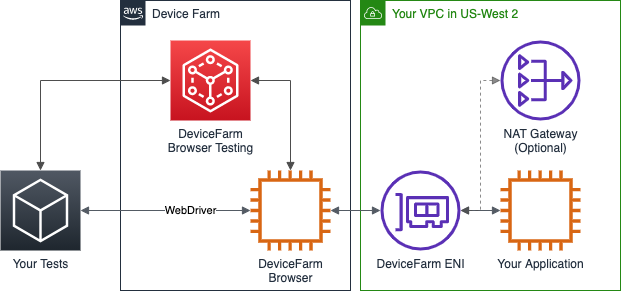
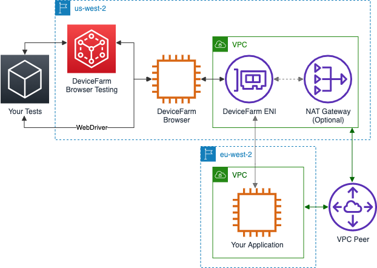

# Using Amazon VPC with Device Farm desktop browser testing

You can give Device Farm desktop browser testing access to an Amazon Virtual Private Cloud (Amazon VPC) environment, enabling testing of
isolated, non-internet-facing services and apps through an [elastic
network interface](../../../vpc/latest/userguide/VPC_ElasticNetworkInterfaces.md "../../../vpc/latest/userguide/VPC_ElasticNetworkInterfaces.md"). For more information on VPCs, see the [Amazon VPC User Guide](../../../vpc/latest/userguide.md "../../../vpc/latest/userguide.md").


If you have private DNS enabled within your VPC, you can use the DNS names within the VPC to
access those resources.

Once you configure VPC access, the browsers that you use for your tests won't be able to
connect to resources outside of the VPC, such as public CDNs, unless there is a NAT gateway that
you specify within the VPC. For more information, see [NAT gateways](../../../vpc/latest/userguide/vpc-nat-gateway.md "../../../vpc/latest/userguide/vpc-nat-gateway.md") in the
_Amazon VPC User Guide_.

As part of using Amazon VPC endpoints with Device Farm desktop browser testing, Device Farm creates an AWS Identity and Access Management (IAM)
service-linked role. For more information, see [Using service-linked roles for Device Farm](using-service-linked-roles.md "using-service-linked-roles.md").

Device Farm can connect to VPCs only within the `us-west-2` AWS Region. To access
resources in a VPC in another Region, you must create a VPC in the `us-west-2` Region
and peer the VPCs. For information on peering VPCs, see the [Amazon VPC Peering Guide](../../../vpc/latest/peering.md "../../../vpc/latest/peering.md").


For information on using AWS CloudFormation to automatically create and peer VPCs, see the [VPCPeering templates](https://github.com/awslabs/aws-cloudformation-templates/tree/master/aws/solutions/VPCPeering "https://github.com/awslabs/aws-cloudformation-templates/tree/master/aws/solutions/VPCPeering") in the AWS CloudFormation template repository on
GitHub.

###### Topics

- [Configuring your project to use Amazon VPC
  endpoints](#techref-vpc-configure "#techref-vpc-configure")
- [Removing an Amazon VPC configuration from a Device Farm desktop browser testing
  project](#techref-vpc-delete "#techref-vpc-delete")

## Configuring your project to use Amazon VPC

endpoints

You must configure Amazon VPC connections on a per-project basis. At this time, you can
configure only one endpoint per project. When you configure a VPC, Device Farm creates an interface
within your VPC and assigns it to the specified subnets and security groups. All future
sessions associated with the project use the configured VPC connection.

###### Important

If you use your VPC with a TestGrid session, you may incur additional bandwidth charges
if your VPC has a public-facing NAT gateway and isn't using an S3 gateway endpoint.

The reason for this is desktop browser sessions provide test artifacts after your tests
are complete and, to make them readily available after your session has been closed, the
host used for your desktop browser test session will periodically synchronize your session's
artifacts into Device Farm's S3 bucket. When you use a public-facing NAT gateway without an S3
gateway endpoint with your VPC, all traffic for test artifact synchronization traverses
through the NAT gateway, which may incur additional bandwidth charges. For more information,
see [Amazon VPC Pricing](https://aws.amazon.com/vpc/pricing/ "https://aws.amazon.com/vpc/pricing/").

To avoid incurring additional bandwidth charges, we recommend that you use an S3 gateway
endpoint in your VPC if your VPC has a public-facing NAT gateway. For more information,
see [Gateway endpoints](../../../vpc/latest/privatelink/gateway-endpoints.md "../../../vpc/latest/privatelink/gateway-endpoints.md") in the _AWS PrivateLink Guide_.

To configure VPC access for a project, you must know:

- The VPC ID where your app is hosted.
- The applicable security groups to apply to the connection.
- The subnets which will be associated with the connection. When a session starts, the
  largest available subnet is used.

Additionally, to verify that you have access to your specified VPC when you configure the
connection, you must configure certain Amazon Elastic Compute Cloud (Amazon EC2) permissions for Device Farm. For more
information, see the [relevant IAM policy](security-acl-iam.md#security-iam-vpc-policy "security-acl-iam.md#security-iam-vpc-policy") in
this guide for configuring VPC connections.

For existing Device Farm desktop browser testing projects, you can update the Amazon VPC configuration using the console
or the AWS Command Line Interface (AWS CLI):

Console
**To update the Amazon VPC configuration using the
console**

1. Sign in to the Device Farm console at [https://console.aws.amazon.com/devicefarm](https://console.aws.amazon.com/devicefarm "https://console.aws.amazon.com/devicefarm").
2. In
   the navigation pane, choose **Desktop Browser
   Testing**, and then choose **Projects**.
3. Under **Desktop browser testing projects**,
   choose
   the name of your project.
4. Choose **Project settings**.
5. In the **Virtual Private Cloud (VPC) Settings** section, you
   can change the **VPC**, **Subnets**, and
   **Security Groups**.
6. Choose **Save**.

CLI
**To update the Amazon VPC configuration using the
AWS CLI**

Use the following AWS CLI command to update the Amazon VPC configuration:

```
`$`  aws devicefarm update-test-grid-project \
   --project-arn arn:aws:devicefarm:us-west-2:`111122223333`:testgrid-project:`123e4567-e89b-12d3-a456-426655440000` \
   --vpc-config '{
     "securityGroupIds": ["`sg-123456789`", `...`],
     "subnetIds": ["`subnet-123456789`", `...`],
     "vpcId": "`vpc-1234abcd5678`"
   }'
```

You can also configure Amazon VPC when creating your project:

```
`$`  aws devicefarm create-test-grid-project \
   --name "`My Testing Project`" \
   --vpc-config '{
     "securityGroupIds": ["`sg-123456789`", `...`],
     "subnetIds": ["`subnet-123456789`", `...`],
     "vpcId": "`vpc-1234abcd5678`"
   }'
```

###### Note

The JSON presented here is written over multiple lines for readability.

## Removing an Amazon VPC configuration from a Device Farm desktop browser testing

project

Console
**To remove the Amazon VPC configuration through the
console**

1. Sign in to the Device Farm console at [https://console.aws.amazon.com/devicefarm](https://console.aws.amazon.com/devicefarm "https://console.aws.amazon.com/devicefarm").
2. In the navigation pane, choose **Desktop Browser Testing**, and then
   choose **Projects**.
3. Under **Desktop browser testing projects**, choose the name of your
   project.
4. Choose **Project settings**.
5. Under **Virtual Private Cloud (VPC) Settings**, for
   **VPC**, choose **No VPC**.
6. Choose **Save**.

CLI
**To remove the Amazon VPC configuration through the
AWS CLI**

To remove the Amazon VPC configuration using the AWS CLI, use the
`update-test-grid-project` command and pass a blank `vpc-config`
parameter:

```
`$`  aws devicefarm update-test-grid-project \
   --project-arn arn:aws:devicefarm:us-west-2:`111122223333`:testgrid-project:`123e4567-e89b-12d3-a456-426655440000` \
   --vpc-config ''
```

To delete the service-linked role that Device Farm created for accessing your Amazon VPC resources,
use the following AWS CLI command:

```
`$` aws iam delete-service-linked-role --role-name AWSServiceRoleForDeviceFarmTestGrid
```
