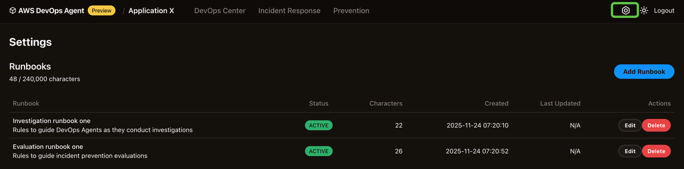

# DevOps Agent Runbooks

You can configure runbooks to guide the AWS DevOps Agent as it performs incident response investigations and incident prevention evaluations. Click on the settings icon in the top right of your DevOps Agent web app and enter one or more runbooks.


Investigation and evaluation performance can be further enhanced by using AWS DevOps Agent Runbooks to provide investigation hints and guidance for non-standard configurations across all connection types. You can also use Investigation chat/steering to test runbook concepts by steering live investigations or restarting completed ones with additional hints.

Please note that the title, description, and status of runbooks matter. Your DevOps Agent will use titles and descriptions to decide which runbook to use. Include a summary of the runbook content in the description field and use a title that reflects the purpose of the runbook. You can also control which runbooks are available to your DevOps Agent via the status field. If you want to skip some runbooks from being used for any reason, you can modify the status of runbook by clicking the “ **Edit** ” button and changing its status to “ **Inactive**.” To make runbooks available again to your DevOps Agent, set the “ **Status** ” back to “ **Active**.”

## Example use cases

If your environment uses Dynatrace for alarms and metrics, Splunk for logs, and CloudWatch for serverless logs, document this in your runbook to accelerate issue resolution.

If your environment uses Atlassian MCP server for managing knowledge, you can hint the agent to read the knowledge using runbook. Here is an example:

```
In all investigations, try to use as many documentation tools as you can to gain context and background information about the task at hand. Retrieving this information saves on investigation time.

# Atlassian Confluence Wiki Pages
Additional runbook and investigation information may be found by using the Atlassian MCP tools. These pages contain very helpful information on how to triage issues, and may contain past root causes and investigation attempts.

## Using the search functionality
In general, you can use the `atlassian_search` tool to look up keywords that may appear inside of a Confluence page. This tool will only return a fragment of information. To retrieve the entire page, you must use the corresponding get page tools.

## Using the getConfluencePage functionality
If you need to read the contents of an entire page, use the `atlassian_getConfluencePage` tool. This tool reads the entire page contents, instead of just a fragment.
```
